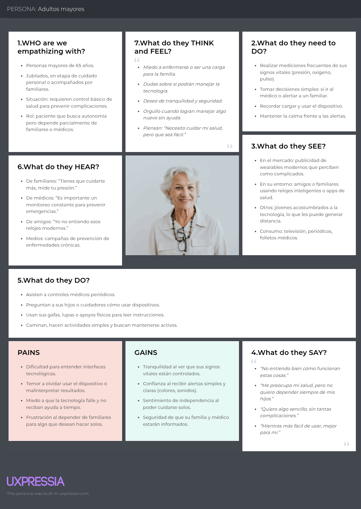
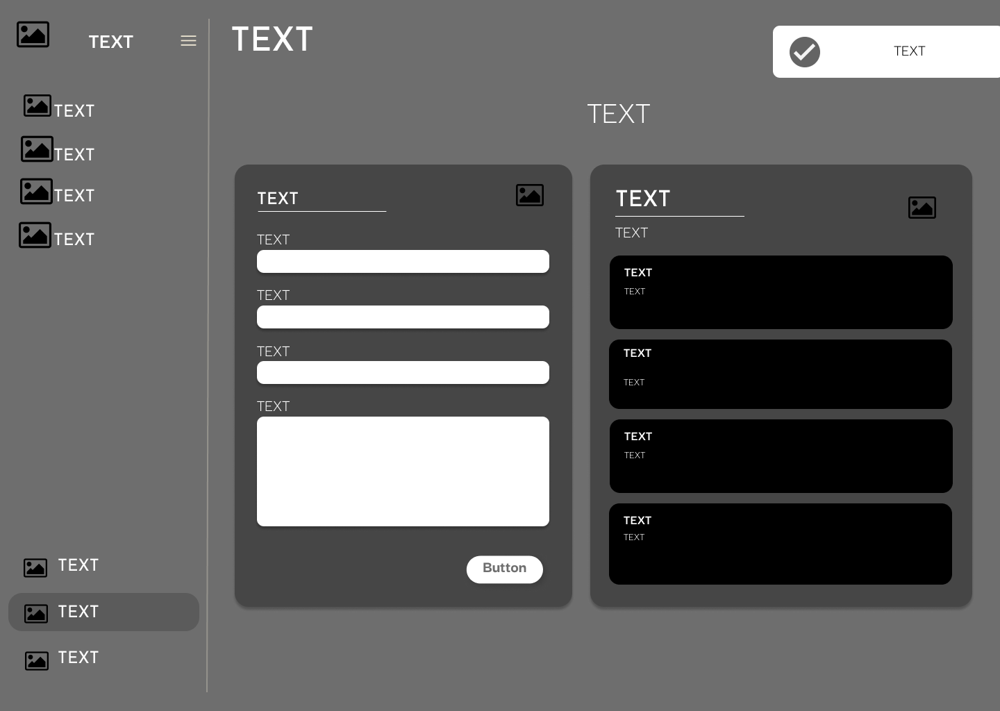
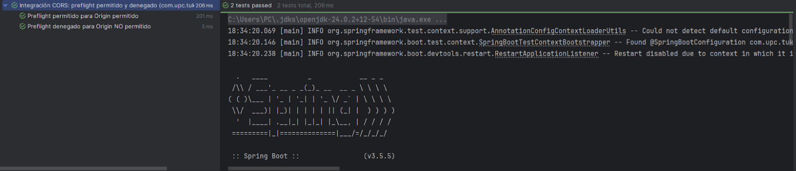

<div align="center">
   <div>

   <br>

   <center>Universidad Peruana de Ciencias Aplicadas</center>


   <br>

   <center></center>


   <br>

   <center><b>Ingeniería de software</b></center>


   <br>

   <center><b>Ciclo 2025-20</b></center>

   <br>

   <center><b>1ASI0732 Diseño de Experimentos de Ingeniería de Software</b></center>

   <br>

   <center><b>Sección:</b> 7491</center>

   <br>

   <center><b>Profesor:</b> Robles Fernández, Ivan</center>

   <br>

 <center>"Informe del Trabajo Final"</center>
 
<br>

   <center><b>Nombre del StartUp:</b> TukenTech</center>

   <br>


   <center><b>Nombre del Producto:</b> TukenTech</center>

   </div>

   <br>

   <div align="center">

   <table style="margin-left: auto; margin-right: auto;">
   <tr>
   <th>Nombre</th>
   <th>Código</th>
   </tr>
   <tr>
   <td>Eric Fabrizio Agama Espinoza</td>
   <td>U202213358</td>
   </tr>
   <tr>
   <td>Oscar Eduardo Soto Zorrilla</td>
   <td>U201811767</td>
   </tr>
   <tr>
   <td>Adriana Giovanna Palomares Chavez</td>
   <td>U20221f23</td>
   </tr>
   <tr>
   <td>Alejandro Manuel Jave Chang</td>
   <td>U202312510</td>
   </tr>
   <tr>
   <td>Erick Maraza Pedemonte</td>
   <td>U202213372</td>
   </tr>
   </table>
   </div>

   <br>

   <center><b>Septiembre, 2025</b></center>

   <br>

</div>
   <br>

   <br>

   <br>

   <br>

   <br>

   <br>


# Registro de Versiones del Informe

<div>

| Versión | Fecha       | Autor                                                                                                                                 | Descripción de modificación                                                                 |
|---------|-------------|----------------------------------------------------------------------------------------------------------------------------------------|---------------------------------------------------------------------------------------------|
| 1.0     | 2025-09-19  | Maraza Pedemonte Erick<br>Palomares Chavez Adriana Giovanna<br>Soto Zorrilla Oscar Eduardo                                             | Desarrollo del código de la aplicación y elaboración de diagramas C4.                       |
| 1.1     | 2025-09-19  | Maraza Pedemonte Erick<br>Palomares Chavez Adriana Giovanna<br>Soto Zorrilla Oscar Eduardo                                             | Creación de mockups (UX/UI).                                                                |
| 1.2     | 2025-09-19  | Jave Chang Alejandro Manuel                                                                                                           | Creación de wireframes.                                                                     |
| 1.3     | 2025-09-19  | Agama Espinoza Eric Fabrizio                                                                                                          | Elaboración de entrevistas, redacción y consolidación del informe.                          |
| 1.4     | 2025-09-19  | Maraza Pedemonte Erick<br>Palomares Chavez Adriana Giovanna<br>Soto Zorrilla Oscar Eduardo<br>Jave Chang Alejandro Manuel<br>Agama Espinoza Eric Fabrizio | Revisión conjunta del documento, correcciones finales y validación de la versión entregable. |
| 1.5     | 2025-10-07  | Maraza Pedemonte Erick<br>Palomares Chavez Adriana Giovanna<br>Soto Zorrilla Oscar Eduardo<br>Jave Chang Alejandro Manuel<br>Agama Espinoza Eric Fabrizio | Revisión conjunta del documento, correcciones de la anterior entrega y elaboracion del Capítulo VI y Capítulo VII. |

</div>

# Project Report Collaboration Insights

URL del repositorio para el proyecto: [Link](https://github.com/TukunTech-Experimentos/Report)

**Github Collaboration Insights**

# Contenido

# Student Outcome

| Criterio Específico | Acciones Realizadas | Conclusiones |
|---------------------|---------------------|--------------|
| Reconoce responsabilidad <br> ética y profesional en <br> situaciones de ingeniería <br> de software. | **Maraza Pedemonte Erick**<br>TB1: Participó activamente en el desarrollo del código de la aplicación y en los diagramas C4, aplicando buenas prácticas de programación y asegurando la coherencia entre los componentes del sistema.<br><br>**Agama Espinoza Eric Fabrizio**<br>TB1: Lideró la elaboración de entrevistas y la redacción del informe, asegurando la fidelidad y ética en la documentación de información de usuarios.<br><br>**Palomares Chavez Adriana Giovanna**<br>TB1: Colaboró en la implementación del código de la aplicación y en la elaboración de los diagramas C4, priorizando la calidad del software.<br><br>**Soto Zorrilla Oscar Eduardo**<br>TB1: Trabajó en la codificación del sistema y en los diagramas C4, buscando claridad en la representación de la arquitectura.<br><br>**Jave Chang Alejandro Manuel**<br>TB1: Se encargó del diseño de wireframes y mockups, priorizando la accesibilidad y facilidad de uso para los usuarios finales. | **TB1:** El equipo asumió con compromiso ético y profesional cada una de sus tareas: los integrantes responsables del código y diagramas garantizaron la calidad técnica, el encargado de UX/UI priorizó la accesibilidad y usabilidad, mientras que el responsable de entrevistas e informe aseguró la fidelidad de la documentación. En conjunto, el trabajo reflejó responsabilidad, organización y buenas prácticas en todas las etapas del proyecto. |
| Emite juicios informados <br> considerando el impacto <br> de las soluciones de ingeniería <br> de software en contextos <br> globales, económicos, <br> ambientales y sociales. | **Maraza Pedemonte Erick**<br>TB1: Analizó la viabilidad técnica del sistema y la optimización de recursos en el desarrollo del software.<br><br>**Agama Espinoza Eric Fabrizio**<br>TB1: Analizó la información recopilada de entrevistas para identificar impactos sociales y económicos de la solución.<br><br>**Palomares Chavez Adriana Giovanna**<br>TB1: Evaluó la consistencia del diseño arquitectónico con la solución planteada y su impacto en la escalabilidad futura del sistema.<br><br>**Soto Zorrilla Oscar Eduardo**<br>TB1: Analizó cómo las decisiones de diseño podían mejorar la eficiencia técnica y reducir costos en el uso de recursos.<br><br>**Jave Chang Alejandro Manuel**<br>TB1: Consideró la importancia del diseño UX/UI en adultos mayores, reduciendo barreras tecnológicas y sociales. | **TB1:** Las decisiones del equipo no se limitaron al ámbito técnico, sino que también consideraron la viabilidad económica, la facilidad de adopción social y la relevancia del producto para los usuarios finales. Esto permitió emitir juicios informados que favorecieron la sostenibilidad, la inclusión y el impacto positivo del sistema en contextos reales. |

| Criterio Específico | Acciones Realizadas | Conclusiones |
|---------------------|---------------------|--------------|
| Reconoce responsabilidad <br> ética y profesional en <br> situaciones de ingeniería <br> de software. | **Maraza Pedemonte Erick**<br>TP1: Participó en el desarrollo del backend, asegurando una estructura sólida, segura y coherente con los requerimientos del sistema.<br><br>**Agama Espinoza Eric Fabrizio**<br>TP1: Supervisó la documentación técnica y la integración del contenido en la landing page, garantizando la veracidad y ética en la presentación de información.<br><br>**Palomares Chavez Adriana Giovanna**<br>TP1: Contribuyó en la programación del frontend web, aplicando principios de diseño limpio y accesible para los usuarios.<br><br>**Soto Zorrilla Oscar Eduardo**<br>TP1: Trabajó en la conexión entre el backend y la interfaz web, velando por la coherencia funcional y la seguridad de los datos.<br><br>**Jave Chang Alejandro Manuel**<br>TP1: Diseñó y ajustó la interfaz visual de la landing page, priorizando la experiencia del usuario y la identidad visual del proyecto. | **TP1:** El equipo mantuvo un enfoque ético y profesional durante el desarrollo web. Cada integrante asumió responsabilidades técnicas específicas, garantizando la calidad del código, la seguridad de la información y la accesibilidad del sitio. El trabajo conjunto reflejó compromiso, organización y respeto por los principios de la ingeniería de software. |
| Emite juicios informados <br> considerando el impacto <br> de las soluciones de ingeniería <br> de software en contextos <br> globales, económicos, <br> ambientales y sociales. | **Maraza Pedemonte Erick**<br>TP1: Analizó la eficiencia del backend para optimizar recursos del servidor y reducir el impacto económico del despliegue.<br><br>**Agama Espinoza Eric Fabrizio**<br>TP1: Evaluó la claridad del contenido en la landing page para fomentar la comprensión y el acceso equitativo a la información del sistema.<br><br>**Palomares Chavez Adriana Giovanna**<br>TP1: Consideró la adaptabilidad del diseño web a distintos dispositivos, promoviendo inclusión digital y sostenibilidad.<br><br>**Soto Zorrilla Oscar Eduardo**<br>TP1: Propuso mejoras técnicas para garantizar una arquitectura escalable y eficiente, con menor consumo de recursos.<br><br>**Jave Chang Alejandro Manuel**<br>TP1: Diseñó interfaces visuales que facilitan la interacción, reduciendo brechas tecnológicas y mejorando la usabilidad para diversos perfiles de usuario. | **TP1:** El equipo analizó el impacto de sus decisiones técnicas en términos de sostenibilidad, accesibilidad y eficiencia. Las soluciones desarrolladas consideraron tanto la optimización de recursos como la inclusión de los usuarios, promoviendo un sistema web funcional, responsable y socialmente consciente. |

| Criterio Específico | Acciones Realizadas | Conclusiones |
|---------------------|---------------------|--------------|
| Reconoce responsabilidad <br> ética y profesional en <br> situaciones de ingeniería <br> de software. | **Maraza Pedemonte Erick**<br>TB2: Implementó pruebas unitarias e integración sobre las entidades centrales del sistema, garantizando la consistencia funcional y evitando la propagación de errores en el flujo principal.<br><br>**Agama Espinoza Eric Fabrizio**<br>TB2: Diseñó y ejecutó el proceso de validación mediante entrevistas, asegurando la correcta documentación, consentimiento y resguardo ético de la información recopilada.<br><br>**Palomares Chavez Adriana Giovanna**<br>TB2: Realizó auditorías de experiencia de usuario con base en heurísticas, manteniendo un enfoque profesional para detectar problemas de usabilidad y accesibilidad.<br><br>**Soto Zorrilla Oscar Eduardo**<br>TB2: Ejecutó análisis estático del código, verificando cumplimiento de estándares, seguridad y buenas prácticas de desarrollo.<br><br>**Jave Chang Alejandro Manuel**<br>TB2: Documentó y organizó los procesos del pipeline CI/CD, manteniendo prácticas éticas en el manejo de información sensible y configuraciones del entorno. | **TB2:** El equipo demostró profesionalismo al ejecutar actividades de validación, auditoría, pruebas y análisis estático. Las acciones realizadas aseguraron calidad técnica, respeto por la ética en la documentación de usuarios y coherencia en los estándares del proyecto. En conjunto, se evidenció compromiso responsable y buenas prácticas en la verificación, validación y despliegue del sistema. |
| Emite juicios informados <br> considerando el impacto <br> de las soluciones de ingeniería <br> de software en contextos <br> globales, económicos, <br> ambientales y sociales. | **Maraza Pedemonte Erick**<br>TB2: Analizó los resultados de pruebas unitarias e integración para evaluar la mantenibilidad y escalabilidad futura del sistema, evitando sobrecostos y asegurando sostenibilidad técnica.<br><br>**Agama Espinoza Eric Fabrizio**<br>TB2: Interpretó los resultados de entrevistas de validación para identificar necesidades reales de los usuarios y su impacto social, proponiendo mejoras orientadas a la inclusión y accesibilidad.<br><br>**Palomares Chavez Adriana Giovanna**<br>TB2: Evaluó los hallazgos de la auditoría UX considerando su efecto en la experiencia del usuario y en la adopción del sistema por distintos perfiles demográficos.<br><br>**Soto Zorrilla Oscar Eduardo**<br>TB2: Analizó métricas del análisis estático para identificar riesgos técnicos y de seguridad, considerando su impacto económico y operativo en el ciclo de vida del producto.<br><br>**Jave Chang Alejandro Manuel**<br>TB2: Evaluó la configuración del pipeline DevOps para garantizar despliegues eficientes, rápidos y con menor impacto ambiental y económico en infraestructura. | **TB2:** El equipo basó sus decisiones en evidencia proveniente de pruebas, entrevistas, auditorías y métricas. Esto permitió emitir juicios informados que consideraron eficiencia técnica, reducción de costos, sostenibilidad, inclusión social y mejora continua del producto. Las acciones del grupo mostraron un entendimiento integral del impacto global de la ingeniería de software en contextos reales. |


# Part I: As-Is Software Project

# Índice
- [Capítulo I: Introducción](#capitulo-i-introduccion)
  - [1.1. Startup Profile](#1-1-startup-profile)
    - [1.1.1. Descripción de la Startup](#1-1-1-descripcion-de-la-startup)
    - [1.1.2. Perfiles de integrantes del equipo](#1-1-2-perfiles-de-integrantes-del-equipo)
  - [1.2. Solution Profile](#1-2-solution-profile)
    - [1.2.1. Antecedentes y problemática](#1-2-1-antecedentes-y-problematica)
    - [1.2.2. Lean UX Process.](#1-2-2-lean-ux-process)
      - [1.2.2.1. Lean UX Problem Statements.](#1-2-2-1-lean-ux-problem-statements)
      - [1.2.2.2. Lean UX Assumptions.](#1-2-2-2-lean-ux-assumptions)
      - [1.2.2.3. Lean UX Hypothesis Statements.](#1-2-2-3-lean-ux-hypothesis-statements)
      - [1.2.2.4. Lean UX Canvas.](#1-2-2-4-lean-ux-canvas)
  - [1.3. Segmentos objetivo.](#1-3-segmentos-objetivo)
- [Capítulo II: Requirements Elicitation & Analysis](#capitulo-ii-requirements-elicitation-analysis)
  - [2.1. Competidores.](#2-1-competidores)
    - [2.1.1. Análisis competitivo.](#2-1-1-analisis-competitivo)
    - [2.1.2. Estrategias y tácticas frente a competidores.](#2-1-2-estrategias-y-tacticas-frente-a-competidores)
  - [2.2. Entrevistas.](#2-2-entrevistas)
    - [2.2.1. Diseño de entrevistas.](#2-2-1-diseno-de-entrevistas)
    - [2.2.2. Registro de entrevistas.](#2-2-2-registro-de-entrevistas)
    - [2.2.3. Análisis de entrevistas.](#2-2-3-analisis-de-entrevistas)
  - [2.3. Needfinding.](#2-3-needfinding)
    - [2.3.1. User Personas.](#2-3-1-user-personas)
    - [2.3.2. User Task Matrix.](#2-3-2-user-task-matrix)
    - [2.3.3. User Journey Mapping.](#2-3-3-user-journey-mapping)
    - [2.3.4. Empathy Mapping.](#2-3-4-empathy-mapping)
    - [2.3.5. As-is Scenario Mapping.](#2-3-5-as-is-scenario-mapping)
  - [2.4. Ubiquitous Language.](#2-4-ubiquitous-language)
- [Capítulo III: Requirements Specification](#capitulo-iii-requirements-specification)
  - [3.1. To-Be Scenario Mapping.](#3-1-to-be-scenario-mapping)
  - [3.2. User Stories.](#3-2-user-stories)
  - [3.3. Product Backlog.](#3-3-product-backlog)
  - [3.4. Impact Mapping.](#3-4-impact-mapping)
- [Capítulo IV: Product Design](#capitulo-iv-product-design)
  - [4.1. Style Guidelines.](#4-1-style-guidelines)
    - [4.1.1. General Style Guidelines.](#4-1-1-general-style-guidelines)
    - [4.1.2. Web Style Guidelines.](#4-1-2-web-style-guidelines)
    - [4.1.3. Mobile Style Guidelines.](#4-1-3-mobile-style-guidelines)
      - [4.1.3.1. iOS Mobile Style Guidelines.](#4-1-3-1-ios-mobile-style-guidelines)
      - [4.1.3.2. Android Mobile Style Guidelines.](#4-1-3-2-android-mobile-style-guidelines)
  - [4.2. Information Architecture.](#4-2-information-architecture)
    - [4.2.1. Organization Systems.](#4-2-1-organization-systems)
    - [4.2.2. Labeling Systems.](#4-2-2-labeling-systems)
    - [4.2.3. SEO Tags and Meta Tags](#4-2-3-seo-tags-and-meta-tags)
    - [4.2.4. Searching Systems.](#4-2-4-searching-systems)
    - [4.2.5. Navigation Systems.](#4-2-5-navigation-systems)
  - [4.3. Landing Page UI Design.](#4-3-landing-page-ui-design)
    - [4.3.1. Landing Page Wireframe.](#4-3-1-landing-page-wireframe)
    - [4.3.2. Landing Page Mock-up.](#4-3-2-landing-page-mock-up)
  - [4.4. Mobile Applications UX/UI Design.](#4-4-mobile-applications-ux-ui-design)
    - [4.4.1. Mobile Applications Wireframes.](#4-4-1-mobile-applications-wireframes)
    - [4.4.2. Mobile Applications Wireflow Diagrams.](#4-4-2-mobile-applications-wireflow-diagrams)
    - [4.4.3. Mobile Applications Mock-ups.](#4-4-3-mobile-applications-mock-ups)
    - [4.4.4. Mobile Applications User Flow Diagrams.](#4-4-4-mobile-applications-user-flow-diagrams)
  - [4.5. Mobile Applications Prototyping.](#4-5-mobile-applications-prototyping)
    - [4.5.1. Android Mobile Applications Prototyping.](#4-5-1-android-mobile-applications-prototyping)
    - [4.5.2. iOS Mobile Applications Prototyping.](#4-5-2-ios-mobile-applications-prototyping)
  - [4.6. Web Applications UX/UI Design.](#4-6-web-applications-ux-ui-design)
    - [4.6.1. Web Applications Wireframes.](#4-6-1-web-applications-wireframes)
    - [4.6.2. Web Applications Wireflow Diagrams.](#4-6-2-web-applications-wireflow-diagrams)
    - [4.6.3. Web Applications Mock-ups.](#4-6-3-web-applications-mock-ups)
    - [4.6.4. Web Applications User Flow Diagrams.](#4-6-4-web-applications-user-flow-diagrams)
  - [4.7. Web Applications Prototyping.](#4-7-web-applications-prototyping)
  - [4.8. Domain-Driven Software Architecture.](#4-8-domain-driven-software-architecture)
    - [4.8.1. Software Architecture Context Diagram.](#4-8-1-software-architecture-context-diagram)
    - [4.8.2. Software Architecture Container Diagrams.](#4-8-2-software-architecture-container-diagrams)
    - [4.8.3. Software Architecture Components Diagrams.](#4-8-3-software-architecture-components-diagrams)
  - [4.9. Software Object-Oriented Design.](#4-9-software-object-oriented-design)
    - [4.9.1. Class Diagrams.](#4-9-1-class-diagrams)
    - [4.9.2. Class Dictionary.](#4-9-2-class-dictionary)
  - [4.10. Database Design.](#4-10-database-design)
    - [4.10.1. Relational/Non-Relational Database Diagram.](#4-10-1-relational-non-relational-database-diagram)
- [Capítulo V: Product Implementation](#capitulo-v-product-implementation)
  - [5.1. Software Configuration Management.](#5-1-software-configuration-management)
    - [5.1.1. Software Development Environment Configuration.](#5-1-1-software-development-environment-configuration)
    - [5.1.2. Source Code Management.](#5-1-2-source-code-management)
    - [5.1.3. Source Code Style Guide & Conventions.](#5-1-3-source-code-style-guide-and-conventions)
    - [5.1.4. Software Deployment Configuration.](#5-1-4-software-deployment-configuration)
  - [5.2. Product Implementation & Deployment.](#5-2-product-implementation-and-deployment)
    - [5.2.1. Sprint Backlogs.](#5-2-1-sprint-backlogs)
    - [5.2.2. Implemented Landing Page Evidence](#5-2-2-implemented-landing-page-evidence)
    - [5.2.3. Implemented Frontend-Web Application Evidence](#5-2-3-implemented-frontend-web-application-evidence)
    - [5.2.4. Acuerdo de Servicio - SaaS](#5-2-4-acuerdo-de-servicio-saas)
    - [5.2.5. Implemented Native-Mobile Application Evidence](#5-2-5-implemented-native-mobile-application-evidence)
    - [5.2.6. Implemented RESTful API and/or Serverless Backend Evidence](#5-2-6-implemented-restful-api-and-or-serverless-backend-evidence)
    - [5.2.7. RESTful API documentation](#5-2-7-restful-api-documentation)
    - [5.2.8. Team Collaboration Insights](#5-2-8-team-collaboration-insights)
  - [5.3. Video About-the-Product.](#5-3-video-about-the-product)
 - [Part II: Verification, Validation & Pipeline](#part-ii-verification-validation-pipeline)
   - [Capítulo VI: Product Verification & Validation](#capitulo-vi-product-verification-validation)
     - [6.1. Testing Suites & Validation](#6-1-testing-suites-validation)
       - [6.1.1. Core Entities Unit Tests.](#6-1-1-core-entities-unit-tests)
       - [6.1.2. Core Integration Tests.](#6-1-2-core-integration-tests)
       - [6.1.3. Core Behavior-Driven Development](#6-1-3-core-behavior-driven-development)
       - [6.1.4. Core System Tests.](#6-1-4-core-system-tests)
     - [6.2. Static testing & Verification](#6-2-static-testing-verification)
       - [6.2.1. Static Code Analysis](#6-2-1-static-code-analysis)
         - [6.2.1.1. Coding standard & Code conventions.](#6-2-1-1-coding-standard-code-conventions)
         - [6.2.1.2. Code Quality & Code Security.](#6-2-1-2-code-quality-code-security)
       - [6.2.2. Reviews](#6-2-2-reviews)
     - [6.3. Validation Interviews.](#6-3-validation-interviews)
       - [6.3.1. Diseño de Entrevistas.](#6-3-1-diseno-de-entrevistas)
       - [6.3.2. Registro de Entrevistas.](#6-3-2-registro-de-entrevistas)
       - [6.3.3. Evaluaciones según heurísticas.](#6-3-3-evaluaciones-segun-heuristicas)
     - [6.4. Auditoría de Experiencias de Usuario](#6-4-auditoria-de-experiencias-de-usuario)
       - [6.4.1. Auditoría realizada.](#6-4-1-auditoria-realizada)
         - [6.4.1.1. Información del grupo auditado.](#6-4-1-1-informacion-del-grupo-auditado)
         - [6.4.1.2. Cronograma de auditoría realizada.](#6-4-1-2-cronograma-de-auditoria-realizada)
         - [6.4.1.3. Contenido de auditoría realizada.](#6-4-1-3-contenido-de-auditoria-realizada)
       - [6.4.2. Auditoría recibida.](#6-4-2-auditoria-recibida)
         - [6.4.2.1. Información del grupo auditor.](#6-4-2-1-informacion-del-grupo-auditor)
         - [6.4.2.2. Cronograma de auditoría recibida.](#6-4-2-2-cronograma-de-auditoria-recibida)
         - [6.4.2.3. Contenido de auditoría recibida.](#6-4-2-3-contenido-de-auditoria-recibida)
         - [6.4.2.4. Resumen de modificaciones para subsanar hallazgos.](#6-4-2-4-resumen-de-modificaciones-para-subsanar-hallazgos)
   - [Capítulo VII: DevOps Practices](#capitulo-vii-devops-practices)
     - [7.1. Continuous Integration](#7-1-continuous-integration)
       - [7.1.1. Tools and Practices.](#7-1-1-tools-and-practices)
       - [7.1.2. Build & Test Suite Pipeline Components.](#7-1-2-build-test-suite-pipeline-components)
     - [7.2. Continuous Delivery](#7-2-continuous-delivery)
       - [7.2.1. Tools and Practices.](#7-2-1-tools-and-practices)
       - [7.2.2. Stages Deployment Pipeline Components.](#7-2-2-stages-deployment-pipeline-components)
     - [7.3. Continuous deployment](#7-3-continuous-deployment)
       - [7.3.1. Tools and Practices.](#7-3-1-tools-and-practices)
       - [7.3.2. Production Deployment Pipeline Components.](#7-3-2-production-deployment-pipeline-components)
     - [7.4. Continuous Monitoring](#7-4-continuous-monitoring)
       - [7.4.1. Tools and Practices](#7-4-1-tools-and-practices)
     - [7.4.2. Monitoring Pipeline Components](#7-4-2-monitoring-pipeline-components)
      - [7.4.3. Alerting Pipeline Components](#7-4-3-alerting-pipeline-components)
      - [7.4.4. Notification Pipeline Components.](#7-4-4-notification-pipeline-components)
  - [Capítulo VIII: Experiment-Driven Development](#8-experiment-driven-development)
    - [8.1. Experiment Planning](#8-1-experiment-planning)
      - [8.1.1. As-Is Summary](#8-1-1-as-is-summary)
      - [8.1.2. Raw Material: Assumptions, Knowledge Gaps, Ideas, Claims](#8-1-2-raw-material)
      - [8.1.3. Experiment-Ready Questions](#8-1-3-experiment-ready-questions)
      - [8.1.4. Question Backlog](#8-1-4-question-backlog)
      - [8.1.5. Experiment Cards](#8-1-5-experiment-cards)
    - [8.2. Experiment Design](#8-2-experiment-design)
      - [8.2.1. Hypotheses](#8-2-1-hypotheses)
      - [8.2.2. Domain Business Metrics](#8-2-2-domain-business-metrics)
      - [8.2.3. Measures](#8-2-3-measures)
      - [8.2.4. Conditions](#8-2-4-conditions)
      - [8.2.5. Scale Calculations and Decisions](#8-2-5-scale-calculations-and-decisions)
      - [8.2.6. Methods Selection](#8-2-6-methods-selection)
      - [8.2.7. Data Analytics: Goals, KPIs and Metrics Selection](#8-2-7-data-analytics)
      - [8.2.8. Web and Mobile Tracking Plan](#8-2-8-web-and-mobile-tracking-plan)
    - [8.3. Experimentation](#8-3-experimentation)
      - [8.3.1. To-Be User Stories](#8-3-1-to-be-user-stories)
      - [8.3.2. To-Be Product Backlog](#8-3-2-to-be-product-backlog)

<a id="capitulo-i-introduccion"></a>
# Capítulo I: Introducción

<a id="1-1-startup-profile"></a>
## 1.1. Startup Profile
<a id="1-1-1-descripcion-de-la-startup"></a>
### 1.1.1. Descripción de la Startup

Las enfermedades cardiovasculares representan una de las principales causas de mortalidad en adultos mayores y personas con antecedentes cardíacos. El monitoreo actual de signos vitales suele ser invasivo, costoso o limitado a mediciones puntuales, lo que impide un seguimiento continuo y accesible.

Aunque existen dispositivos comerciales como relojes inteligentes u oxímetros, estos muchas veces no están diseñados para adultos mayores debido a su complejidad, alto costo o poca claridad en la interpretación de resultados. Además, los datos generados no siempre son accesibles en tiempo real para familiares o cuidadores.

Por ello, se requiere un sistema poco invasivo, portable y fácil de usar, que funcione como un gadget accesible, capaz de monitorear parámetros básicos como frecuencia cardíaca y saturación de oxígeno, y que traduzca los datos médicos en acciones simples y comprensibles. A través de una conexión con la nube, este sistema debe permitir que la información esté disponible en aplicaciones web y móviles, generando alertas inmediatas mediante un esquema de tres niveles de aviso (relajación, medicación, emergencia), simulados con LEDs en el dispositivo físico.

<a id="1-1-2-perfiles-de-integrantes-del-equipo"></a>
### 1.1.2. Perfiles de integrantes del equipo

| Nombre | Descripción |
|--------|-------------|
|     | Soy estudiante de Ingeniería de Software con un enfoque proactivo en la resolución de problemas. Me caracterizo por mi adaptabilidad a diversas situaciones y por superar desafíos. Además, tengo conocimientos en C++, HTML, CSS, JavaScript y Python, lo que me permite trabajar en diversos proyectos tecnológicos.          |
|      | Soy estudiante de Ingeniería de Software con habilidades en programación en lenguajes como C++ y Python. Mi enfoque dedicado a los proyectos que me apasionan me impulsa a explorar nuevas fronteras en mi carrera. Estas habilidades me permiten desarrollar una amplia gama de aplicaciones y soluciones, y estoy comprometido a seguir aprendiendo y aplicando estas habilidades para resolver desafíos creativos en el mundo del desarrollo de software.            |
|        | Soy Adriana Palomares, tengo 21 años y actualmente estudio Ingeniería de Software en UPC en el 5to ciclo. Me gusta explorar nuevas tecnologías, especialmente lenguajes de programación. También me apasionan los animales, particularmente los perros. Me comprometo al trabajo en equipo y la responsabilidad que conlleva este.            |
|         |  Vengo de la carrera de Ingeniería de software, tengo conocimientos en los lenguajes de programación C++ y python. Me gusta explorar diversas soluciones a desafíos tecnológicos y me apasiona aprender nuevas cosas.           |
|        | Soy Eric Agama, estudiante de Ingeniería de Software. Me caracterizo por ser responsable y comprometido en mis trabajos, y siempre busco optimizar la organización dentro del equipo. Tengo experiencia con el lenguaje Luau en Roblox Studio.            |

<a id="1-2-solution-profile"></a>
## 1.2. Solution Profile

Decidimos llamar a nuestro producto “TukunTech”, inspirado en el sonido “tukun” que imita el latido del corazón, símbolo de vida y salud. Este nombre refleja el objetivo principal de nuestro sistema: monitorear y cuidar de manera preventiva los signos vitales en adultos mayores y personas con problemas cardíacos.
El sufijo “Tech” resalta la innovación tecnológica aplicada al cuidado de la salud, transmitiendo la unión entre lo humano y lo tecnológico.
TukunTech busca ser más que un dispositivo: un compañero de bienestar, accesible y confiable, que combina el pulso de la vida con soluciones digitales modernas.

Product Description: TukunTech es un sistema portable, no invasivo y fácil de usar, diseñado especialmente para adultos mayores y personas con problemas cardíacos.
El dispositivo, basado en Arduino y un sensor óptico, mide de forma continua la frecuencia cardíaca y la saturación de oxígeno (SpO₂).

Los datos son enviados a la nube, donde se procesan en tiempo real. Según los parámetros detectados, el sistema genera alertas automáticas escalonadas, representadas en el dispositivo con LEDs que simulan acciones:

Verde: frecuencia elevada → recomendación de relajación.
Azul: valores críticos → sugerencia de medicación.
Rojo: riesgo extremo → simulación de contacto con una ambulancia.

Además, los usuarios y cuidadores pueden acceder a una aplicación web y móvil que permite visualizar los signos vitales en tiempo real, consultar el historial y recibir notificaciones instantáneas en situaciones de emergencia.

De esta manera, TukunTech convierte datos médicos complejos en indicaciones claras y comprensibles, brindando seguridad y acompañamiento continuo tanto a pacientes como a sus familias.

Monetización: Para garantizar la accesibilidad del sistema y cubrir distintos escenarios de uso, TukunTech ofrecerá dos planes principales:

Plan Familiar
Enfocado en hogares con un adulto mayor o persona con problemas cardíacos.
Acceso a la aplicación móvil con notificaciones en tiempo real.
Visualización de registros históricos y gráficos de signos vitales.
Alertas personalizadas según los parámetros configurados.
Vigencia: mensual.
Ideal para familias que desean acompañar y monitorear de forma preventiva a sus seres queridos.

<a id="1-2-1-antecedentes-y-problematica"></a>
### 1.2.1. Antecedentes y problemática

Descripción de la problemática
El problema identificado radica en la falta de una solución accesible, sencilla y poco invasiva para el monitoreo continuo de signos vitales en adultos mayores y personas con problemas cardíacos. Los sistemas actuales dependen en gran medida de dispositivos comerciales como relojes inteligentes u oxímetros tradicionales, que no ofrecen una integración real con plataformas de análisis ni permiten alertas automáticas y personalizadas.

Esta situación genera que tanto pacientes como familiares no cuenten con un sistema preventivo confiable, limitando la capacidad de respuesta ante cambios bruscos en la frecuencia cardíaca o la oxigenación. Además, los dispositivos existentes suelen ser costosos o poco adaptados a las necesidades locales, lo que reduce su accesibilidad y uso en entornos familiares.

### Objetivos
- Desarrollar un dispositivo portátil basado en Arduino y sensores ópticos que permita el monitoreo continuo y en tiempo real de la frecuencia cardíaca y la saturación de oxígeno.
- Crear un sistema de alertas escalonado (verde, azul, rojo) que simule acciones preventivas, recomendaciones médicas y llamados de emergencia.
- Integrar los datos en una aplicación web y móvil conectada a la nube para facilitar el acceso remoto a la información por parte de pacientes y familiares.
- Reducir la necesidad de supervisión manual, mejorando la prevención y la calidad del cuidado en adultos mayores y personas con enfermedades cardíacas.

### Restricciones
- Dependencia de la conectividad de red para transmitir datos a la nube. En zonas con mala conexión, la funcionalidad del sistema podría verse limitada.
- Precisión de los sensores: al tratarse de un sistema portátil y accesible, la calidad de las mediciones puede variar frente a equipos médicos de alta gama.
- Facilidad de uso: el dispositivo debe ser intuitivo para que adultos mayores lo utilicen sin dificultad.

### Antecedentes
#### Oxímetros y pulseras inteligentes
Los oxímetros de dedo y relojes inteligentes disponibles en el mercado permiten medir la saturación y la frecuencia cardíaca, pero suelen funcionar de manera aislada y no siempre incluyen sistemas de alerta escalonada ni integración con aplicaciones familiares. TukunTech se diferencia al ofrecer un ecosistema completo que combina hardware accesible con software en la nube.

#### AliveCor
AliveCor ofrece dispositivos portátiles que registran la actividad cardíaca y generan electrocardiogramas móviles. Sin embargo, TukunTech busca una alternativa menos técnica y más accesible, enfocada en el monitoreo básico (latidos y oxigenación) con alertas claras y fáciles de interpretar por usuarios no médicos.

#### Philips Healthcare
Philips cuenta con soluciones avanzadas de monitoreo remoto, principalmente para entornos hospitalarios. TukunTech se diferencia al estar diseñado para el hogar, con un enfoque en simplicidad, bajo costo y adaptación a la realidad local, evitando la dependencia de infraestructura clínica compleja.

### Herramienta de 5W y 2H
- What - ¿Cuál es el problema?
  - La falta de una solución portátil, accesible y no invasiva para el monitoreo continuo y en tiempo real de frecuencia cardíaca y oxigenación en adultos mayores y personas con problemas cardíacos.
- When - ¿Cuándo sucede el problema?
  - El problema ocurre en la vida diaria de los pacientes, donde es necesario un monitoreo constante y preventivo que detecte cambios bruscos o riesgos a tiempo.
- Where - ¿Dónde surge el problema?
  - Surge principalmente en hogares y entornos familiares donde se requiere un sistema confiable para supervisar la salud de adultos mayores sin depender de infraestructura hospitalaria.
- Who - ¿Quiénes son afectados por el problema?
  - Los adultos mayores y personas con enfermedades cardíacas, sus familiares y cuidadores, quienes carecen de herramientas preventivas fáciles de usar y en tiempo real.
- Why - ¿Cuál es la causa del problema?
  - La falta de integración de soluciones accesibles y la dependencia de dispositivos comerciales aislados que no incluyen un sistema preventivo con alertas inmediatas y personalizadas.
- How - ¿Cómo se manifiesta el problema?
  - En la ausencia de monitoreo continuo, en la dificultad de interpretar datos médicos por parte de usuarios no especializados y en la falta de respuesta rápida ante emergencias.
- How much - ¿Cuál es la magnitud del problema?
  - La magnitud se refleja en el aumento de riesgos para pacientes vulnerables, la preocupación constante de familiares, y la ausencia de una solución accesible que combine monitoreo en tiempo real con acciones preventivas claras.

<a id="1-2-2-lean-ux-process"></a>
### 1.2.2. Lean UX Process.
<a id="1-2-2-1-lean-ux-problem-statements"></a>
#### 1.2.2.1. Lean UX Problem Statements.

El monitoreo de signos vitales en adultos mayores y personas con problemas cardíacos ha dependido tradicionalmente de dispositivos médicos convencionales o de consumo, como oxímetros de dedo o relojes inteligentes. Estos equipos, si bien cumplen una función puntual, requieren la intervención manual del usuario o del personal de salud para la recolección de datos y no ofrecen una integración real con plataformas que permitan un análisis continuo y preventivo.

En consecuencia, los sistemas actuales suelen ser fragmentados, estáticos y de difícil acceso para familias o cuidadores que requieren información en tiempo real. Esta falta de integración limita la eficiencia en la supervisión, la capacidad de generar alertas inmediatas y la posibilidad de responder rápidamente ante cambios bruscos en la frecuencia cardíaca o la saturación de oxígeno.

Nuestro producto aborda esta brecha mediante el desarrollo de un sistema de monitoreo de signos vitales basado en IoT, diseñado específicamente para el hogar. Este sistema integrará un dispositivo portátil construido con un microcontrolador (ESP32/Arduino) y un sensor óptico capaz de medir continuamente la frecuencia cardíaca y la saturación de oxígeno en sangre.

#### Según los parámetros detectados, el sistema activará un esquema de alertas escalonadas representadas en el prototipo físico mediante luces LED:
- Verde: el usuario debe relajarse por un aumento leve en su frecuencia cardíaca.
- Azul: el sistema recomienda tomar la medicación indicada.
- Rojo: se simula el contacto inmediato con una ambulancia.

En paralelo, tanto la aplicación móvil como la plataforma web mostrarán la información en tiempo real al paciente y a sus familiares o cuidadores, permitiendo un monitoreo continuo, accesible y poco invasivo.

A diferencia de soluciones hospitalarias costosas y complejas, TukunTech se enfoca en brindar un dispositivo accesible y fácil de usar, pensado principalmente para hogares, adultos mayores y personas con enfermedades cardíacas que requieren un acompañamiento constante pero no invasivo.

### El éxito de la solución se medirá en función de:
- La reducción del tiempo de reacción ante cambios críticos en los signos vitales.
- El aumento de la tranquilidad y confianza de los familiares al contar con alertas en tiempo real.
- La facilidad de uso y aceptación del dispositivo por parte de adultos mayores.
- La mejora en la prevención de emergencias médicas gracias al monitoreo continuo.

<a id="1-2-2-2-lean-ux-assumptions"></a>
#### 1.2.2.2. Lean UX Assumptions.

En esta sección se presentan las suposiciones relacionadas con los resultados esperados del sistema de monitoreo continuo de signos vitales basado en IoT. Se dividen en cuatro categorías: Business Outcomes, que abordan los impactos comerciales y la sostenibilidad del producto; User Outcomes, que se centran en los beneficios para usuarios y familiares; User Outcomes Assumptions, que analizan las necesidades y comportamientos de los usuarios; y Features Assumptions, que plantean funcionalidades clave del sistema.

##### Business Outcomes
- Creemos que al implementar el sistema de monitoreo continuo de frecuencia cardíaca y saturación de oxígeno basado en IoT, podremos reducir el riesgo de emergencias médicas no atendidas en un 30%.
- Creemos que al ofrecer alertas automáticas claras (verde, azul y rojo), aumentaremos la capacidad de reacción de los cuidadores y familiares en un 40%.
- Creemos que al contar con un sistema accesible y poco invasivo, mejoraremos la adherencia al monitoreo en adultos mayores en un 25%.
- Creemos que al centralizar los datos en una plataforma en la nube, facilitaremos el acceso remoto a la información, aumentando la confianza y tranquilidad de las familias en un 35%.

##### Business Outcomes Assumptions
- Creemos que la falta de monitoreo continuo y accesible en el hogar es un problema que afecta directamente la calidad de vida de adultos mayores y personas con enfermedades cardíacas.
- Creemos que las familias estarán dispuestas a pagar una suscripción mensual o anual por un sistema que les permita monitorear en tiempo real y recibir alertas inmediatas ante situaciones críticas.
- Creemos que un sistema basado en IoT será más atractivo que los dispositivos tradicionales al ser menos invasivo y más integrado con aplicaciones móviles.
- Creemos que ofrecer un producto costo-eficiente y fácil de usar permitirá posicionar a TukunTech en un segmento amplio de usuarios domésticos.

##### User Outcomes
- Creemos que al ofrecer alertas visuales y notificaciones inmediatas, los familiares podrán tomar decisiones rápidas para proteger la salud de los pacientes.
- Creemos que al proporcionar una aplicación móvil y una plataforma web simples, los cuidadores podrán acceder fácilmente a la información, sin necesidad de conocimientos técnicos.
- Creemos que al implementar un historial digital de mediciones, los usuarios podrán detectar patrones y prevenir complicaciones.
- Creemos que al transmitir los datos en tiempo real desde el dispositivo IoT, los familiares se sentirán más tranquilos y seguros respecto al estado de salud del paciente.
- Creemos que la facilidad de uso motivará a los adultos mayores a mantener el dispositivo encendido y en uso diario.

##### User Outcomes Assumptions
- Creemos que los cuidadores necesitan un acceso inmediato y claro a los datos de frecuencia cardíaca y oxigenación para actuar oportunamente.
- Creemos que los adultos mayores valoran soluciones poco invasivas que no requieran configuraciones complejas.
- Creemos que las familias priorizan la tranquilidad y seguridad, por lo que confiarán en un sistema que ofrezca alertas automáticas y confiables.
- Creemos que al reducir la necesidad de mediciones manuales, aumentaremos la disposición de los pacientes a utilizar el sistema diariamente.
- Creemos que una plataforma simple y accesible desde cualquier dispositivo aumentará la adopción del sistema en hogares.

##### Features Assumptions
- Creemos que agregar un dashboard centralizado que muestre signos vitales en tiempo real facilitará la supervisión tanto en la app como en la web.
- Creemos que implementar alertas automáticas basadas en umbrales (verde, azul, rojo) permitirá una respuesta rápida ante situaciones críticas sin necesidad de revisión constante.
- Creemos que incluir un historial de mediciones permitirá identificar tendencias y ayudar en la prevención de emergencias.
- Creemos que la integración con la nube permitirá a familiares y cuidadores acceder a los datos a distancia de manera segura.
- Creemos que diseñar una interfaz simple e intuitiva reducirá las barreras de adopción tecnológica y fomentará su uso entre adultos mayores y familiares no técnicos.

<a id="1-2-2-3-lean-ux-hypothesis-statements"></a>
#### 1.2.2.3. Lean UX Hypothesis Statements.

En esta sección, se busca validar el impacto de nuestro sistema de monitoreo de signos vitales basado en IoT en el ámbito domiciliario y familiar. Las hipótesis exploran cómo la plataforma puede mejorar la prevención de emergencias, brindar tranquilidad a los familiares, aumentar la adherencia al monitoreo en adultos mayores y fortalecer la confianza en soluciones tecnológicas accesibles y poco invasivas. Además, evaluamos cómo el modelo de negocio, basado en suscripciones individuales y familiares, puede generar ingresos recurrentes y fomentar relaciones de largo plazo con los usuarios finales.

##### Hypothesis Statement #1
- Creemos que reduciremos el riesgo de emergencias no atendidas en adultos mayores y personas con problemas cardíacos
- Si los familiares y cuidadores
  - Obtienen acceso inmediato a datos actualizados y alertas en tiempo real
- Con un sistema de monitoreo IoT conectado que integra notificaciones automáticas y alertas visuales mediante LEDs en el dispositivo.

##### Hypothesis Statement #2
- Creemos que aumentaremos la tranquilidad y confianza de las familias en el cuidado de sus seres queridos
- Si los cuidadores
  - Obtienen una aplicación móvil y una plataforma web fáciles de usar
- Con una interfaz intuitiva que permita acceder a la información desde cualquier lugar, sin necesidad de conocimientos técnicos.

##### Hypothesis Statement #3
- Creemos que mejoraremos la prevención de complicaciones en pacientes con problemas cardíacos
- Si los usuarios y familiares
  - Obtienen reportes automáticos y un historial de mediciones
- Con un sistema que recopila y presenta tendencias sobre la frecuencia cardíaca y la saturación de oxígeno, ayudando a detectar anomalías de forma temprana.

##### Hypothesis Statement #4
- Creemos que aumentaremos la disposición de los adultos mayores a utilizar el sistema de manera continua
- Si los pacientes
  - Reciben un dispositivo accesible, cómodo y poco invasivo
- Con un hardware sencillo (ESP32 + sensor óptico) que requiere mínima intervención y genera alertas automáticas sin necesidad de interacción constante.

##### Hypothesis Statement #5
- Creemos que facilitaremos la coordinación y el acompañamiento en el cuidado del paciente
- Si los familiares
  - Obtienen la posibilidad de compartir el acceso a la información en tiempo real
- Con un sistema multiusuario que permite a varios cuidadores supervisar el estado de salud de la misma persona de manera simultánea.

<a id="1-2-2-4-lean-ux-canvas"></a>
#### 1.2.2.4. Lean UX Canvas.

A continuación se presenta el Lean UX Canvas, una herramienta basada en los principios de Lean UX que nos permite comprender los problemas del usuario, la definición de supuestos, la formulación de hipótesis y la planificación de experimentos para validar o refutar estas hipótesis rápidamente. La principal ventaja es la reducción de riesgos en el desarrollo de nuestro producto, ya que permite iterar de manera rápida y efectiva basándonos en la retroalimentación de los usuarios.

[Link al Lean UX Canvas](https://miro.com/welcomeonboard/YXAwb0YyY2RYdm9zYzQxeE45NHRjdnhOMHUxT3Uzc2FubWFaTTFWOUZUaFUyam14ZW13d0Y5Z2ZJR2hBRU5IQ1hkeldDU016c2tNMmZSNXRqQ202ZGJQSGNGeDZJV3V2bzZydFZGalphTm5YUTlNNDhYL1Jlcm9reFpuRXhuK3JzVXVvMm53MW9OWFg5bkJoVXZxdFhRPT0hdjE=?share_link_id=34180130578)

<a id="1-3-segmentos-objetivo"></a>
## 1.3. Segmentos objetivo.

De acuerdo a Vásquez (2010), “los médicos dependen cada vez más de los equipos electromédicos para lograr un diagnóstico certero y eficaz. Los equipos electromédicos son una herramienta fundamental para obtener diagnósticos y así brindar tratamientos adecuados a los pacientes”. Esta afirmación evidencia la relevancia de contar con tecnologías de monitoreo que faciliten diagnósticos oportunos, mejoren la experiencia de los usuarios y complementen los servicios de salud existentes.

Por otro lado, Ruiz (2016) señala lo siguiente:
“Los pacientes adultos mayores debido a su avanzada edad se les dificulta la realización de visitas periódicas a los centros especializados de salud … por eso surge la necesidad de mantener un correcto monitoreo de los principales signos vitales, esto permitirá mantener controlado al paciente, así evitando futuras complicaciones … además de contar con estadísticas de sus diferentes valores” (p. 21).

Estos antecedentes refuerzan la importancia de diseñar soluciones accesibles, poco invasivas y conectadas a través de IoT, que permitan el monitoreo en tiempo real de la salud en entornos domiciliarios, brindando seguridad y confianza a las familias.

En base a lo mencionado, se establecen los tres segmentos objetivos que serán abordados a lo largo del proyecto:
- Segmento 1: Adultos mayores que requieren monitoreo preventivo y fácil de entender.
- Segmento 2: Personas con problemas cardíacos crónicos.
- Segmento 3: Familiares y cuidadores, que necesitan recibir notificaciones claras y oportunas sobre el estado de salud del paciente.

<a id="capitulo-ii-requirements-elicitation-analysis"></a>
# Capítulo II: Requirements Elicitation & Analysis

<a id="2-1-competidores"></a>
## 2.1. Competidores.
<a id="2-1-1-analisis-competitivo"></a>
### 2.1.1. Análisis competitivo.
### 2.1.1. Análisis competitivo

| Dimensión                                | Tukuntech                                                                                                                                                                                                                                                    | AliveCor                                                                                                | Philips Healthcare                                                                                        | Xiaomi Smart Band                                                                                          |
|------------------------------------------|------------------------------------------------------------------------------------------------------------------------------------------------------------------------------------------------------------------------------------------------------------------------------------------------------------------|------------------------------------------------------------------------------------------------------------------------------------------------------------------------|-----------------------------------------------------------------------------------------------------------------------------------------------------------------------|-----------------------------------------------------------------------------------------------------------------------------------------------------------------------|
| **Perfil – Overview**                     | Startup de healthtech basada en IoT enfocada en el monitoreo continuo, no invasivo y accesible de signos vitales. Diseñada especialmente para adultos mayores y personas con problemas cardíacos, combina un sistema embebido con sensores conectado a un servidor edge local y una plataforma en la nube (web/móvil). | Medtech enfocada en ECG personales (KardiaMobile, KardiaMobile 6L, 12L portátil) y servicios/AI para monitoreo cardiaco remoto; opera B2C y B2B (salud, pagadores).    | Multinacional de tecnología de salud (imágenes, monitorización de pacientes, cuidados respiratorios, informática clínica) para hospitales y sistemas de salud.          | Línea de pulseras fitness de bajo costo con pantalla AMOLED, >150 modos deportivos, batería hasta 21 días y app Mi Fitness. Posibilidad de integrarse con HyperOS/Smart Hub. |
| **Perfil – Ventaja competitiva**          | Monitoreo preventivo en tiempo real con alertas escalonadas (verde, azul, rojo) fáciles de interpretar. Económico, sencillo de usar, convierte datos médicos en recomendaciones claras.                                                                                                                           | Datos ECG de grado clínico en 30 s desde el móvil; dispositivos FDA-cleared; detecciones ampliables vía suscripción (KardiaCare); opciones 6 y 12 derivaciones.        | Portafolio integral con soluciones de punta a punta, integración de datos y presencia global; foco en sostenibilidad y alianzas.                                       | Relación precio-prestaciones muy alta; amplia autonomía; ecosistema y app unificadas; variedad de diseños/straps.                                                      |
| **Perfil de Marketing – Mercado objetivo** | Hogares con adultos mayores o pacientes con problemas cardíacos, familiares y cuidadores.                                                                                                                                                                                                                        | Pacientes con riesgo/antecedentes de arritmias, usuarios pro-salud, cardiólogos y health systems que implementan monitorización remota.                                | Hospitales, clínicas, redes de salud, gobierno y partners del sector salud (B2B).                                                                                      | Consumidores masivos que buscan wearables accesibles para actividad física, salud básica y notificaciones.                                                             |
| **Perfil de Marketing – Estrategias**     | Estrategia B2C con valor emocional (tranquilidad y acompañamiento familiar). Marketing digital (RRSS, testimonios, blogs), alianzas con clínicas/aseguradoras (B2B2C), programas en comunidades de adultos mayores.                                                                                              | Mensajes clínicos (validación, publicaciones), respaldo médico, venta directa DTC (kardia.com), soluciones empresariales (AliveCor.com).                               | Marketing B2B consultivo con demos/ferias clínicas, canales de partners/distribuidores y financiación a canales.                                                       | Value for money, lanzamientos frecuentes, comunidad y e-commerce global (mi.com) + retail; empuje del ecosistema HyperOS/Mi Fitness.                                   |
| **Perfil de Producto – Productos**        | 1) Dispositivo IoT embebido + sensores <br> 2) Integración con servidor Edge <br> 3) App web y móvil <br> 4) Alertas LED y notificaciones push <br> 5) Planes de suscripción                                                                                                                                    | KardiaMobile (1-lead), KardiaMobile 6L, Kardia 12L, KardiaCare (membresía), integración de datos, KardiaPro/Station.                                                   | Imagen (CT/MR/Ultrasound/IGT), monitorización de pacientes, cuidados respiratorios, informática y servicios.                                                           | Smart Band 9/9 Active/10, carátulas, straps; pasos, HR, SpO₂, sueño, deportes, notificaciones.                                                                        |
| **Perfil de Producto – Precios**          | **Plan Individual**: App móvil y web, monitoreo en tiempo real (FC, SpO₂, temperatura), alertas inmediatas, historial, 50GB nube (30 días), 1 dispositivo, mensual/anual. <br><br> **Plan Familiar**: App móvil y web, monitoreo en tiempo real, alertas inmediatas, historial, nube ilimitada, hasta 4 dispositivos. | KardiaMobile: US$79 <br> Membresía KardiaCare: ~US$11.99/mes <br> Bundles y planes Plus                                                                                | Precios no públicos (venta enterprise, licitaciones, partners).                                                                                                        | Band 10: US$54–85 (según región/promoción).                                                                                                                           |
| **Perfil de Producto – Canales**          | Directo online (web oficial, e-commerce, app stores). App web y móvil multiplataforma.                                                                                                                                                                                                                           | DTC (kardia.com/store), App Kardia en iOS/Android; también programas B2B.                                                                                              | Venta directa B2B y red global de distribuidores; acuerdos/licenciamiento/partners.                                                                                    | Web mi.com, retailers, app Mi Fitness en Google Play / App Store.                                                                                                     |
| **SWOT – Fortalezas**                      | – Económico <br> – Simple, diseñado para adultos mayores <br> – Alertas intuitivas <br> – Datos en tiempo real para familiares <br> – Modelo escalable de suscripción                                                                                                                                            | – Validación clínica y FDA-cleared <br> – Facilidad móvil <br> – Opciones 6L/12L <br> – Base de usuarios amplia <br> – Publicaciones médicas                           | – Marca reconocida <br> – Portafolio completo <br> – Escala global <br> – Partners y soporte                                                                          | – Precio bajo <br> – Larga batería <br> – Ecosistema amplio <br> – Compatible Android/iOS                                                                            |
| **SWOT – Debilidades**                     | – Dependencia de Internet <br> – Menor precisión que equipos médicos de alta gama <br> – Startup con recursos limitados                                                                                                                                                                                          | – Dependencia del móvil <br> – Suscripciones obligatorias <br> – Exposición a litigios                                                                                 | – Exposición regulatoria y recalls (ej. CPAP) <br> – Riesgos reputacionales                                                                                            | – Menor precisión clínica <br> – Funciones dependen de la app/móvil                                                                                                   |
| **SWOT – Oportunidades**                   | – Crecimiento telemedicina/IoT <br> – Envejecimiento poblacional <br> – Interés aseguradoras <br> – Integración futura con wearables/ecosistemas digitales                                                                                                                                                        | – Envejecimiento poblacional <br> – RPM (remote patient monitoring) <br> – Acuerdos con health systems                                                                | – Digital/AI en hospitales <br> – Modernización de infraestructura <br> – Contratos multi-año                                                                         | – Crecimiento wearables low-cost <br> – Integración hogar-salud <br> – Mercados emergentes                                                                            |
| **SWOT – Amenazas**                        | – Competencia grandes marcas (Apple, Xiaomi, Philips) <br> – Regulaciones médicas estrictas <br> – Reticencia de adultos mayores a nuevas tecnologías <br> – Riesgos de privacidad de datos                                                                                                                       | – Competencia smartwatches ECG <br> – Riesgos de patentes/litigios                                                                                                    | – Regulación estricta <br> – Contingencias legales (consent decree, settlements)                                                                                       | – Competencia fuerte (Apple, Fitbit, Huawei) <br> – Cambios en plataformas <br> – Normativas de salud                                                                 |

<a id="2-1-2-estrategias-y-tacticas-frente-a-competidores"></a>
### 2.1.2. Estrategias y tácticas frente a competidores.

| Dimensión | Competidores (Xiaomi, AliveCor, Philips) | Estrategia de TukunTech | Tácticas Concretas |
|---|---|---|---|
| Fortalezas de competidores | • Xiaomi: bajo costo, gran comunidad<br>• AliveCor: precisión clínica, FDA-cleared<br>• Philips: marca global, portafolio integral | Diferenciarse con <strong>simplicidad, accesibilidad y foco en adultos mayores</strong> | • Interfaces intuitivas y alertas LED fáciles de entender<br>• Suscripciones familiares accesibles<br>• Comunicación emocional: seguridad y tranquilidad para familias |
| Debilidades de competidores | • Xiaomi: no diseñado para adultos mayores<br>• AliveCor: alto costo, depende de suscripción individual<br>• Philips: soluciones costosas y complejas para hospitales | Aprovechar el espacio de <strong>prevención domiciliaria accesible</strong> | • Marketing con mensajes: “hecho para el adulto mayor”<br>• Planes económicos con varios usuarios<br>• Prototipos ligeros que no requieren infraestructura hospitalaria |
| Oportunidades del mercado | • Creciente demanda de telemedicina y wearables<br>• Envejecimiento poblacional<br>• Interés de aseguradoras en monitoreo preventivo | Posicionarse como <strong>solución preventiva en casa</strong>, complementaria a sistemas médicos | • Alianzas con aseguradoras y clínicas para programas piloto<br>• Integración futura con wearables y dashboards de salud<br>• Estrategia B2B2C con instituciones de cuidado de adultos mayores |
| Amenazas del mercado | • Competencia intensa de grandes marcas (Apple, Huawei, Fitbit)<br>• Regulaciones médicas estrictas<br>• Riesgos de privacidad de datos | Apostar por <strong>agilidad, nicho y confianza</strong> | • Invertir en seguridad de datos y certificaciones progresivas<br>• Construir comunidad y casos de éxito locales antes de expandir<br>• Diferenciarse en narrativa: “compañero de bienestar, no solo dispositivo” |

<a id="2-2-entrevistas"></a>
## 2.2. Entrevistas.
En esta sección, presentamos las preguntas que hemos diseñado para llevar a cabo las entrevistas con los grupos de usuarios a los que nos dirigimos. Es importante mencionar que las preguntas son de formato abierto y dirigidas a los segmentos objetivos, lo que nos permitirá recopilar información valiosa para comprender mejor cómo abordar los desafíos que enfrentan.

<a id="2-2-1-diseno-de-entrevistas"></a>
### 2.2.1. Diseño de entrevistas.
A continuación, se presentan las preguntas diseñadas para las entrevistas, organizadas en dos niveles:  
1) **Información transversal a los tres segmentos** y  
2) **Preguntas específicas según cada segmento de usuarios**.

---

#### Información a recolectar (transversal a los 3 segmentos)

**1. Datos demográficos básicos**  
- ¿Cuál es su edad?  
- ¿Con qué género se identifica?  
- ¿En qué distrito o zona de residencia vive actualmente?  
- ¿Cuál es su estado civil?  
- ¿Con quién vive actualmente (solo, pareja, hijos, otros familiares)?  
- ¿Cuál es su ocupación o a qué se dedica actualmente?  
- ¿Cuál es su nivel educativo?  

**2. Contexto familiar**  
- ¿Cuenta con el apoyo de familiares o cuidadores en su día a día?  
- ¿Con qué frecuencia recibe ayuda de ellos?  
- ¿Quién se encarga principalmente de su cuidado en temas de salud?  

**3. Estilo de vida y personalidad**  
- ¿Cómo describiría un día típico en su vida?  
- ¿Qué actividades realiza con mayor frecuencia (trabajo, estudios, deporte, hobbies)?  
- ¿Cómo se considera respecto al uso de la tecnología: le resulta fácil, regular o difícil?  

**4. Dispositivos de preferencia y canales digitales**  
- ¿Qué tipo de celular utiliza: smartphone o básico?  
- ¿Qué aplicaciones usa con más frecuencia (WhatsApp, Facebook, llamadas, otras)?  
- ¿Prefiere usar más el celular, la computadora o dispositivos especializados (ej. relojes inteligentes)?  
- ¿Cómo le gusta recibir información importante: llamada, mensaje de texto, notificación de app, correo electrónico?  

**5. Objetivos y motivaciones**  
- ¿Qué es lo más importante para usted respecto a su salud o la de su familiar?  
- ¿Qué lo motivaría a utilizar un sistema de monitoreo de salud?  
- ¿Qué significa para usted tener tranquilidad y seguridad en temas de salud?  

**6. Frustraciones y problemas actuales**  
- ¿Qué dificultades tiene actualmente para controlar la salud (propia o de su familiar)?  
- ¿Ha tenido problemas con dispositivos médicos o tecnológicos? ¿Cuáles?  
- ¿Qué es lo que más le preocupa respecto al cuidado de la salud?  

**7. Biografía o background**  
- ¿Podría contarme un poco sobre su historia personal relacionada con la salud?  
- ¿Ha tenido alguna experiencia de emergencia médica que le haya marcado?  
- ¿Qué cambios le gustaría ver en la forma en que cuida su salud o la de su familiar?  

---

#### Segmento 1: Adultos mayores que requieren monitoreo preventivo
**Objetivo:** Entender sus rutinas, nivel de independencia, percepciones de la tecnología y necesidades de simplicidad.  

**Preguntas principales**  
- ¿Podría contarme cómo suele cuidar actualmente su salud día a día?  
- ¿Con qué frecuencia mide sus signos vitales (presión, frecuencia cardíaca, oxígeno en sangre)?  
- ¿Qué dispositivos o herramientas utiliza para hacerlo (oxímetro, reloj inteligente, tensiómetro)?  
- ¿Qué dificultades ha tenido al usarlos?  
- ¿Cómo le gustaría recibir información sobre su estado de salud: luces, sonidos, mensajes en el celular?  
- ¿Qué significa para usted sentirse seguro respecto a su salud en casa?  

**Preguntas complementarias**  
- ¿Usa celular inteligente? ¿Qué aplicaciones le resultan fáciles o difíciles?  
- ¿Confía más en su propio monitoreo o en que un familiar lo supervise?  
- ¿Ha tenido alguna experiencia de emergencia donde no pudo reaccionar a tiempo?  

---

#### Segmento 2: Personas con problemas cardíacos crónicos
**Objetivo:** Explorar rutinas de monitoreo, adherencia a tratamientos y percepción de la utilidad de un sistema de alertas continuas.  

**Preguntas principales**  
- ¿Cómo controla actualmente su condición cardíaca en casa?  
- ¿Qué dispositivos médicos utiliza y con qué frecuencia?  
- ¿Qué tan útil considera recibir alertas automáticas sobre su estado de salud?  
- ¿Qué tipo de información médica le resulta difícil de entender?  
- ¿Qué lo motivaría a usar un dispositivo de monitoreo todos los días?  
- ¿Cuáles son sus principales miedos o preocupaciones respecto a su condición de salud?  

**Preguntas complementarias**  
- ¿Ha tenido experiencias negativas con dispositivos actuales (complejidad, costos, incomodidad)?  
- ¿Qué tanto involucra a su familia en su cuidado diario?  
- ¿Le interesaría que su médico pueda acceder también a sus datos de salud en tiempo real?  

---

#### Segmento 3: Familiares y cuidadores
**Objetivo:** Comprender sus necesidades de supervisión remota, nivel de tranquilidad que esperan y cómo quieren recibir notificaciones.  

**Preguntas principales**  
- ¿Cómo supervisa actualmente la salud de su familiar/paciente?  
- ¿Qué herramientas o dispositivos utilizan en casa?  
- ¿Qué tipo de alertas le gustaría recibir en caso de que ocurra una emergencia?  
- ¿Qué información considera más útil: valores numéricos o mensajes claros y simples?  
- ¿Cuánto tiempo suele dedicar diariamente al monitoreo de su familiar?  
- ¿Qué le daría mayor tranquilidad al cuidar de su ser querido?  

**Preguntas complementarias**  
- ¿Prefiere recibir notificaciones en su celular, correo o una llamada automática?  
- ¿Qué experiencias ha tenido en situaciones de emergencia?  
- ¿Qué dificultades enfrenta actualmente al coordinar con otros cuidadores o familiares?  

<a id="2-2-2-registro-de-entrevistas"></a>
### 2.2.2. Registro de entrevistas

#### Segmento 1: Adultos Mayores

| Datos generales | Información |
|-----------------|-------------|
| **Nombre** | Flavio Nicolich |
| **Edad** | 67 |
| **Distrito** | Surco |
| **URL** | [Enlace](https://youtu.be/ZtgT9s6pnyw?si=OjAeQBCZbIvqDFEv) |
| **Timestamp** | 42:55 |
| **Duración** | 8:54 |

**Resumen:**  
El entrevistado es un adulto mayor con una condición cardíaca que requiere un seguimiento constante de su salud. Aunque está acostumbrado a métodos tradicionales para cuidarse, reconoce que la tecnología puede darle un gran valor en su día a día. Considera esencial poder monitorear en tiempo real parámetros como la frecuencia cardíaca, la presión arterial, la saturación de oxígeno y el electrocardiograma. Para él, contar con dispositivos modernos que brinden información precisa y continua le daría tranquilidad y mejoraría su calidad de vida, ya que cualquier error en las mediciones podría representar un riesgo serio. Además, valora la posibilidad de acceder a estos datos desde una computadora o un smartphone, lo cual le facilita un control más práctico y la opción de compartir información con familiares si fuera necesario.  

**Personalidad:** Precavido, responsable y consciente de su salud.  
**Marcas:** Necesita herramientas fáciles de usar, confiables y que brinden información clara en tiempo real sobre su salud cardíaca.  
**Dispositivos:** Smartphone y computadora.  
**Flujos principales:**  
- Monitoreo diario de signos vitales relacionados con el corazón.  
- Acceso a datos de manera sencilla desde dispositivos digitales.  
- Recepción de alertas y notificaciones que le permitan reaccionar a tiempo.  
- Posibilidad de compartir la información con familiares o cuidadores.  

---

| Datos generales | Información |
|-----------------|-------------|
| **Nombre** | Oscar Soto |
| **Edad** | 62 |
| **Distrito** | Surco |
| **URL** | [Enlace](https://youtu.be/ZtgT9s6pnyw?si=OjAeQBCZbIvqDFEv) |
| **Timestamp** | 29:02 |
| **Duración** | 15:53 |

**Resumen:**  
El entrevistado es un médico encargado del control y seguimiento de pacientes. Reconoce la importancia de una organización eficaz en los servicios médicos y valora positivamente la digitalización de historias clínicas, ya que facilita una atención integral y eficiente. Sin embargo, identifica como principal desafío la falta de tecnología que permita un acceso rápido y centralizado a exámenes de laboratorio y signos vitales. Considera esencial contar con una herramienta que integre y muestre en tiempo real parámetros clave como frecuencia cardíaca, saturación de oxígeno, presión arterial y electrocardiograma, para mejorar la capacidad de respuesta inmediata.  

**Personalidad:** Organizado, práctico y orientado a la eficiencia.  
**Marcas:** Necesita plataformas que centralicen información clínica y permitan monitoreo continuo.  
**Dispositivos:** Software médico y dispositivos digitales.  
**Flujos principales:**  
- Uso de historias clínicas digitales.  
- Centralizar resultados de laboratorio y signos vitales.  
- Monitoreo en tiempo real (frecuencia cardíaca, saturación, presión arterial, ECG).  
- Recepción de alertas y visualización centralizada para decisiones rápidas.  

---

#### Segmento 2: Personas con problemas cardíacos crónicos

| Datos generales | Información |
|-----------------|-------------|
| **Nombre** | Rodrigo Salvador |
| **Edad** | 24 |
| **Distrito** | Cercado de Lima |
| **URL** | Link |
| **Timing** | — |

**Resumen:**  
Controla su condición cardíaca con medicinas, oxímetro y tensiómetro de forma ocasional. Valora las alertas automáticas y la información simple en el celular, ya que los reportes médicos le resultan confusos. Vive solo, teme una crisis sin apoyo y le gustaría que su cardiólogo reciba sus datos en tiempo real.  

---

| Datos generales | Información |
|-----------------|-------------|
| **Nombre** | Maritza Rosas Atarama |
| **Edad** | 72 |
| **Distrito** | Santiago de Surco |
| **URL** | [Enlace](https://youtu.be/ZtgT9s6pnyw?si=OjAeQBCZbIvqDFEv) |
| **Timestamp** | 00:00 |
| **Duración** | 03:27 |

**Resumen:**  
Tiene problemas cardíacos que le generan intranquilidad. Usa su smartphone para redes sociales como WhatsApp, Messenger, Facebook y TikTok, y navega en Google Chrome.  

**Personalidad:** Sociable y conectada, aunque preocupada por su salud.  
**Marcas:** Prefiere herramientas fáciles de usar.  
**Dispositivos:** Smartphone (Android).  
**Flujos principales:**  
- Comunicación en redes sociales.  
- Monitoreo de salud con oxímetro y apoyo familiar.  
- Acceso a información de salud en internet.  
- Recepción de alertas y notificaciones.  

---

#### Segmento 3: Familiares y Cuidadores

| Datos generales | Información |
|-----------------|-------------|
| **Nombre** | Juan Carlos |
| **Edad** | 21 |
| **Distrito** | Cercado de Lima |
| **URL** | Link |
| **Timing** | — |

**Resumen:**  
Cuida a su padre recordándole medicinas y usando oxímetro y tensiómetro sin conexión. Prefiere alertas claras en su celular porque no siempre entiende valores numéricos. Dedica 30–60 min diarios al cuidado. Ha vivido emergencias angustiosas y valora notificaciones inmediatas, además de un registro centralizado para compartir con sus hermanos.  

---

| Datos generales | Información |
|-----------------|-------------|
| **Nombre** | Alejandro Barturen |
| **Edad** | 21 |
| **Distrito** | San Miguel |
| **URL** | Link |
| **Timing** | — |

**Resumen:**  
Cuida a su hermano sin rutina fija, usando solo un oxímetro. Prefiere alertas con luces/sonidos y mensajes simples. Ha vivido emergencias por baja saturación y se preocupa cuando debe salir, ya que es el único cuidador.  

---

| Datos generales | Información |
|-----------------|-------------|
| **Nombre** | Jorge Ramírez |
| **Edad** | 30 |
| **Distrito** | Miraflores |
| **URL** | Link |
| **Timing** | — |

**Resumen:**  
Cuida a su esposa con oxímetro y smartwatch (a veces impreciso). Prefiere mensajes claros junto a valores numéricos. Dedica 15 min diarios. Ha vivido emergencias por taquicardia. Desea compartir datos fácilmente con su médico.  

---

| Datos generales | Información |
|-----------------|-------------|
| **Nombre** | Alejandro Angulo |
| **Edad** | 28 |
| **Distrito** | San Miguel |
| **URL** | [Enlace](https://youtu.be/ZtgT9s6pnyw?si=OjAeQBCZbIvqDFEv) |
| **Timestamp** | 02:54 |
| **Duración** | 4:12 |

**Resumen:**  
Médico que supervisa pacientes en casa. Usa smartphone, laptop y apps. Valora la información específica para monitoreo continuo.  

**Personalidad:** Sociable pero preocupado por la salud del paciente.  
**Marcas:** Necesita información específica.  
**Dispositivos:** iPhone.  
**Flujos principales:**  
- Comunicación en WhatsApp.  
- Uso de oxímetro, tensiómetro y termómetro.  
- Acceso a información médica digital.  
- Recepción de alertas en tiempo real.  

---

| Datos generales | Información |
|-----------------|-------------|
| **Nombre** | Shaden Cabañas Portocarrero |
| **Edad** | 23 |
| **Distrito** | Callao |
| **URL** | [Enlace](https://youtu.be/ZtgT9s6pnyw?si=OjAeQBCZbIvqDFEv) |
| **Timestamp** | 07:07 |
| **Duración** | 8:44 |

**Resumen:**  
Interna de medicina que cuida a sus abuelos hipertensos. Usa iPhone y tensiómetro. Sus principales problemas son falta de tiempo y recordatorio de pastillas.  

**Personalidad:** Empática y responsable.  
**Marcas:** Necesita herramientas con recordatorio de medicación e historial de salud.  
**Dispositivos:** iPhone y tensiómetro.  
**Flujos principales:**  
- Comunicación por WhatsApp e Instagram.  
- Monitoreo de abuelos.  
- Revisión de historial de salud.  
- Compartir datos con médicos.  

---

| Datos generales | Información |
|-----------------|-------------|
| **Nombre** | Miriam Zorrilla |
| **Edad** | 56 |
| **Distrito** | Surco |
| **URL** | [Enlace](https://youtu.be/ZtgT9s6pnyw?si=OjAeQBCZbIvqDFEv) |
| **Timestamp** | 15:51 |
| **Duración** | 13:10 |

**Resumen:**  
Profesional de salud que cuida adultos mayores. Frustrada por falta de tecnología adecuada. Considera clave contar con soluciones que permitan monitoreo continuo de signos vitales.  

**Personalidad:** Comprometida y empática.  
**Marcas:** Requiere herramientas tecnológicas confiables y proactivas.  
**Dispositivos:** Oxímetro, tensiómetro, termómetro y software digital.  
**Flujos principales:**  
- Comunicación con colegas y familiares.  
- Monitoreo intermitente con dispositivos médicos.  
- Acceso a información médica actualizada.  
- Alta necesidad de alertas en tiempo real.  


<a id="2-2-3-analisis-de-entrevistas"></a>
### 2.2.3. Análisis de entrevistas

**Resumen:**  
Las personas con problemas cardíacos entrevistados presentan condiciones de salud que requieren monitoreo constante. Aunque suelen mantener una vida social activa y buscan estar comunicadas con familiares y amigos, su salud es una fuente de preocupación recurrente. La tecnología no les resulta ajena, ya que utilizan smartphones y redes sociales con frecuencia, pero necesitan que las soluciones de salud sean simples, poco invasivas y fáciles de comprender.  
Se apoyan en dispositivos básicos como oxímetros y en familiares para interpretar resultados o reaccionar en emergencias. Para ellas, la **tranquilidad y la seguridad en casa** son el principal valor que esperan de un sistema de monitoreo.  

---

#### Edad de entrevistados

| Entrevistado             | Edad |
|---------------------------|------|
| Maritza Rosas Atarama     | 72   |
| Flavio Nicolich           | 67   |
| Alejandro Angulo          | 28   |
| Shaden Cabañas            | 23   |
| Miriam Zorrilla           | 56   |
| Oscar Soto                | 62   |
| **Media**                 | 51   |

---

#### Personalidad

- **Personas con problemas cardíacos crónicos:** preocupadas y responsables, con cierta ansiedad frente a su estado de salud, aunque sociables y conectadas con familiares/amigos.  
- **Familiares y cuidadores:** prácticos, empáticos y protectores; buscan garantizar la seguridad del paciente y facilitar el manejo de herramientas de monitoreo.  
- **Adultos mayores con experiencia médica:** organizados, pragmáticos y orientados a la eficiencia; abiertos a la tecnología siempre que aporte confianza, simplicidad y precisión.  

---

#### Marcas y canales de comunicación

| Marca / Canal        | Frecuencia Absoluta | Frecuencia Relativa |
|----------------------|----------------------|----------------------|
| WhatsApp             | 2                    | 28.6%               |
| Messenger            | 1                    | 14.3%               |
| Facebook / TikTok    | 1                    | 14.3%               |
| Llamadas telefónicas | 1                    | 14.3%               |
| Llamadas noticias    | 1                    | 14.3%               |
| Otros                | 1                    | 14.3%               |
| **Total**            | 7                    | 100%                |

---

#### Dispositivos

| Dispositivo | Frecuencia Absoluta | Frecuencia Relativa |
|-------------|----------------------|----------------------|
| Smartphone  | 6                    | 100%                |

---

#### Flujos principales

| Flujo de trabajo                                        | Frecuencia Absoluta | Frecuencia Relativa |
|---------------------------------------------------------|----------------------|----------------------|
| Comunicación en WhatsApp y redes sociales               | 2                    | 25%                 |
| Monitoreo de salud con oxímetro y ayuda de familiar     | 1                    | 12.5%               |
| Acceso a información de salud en redes y medios digitales | 1                  | 12.5%               |
| Monitoreo diario de signos vitales (FC, presión, satO₂, ECG) | 1                  | 12.5%               |
| Recepción de alertas y notificaciones                   | 2                    | 25%                 |
| Compartir información con familiares/cuidadores         | 1                    | 12.5%               |
| **Total**                                               | 8                    | 100%                |


<a id="2-3-needfinding"></a>
## 2.3. Needfinding.
La sección de Needfindings tiene como objetivo identificar las necesidades y problemas específicos de los usuarios que TukunTech pretende resolver. A través de investigaciones y análisis cualitativos y cuantitativos, se detectan oportunidades clave para mejorar la experiencia del usuario, basándose principalmente en entrevistas. Así mismo, se definen los aspectos esenciales que deberán abordarse para lograr una solución efectiva y centrada en el usuario.

<a id="2-3-1-user-personas"></a>
### 2.3.1. User Personas.
A través de un perfil detallado, esta sección explora las características demográficas, necesidades, deseos, comportamientos y problemas específicos de los usuarios de los segmentos objetivos predefinidos, facilitando el diseño de soluciones que se alineen mejor con sus expectativas y desafíos.
**Segmento #1: Adultos mayores que requieren monitoreo preventivo**
<div align="center">

</div>

**Segmento #2: Personas con problemas cardíacos crónicos**
<div align="center">

</div>

**Segmento #3: Familiares y cuidadores**
<div align="center">

</div>

<a id="2-3-2-user-task-matrix"></a>
### 2.3.2. User Task Matrix.
Esta sección permite identificar las tareas clave que realizan los usuarios de los segmentos para alcanzar sus objetivos, evaluando su frecuencia e importancia. El análisis resalta coincidencias, diferencias y puntos críticos que la solución debe atender.

| Tareas (Tasks)                                                                 | Adulto mayor Patty Vasquez (Frecuencia) | Adulto mayor Patty Vasquez (Importancia) | Paciente cardíaco crónico Carlos Huamán (Frecuencia) | Paciente cardíaco crónico Carlos Huamán (Importancia) | Familiar/Cuidador Miriam Zorrilla (Frecuencia) | Familiar/Cuidador Miriam Zorrilla (Importancia) |
|---------------------------------------------------------------------------------|-----------------------------------------|------------------------------------------|------------------------------------------------------|-------------------------------------------------------|------------------------------------------------|-------------------------------------------------|
| **Medirse signos vitales** (ej. presión, pulso, oxígeno)                        | Media (2-3 veces/semana)                | Alta                                     | Alta (1-2 veces/día)                                | Muy alta                                              | Baja (solo supervisa cuando visita)             | Alta                                            |
| **Tomar/recordar medicación según lo indicado**                                 | Alta (todos los días)                   | Muy alta                                 | Muy alta (varias veces al día)                       | Muy alta                                              | Media (recordatorios al paciente)               | Muy alta                                        |
| **Visitar al médico o centro de salud**                                         | Media (cada 1-2 meses)                  | Media                                    | Alta (cada 2-3 semanas o emergencias)                | Alta                                                  | Media (acompañar a citas)                       | Alta                                            |
| **Interpretar resultados médicos** (números, gráficos, informes)                | Baja                                    | Alta                                     | Media                                               | Muy alta                                              | Alta (debe entender datos para tomar decisiones) | Alta                                            |
| **Comunicarse sobre estado de salud** (con médico o familia)                    | Alta (casi a diario con familia)        | Alta                                     | Media (cuando ocurre algo relevante)                 | Alta                                                  | Muy alta (mantenerse informado)                 | Muy alta                                        |
| **Realizar actividades de autocuidado** (ej. caminar, dieta, descanso)          | Media                                   | Alta                                     | Alta                                                | Alta                                                  | Media (apoyo en hábitos de paciente)            | Alta                                            |
| **Manejo de emergencias médicas** (ej. llamar a ambulancia)                     | Baja (pocas veces, pero críticas)       | Muy alta                                 | Media (riesgo recurrente)                            | Muy alta                                              | Alta (responsable principal de actuar)          | Muy alta                                        |
| **Uso de dispositivos tecnológicos** (apps, relojes, oxímetros)                 | Baja                                    | Media                                    | Media                                               | Alta                                                  | Media-Alta (monitorear a través de apps/web)    | Alta                                            |
| **Mantener tranquilidad y reducir la ansiedad por la salud**                     | Alta                                    | Muy alta                                 | Alta                                                | Muy alta                                              | Alta (confianza en que paciente está estable)   | Alta                                            |


<a id="2-3-3-user-journey-mapping"></a>
### 2.3.3. User Journey Mapping.
En esta sección, se presenta el mapa de viaje del usuario para el sistema de monitoreo de signos vitales, destacando las interacciones clave del usuario desde la fase de concientización hasta la de recomendación. Se detallan las acciones que realiza el usuario, las experiencias emocionales asociadas en cada etapa y los puntos de contacto clave que facilitan su interacción con el sistema.

**Segmento #1: Adultos mayores que requieren monitoreo preventivo**
<div align="center">

</div>

**Segmento #2: Personas con problemas cardíacos crónicos**
<div align="center">

</div>

**Segmento #3: Familiares y cuidadores**
<div align="center">

</div>

<a id="2-3-4-empathy-mapping"></a>
### 2.3.4. Empathy Mapping.
En esta parte se muestra el Empathy Mapping de los dos segmentos a los que nos dirigimos. Esta herramienta fue utilizada porque facilita la identificación de nuestro público objetivo, comprendiendo su contexto y necesidades, lo que nos ayuda a ver el mundo desde su perspectiva.

**Segmento #1: Adultos mayores que requieren monitoreo preventivo**
<div align="center">

</div>

**Segmento #2: Personas con problemas cardíacos crónicos**
<div align="center">

</div>

**Segmento #3: Familiares y cuidadores**
<div align="center">

</div>


<a id="2-3-5-as-is-scenario-mapping"></a>
### 2.3.5. As-is Scenario Mapping

#### Segmento 1: Personas que requieren monitoreo preventivo de problemas cardiacos

| **Fase**                  | **Doing**                                                                                           | **Thinking**                                                                                      | **Feeling**                                                                                      |
|----------------------------|-----------------------------------------------------------------------------------------------------|--------------------------------------------------------------------------------------------------|--------------------------------------------------------------------------------------------------|
| Monitoreo de salud diario  | Usan oxímetros de dedo o relojes inteligentes de manera puntual; registran en cuadernos o memoria   | “¿Lo estaré usando bien?”                                                                         | Ansiedad e inseguridad por no entender del todo los resultados                                   |
| Interpretación de resultados | Revisan valores en pantalla; a veces llaman a familiares o al médico                              | “¿Estos números son normales o peligrosos?”<br>“No sé si debo preocuparme o si es solo algo pasajero” | Confusión y frustración por falta de claridad                                                    |
| Reacción ante cambios      | Si sienten síntomas (mareo, dolor), esperan a ver si pasa o llaman a un familiar                    | “¿Será necesario ir al hospital?”<br>“No quiero molestar a mi familia por algo leve”              | Intranquilidad, miedo a equivocarse, sensación de vulnerabilidad                                 |
| Emergencia                 | Dependen de familiares para llevarlos al hospital o llamar a una ambulancia                         | “Ojalá lleguen rápido”<br>“No sé si tengo tiempo”                                                 | Temor y sensación de desamparo                                                                   |


#### Segmento 2: Familiares y cuidadores

| **Fase**                  | **Doing**                                                                                           | **Thinking**                                                                                      | **Feeling**                                                                                      |
|----------------------------|-----------------------------------------------------------------------------------------------------|--------------------------------------------------------------------------------------------------|--------------------------------------------------------------------------------------------------|
| Supervisión de salud       | Preguntan al paciente cómo se siente o revisan manualmente dispositivos como oxímetros              | “No puedo estar todo el tiempo con él/ella”<br>“¿Qué pasa si ocurre algo cuando no estoy?”        | Preocupación constante y carga emocional                                                         |
| Interpretación de resultados | Ven números en dispositivos, buscan en internet o llaman al médico                                | “¿Estos valores son peligrosos o normales para su edad?”<br>“¿Estoy haciendo lo correcto?”        | Incertidumbre y estrés por no tener claridad                                                     |
| Reacción ante cambios      | Aconsejan reposo o medicación según experiencia previa; llaman a otros familiares para coordinar    | “¿Y si empeora?”                                                                                 | Ansiedad, temor a tomar malas decisiones                                                         |
| Emergencia                 | Llaman a la ambulancia o trasladan al paciente; avisan a otros familiares                           | “Cada minuto cuenta”<br>“¿Llegaremos a tiempo?”                                                   | Angustia, desesperación, sensación de responsabilidad excesiva                                   |


<a id="2-4-ubiquitous-language"></a>
## 2.4. Ubiquitous Language.
En Domain-Driven Design (DDD), el concepto de “Ubiquitous Language” se refiere a la práctica de utilizar un vocabulario común y consistente entre todos los miembros del equipo, incluidos desarrolladores, expertos en el dominio y partes interesadas. Este enfoque busca prevenir malentendidos y mejorar la comunicación dentro del equipo, asegurando que todos tengan una comprensión clara y unificada del dominio del problema.

Patient (Paciente): Persona cuyo estado de salud es monitoreado por el sistema, generalmente adultos mayores o personas con enfermedades cardíacas crónicas.

Vital Signs (Signos Vitales): Conjunto de parámetros fisiológicos que reflejan el estado de salud del paciente. Incluyen:

- Heart Rate (Frecuencia Cardíaca): Número de latidos del corazón por minuto.
- Blood Pressure (Presión Arterial): Fuerza ejercida por la sangre contra las paredes de las arterias.
- Oxygen Saturation – SpO₂ (Saturación de Oxígeno): Porcentaje de oxígeno transportado en la sangre.
- Body Temperature (Temperatura Corporal): Medida de la regulación térmica del cuerpo.

Monitoring Session (Sesión de Monitoreo): Periodo continuo durante el cual se recolectan y analizan los signos vitales de un paciente.

Alarm Threshold (Umbral de Alarma): Valor límite predefinido que, al ser superado o disminuido, activa una alerta en el sistema.

Alert Levels (Niveles de Alerta): Escala de notificaciones que indican la severidad de una condición detectada. En TukunTech se representan con luces LED:

- Red Alert (Alerta Roja): Indica una situación de emergencia que requiere atención inmediata.

Caregiver (Cuidador): Persona (familiar o profesional de salud) que supervisa el estado del paciente y recibe notificaciones del sistema.

Monitoring Device (Dispositivo de Monitoreo): Equipo portátil no invasivo que mide y transmite signos vitales a la nube.

Dashboard (Panel de Control): Interfaz digital que presenta los datos de los signos vitales en tiempo real, gráficos históricos y alertas.

Notification (Notificación): Mensaje enviado al paciente, familiar o cuidador para informar sobre el estado de los signos vitales o la activación de una alerta.

Medical History (Historial Médico): Registro acumulado de los signos vitales y alertas del paciente a lo largo del tiempo.

Preventive Monitoring (Monitoreo Preventivo): Seguimiento continuo y accesible del estado de salud para anticipar emergencias antes de que ocurran.

Accessibility (Accesibilidad): Facilidad con la que el paciente (especialmente adultos mayores) puede comprender y utilizar el sistema sin barreras tecnológicas.

Peace of Mind (Tranquilidad): Valor percibido por familiares y pacientes al contar con un sistema confiable que reduce la incertidumbre sobre emergencias.

<a id="capitulo-iii-requirements-specification"></a>
# Capítulo III: Requirements Specification
Las User Stories representan la manera en que los requerimientos funcionales del sistema se transforman en necesidades concretas desde la perspectiva de los diferentes actores involucrados: pacientes, familiares/cuidadores, administradores, médicos y equipo técnico.
Cada historia se redacta bajo el formato “Como [rol], quiero [objetivo] para [beneficio]”, acompañado de criterios de aceptación expresados en términos de Given–When–Then.
De esta forma, las historias permiten:
- Capturar las necesidades de negocio de manera simple y entendible.
- Facilitar la priorización y planificación en los sprints.
- Garantizar que cada funcionalidad se centra en generar valor real para los usuarios finales y los responsables de operación.
En este proyecto se han elaborado User Stories organizadas en épicas, cubriendo desde la landing page hasta el backend, pasando por la aplicación móvil, la aplicación web, las funcionalidades de monitoreo IoT y las reglas de seguridad.

<a id="3-1-to-be-scenario-mapping"></a>
## 3.1. To-Be Scenario Mapping

#### Segmento 1: Personas que requieren monitoreo preventivo de problemas cardiacos

| **Fase**                           | **Doing**                                                                                 | **Thinking**                                                                                  | **Feeling**                                                                                 |
|------------------------------------|-------------------------------------------------------------------------------------------|----------------------------------------------------------------------------------------------|---------------------------------------------------------------------------------------------|
| Monitoreo automático y continuo    | Usan el dispositivo TukunTech de manera pasiva, que mide frecuencia cardíaca y SpO₂ en segundo plano | “Ya no necesito acordarme ni anotar”<br>“El sistema lo hace por mí”                          | Tranquilidad y alivio por tener supervisión constante sin esfuerzo                          |
| Interpretación simplificada y accesible | Ven luces LED (verde, azul, rojo) en el dispositivo y mensajes claros en la app           | “Ahora entiendo fácilmente qué significa cada estado”                                         | Seguridad y confianza en la información recibida                                            |
| Alertas preventivas y acciones inmediatas | Reciben avisos claros (relajarse, tomar medicación, emergencia) y siguen instrucciones   | “Sé exactamente qué hacer en cada caso”                                                       | Empoderamiento y reducción del miedo a equivocarse                                          |
| Acompañamiento remoto y confianza familiar | Comparten sus datos en tiempo real con familiares/cuidadores a través de la app          | “No estoy solo, mi familia puede ver cómo estoy”                                              | Compañía, confianza y paz emocional                                                         |


#### Segmento 2: Familiares y cuidadores

| **Fase**                           | **Doing**                                                                                 | **Thinking**                                                                                  | **Feeling**                                                                                 |
|------------------------------------|-------------------------------------------------------------------------------------------|----------------------------------------------------------------------------------------------|---------------------------------------------------------------------------------------------|
| Monitoreo automático y continuo    | Acceden desde la app/web a los signos vitales del paciente en tiempo real                  | “Ya no dependo de preguntar”<br>“Puedo ver su estado en cualquier momento”                   | Alivio y reducción de la carga emocional                                                    |
| Interpretación simplificada y accesible | Reciben alertas claras y visuales en la app (notificaciones push, SMS, correo)            | “Los colores y mensajes me dicen exactamente la gravedad del caso”                            | Confianza y seguridad en la información                                                     |
| Alertas preventivas y acciones inmediatas | Reaccionan rápido siguiendo el protocolo (llamar, acompañar, activar plan de emergencia) | “Tengo tiempo y claridad para actuar correctamente”                                           | Serenidad, control y menor estrés                                                           |
| Acompañamiento remoto y confianza familiar | Supervisan al paciente desde cualquier lugar y coordinan con otros familiares/médicos    | “Podemos cuidarlo juntos, incluso a distancia”                                                | Tranquilidad compartida, reducción del sentimiento de carga individual                      |


<a id="3-2-user-stories"></a>
## 3.2. User Stories.
| Epic ID | Título                               |
|---------|---------------------------------------|
| EP-01   | Gestión de Usuarios y Roles           |
| EP-02   | Dispositivo IoT y Monitoreo de Signos Vitales |
| EP-03   | Alertas y Notificaciones              |
| EP-04   | Aplicación Móvil                      |
| EP-05   | Aplicación Web                        |
| EP-06   | Reportes, Historial y Analítica       |
| EP-07   | Medicación y Recordatorios            |
| EP-08   | Landing Page y Marketing              |
| EP-09   | Backend y Tech Stories                |

| Epic / Story ID | Título                                 | Descripción                                                                 | Criterios de Aceptación                                                                 | Relacionado con (Epic ID) |
|-----------------|-----------------------------------------|-----------------------------------------------------------------------------|------------------------------------------------------------------------------------------|---------------------------|
| US-001          | Registro de paciente                   | Como paciente, quiero registrarme en el sistema con mis datos personales, para acceder a mi perfil de salud. | Given que un paciente completa el formulario de registro<br>When presiona “Crear cuenta”<br>Then el sistema guarda sus datos y genera un perfil asociado. | EP-01 |
| US-002          | Registro de familiar                   | Como familiar, quiero registrarme y vincularme con un paciente, para poder monitorear su estado de salud. | Given que un familiar completa sus datos<br>When ingresa el código de invitación del paciente<br>Then queda asociado al perfil del paciente. | EP-01 |
| US-003          | Registro de cuidador                   | Como cuidador, quiero unirme al perfil de un paciente, para dar seguimiento a su condición. | Given que el paciente genera una invitación<br>When el cuidador acepta la invitación<br>Then queda vinculado como cuidador en el sistema. | EP-01 |
| US-004          | Inicio de sesión con email             | Como usuario, quiero iniciar sesión con mi correo y contraseña, para acceder a mi información de salud. | Given que un usuario tiene una cuenta activa<br>When ingresa credenciales correctas<br>Then accede a su panel según su rol. | EP-01 |
| US-005          | Inicio de sesión con redes sociales    | Como usuario, quiero iniciar sesión con Google o Facebook, para acceder al sistema de manera más rápida. | Given que un usuario selecciona “Iniciar sesión con Google/Facebook”<br>When autoriza el acceso con su cuenta social<br>Then accede a su panel asignado. | EP-01 |
| US-006          | Recuperación de contraseña             | Como usuario, quiero recuperar mi contraseña olvidada, para volver a acceder a mi cuenta. | Given que un usuario olvidó su contraseña<br>When solicita recuperación e ingresa su email<br>Then recibe un enlace para crear una nueva contraseña. | EP-01 |
| US-007          | Gestión de roles y permisos            | Como administrador, quiero asignar o revocar roles, para controlar el acceso a funcionalidades. | Given que el administrador accede a la gestión de roles<br>When asigna un rol a un usuario<br>Then el sistema actualiza sus permisos inmediatamente. | EP-01 |
| US-008          | Edición de perfil de usuario           | Como usuario, quiero editar mis datos personales, para mantener mi información actualizada en el sistema. | Given que un usuario está autenticado<br>When modifica sus datos en el perfil<br>Then el sistema guarda los cambios de manera correcta. | EP-01 |
| US-009          | Medición de frecuencia cardíaca        | Como paciente, quiero que el dispositivo mida continuamente mi frecuencia cardíaca, para tener control sobre mi salud. | Given que el dispositivo está encendido<br>When detecta el pulso del paciente<br>Then guarda y envía el valor de frecuencia cardíaca. | EP-02 |
| US-010          | Medición de saturación de oxígeno      | Como paciente, quiero que el dispositivo mida mi nivel de SpO2, para detectar posibles complicaciones respiratorias. | Given que el sensor está en uso<br>When se coloca correctamente en el dedo<br>Then muestra y envía el nivel de SpO2. | EP-02 |
| US-011          | Visualización de alertas LED           | Como adulto mayor, quiero ver luces LED en el dispositivo (verde, azul, rojo), para entender rápidamente mi estado de salud. | Given que se detecta una anomalía en las mediciones<br>When se supera un umbral<br>Then el dispositivo enciende el LED correspondiente. | EP-02 |
| US-012          | Almacenamiento temporal de datos       | Como paciente, quiero que el dispositivo almacene datos cuando no hay internet, para no perder información de salud. | Given que el dispositivo pierde conexión<br>When se realizan mediciones<br>Then los datos quedan guardados y se sincronizan al reconectarse. | EP-02 |
| US-013          | Envío de datos en tiempo real          | Como familiar, quiero que los signos vitales se envíen a la nube en tiempo real, para supervisar de inmediato el estado del paciente. | Given que el dispositivo está conectado a internet<br>When mide un signo vital<br>Then envía los datos a la nube y actualiza la aplicación. | EP-02 |
| US-014          | Indicador de batería baja              | Como paciente, quiero que el dispositivo me avise cuando la batería esté baja, para poder cargarlo a tiempo. | Given que el nivel de batería es menor al 15%<br>When el sistema detecta esa condición<br>Then enciende un LED y envía una notificación. | EP-02 |
| US-015          | Estado de conectividad del dispositivo | Como familiar, quiero saber si el dispositivo está conectado, para asegurar que el monitoreo funciona correctamente. | Given que el dispositivo se desconecta de internet<br>When no envía datos durante más de 5 minutos<br>Then el sistema envía una notificación al familiar. | EP-02 |
| US-016          | Calibración inicial del sensor         | Como paciente, quiero calibrar el sensor la primera vez que lo uso, para asegurar mediciones confiables. | Given que es la primera vez que se enciende el dispositivo<br>When se realiza la calibración<br>Then el sistema ajusta los valores de referencia. | EP-02 |
| US-017          | Reintento automático de envío          | Como sistema IoT, quiero reenviar los datos en caso de error, para garantizar que la información llegue a la nube. | — | EP-02 |
| US-018          | Emparejamiento con red Wi-Fi           | Como paciente, quiero conectar fácilmente mi dispositivo a la red Wi-Fi, para que transmita los datos automáticamente. | Given que el dispositivo está en modo configuración<br>When selecciono la red Wi-Fi y clave<br>Then el dispositivo queda vinculado y conectado. | EP-02 |
| US-019          | Confirmación de envío exitoso          | Como familiar, quiero recibir una confirmación de que los datos se enviaron correctamente, para confiar en el monitoreo. | Given que una medición fue transmitida<br>When se recibe en la nube<br>Then se notifica a la app que el envío fue exitoso. | EP-02 |
| US-020          | Cifrado en transmisión de datos         | Como equipo técnico, quiero que los datos del dispositivo se transmitan cifrados, para garantizar la privacidad. | Given que el dispositivo envía datos<br>When se establece la conexión con la nube<br>Then los datos viajan encriptados con TLS. | EP-02 |
| US-021          | Detección de errores de sensor          | Como sistema IoT, quiero detectar lecturas anormales del sensor, para evitar registros incorrectos. | Given que un sensor entrega un valor fuera de rango<br>When se procesa la señal<br>Then el sistema descarta o corrige el valor. | EP-02 |
| US-022          | Sincronización horaria automática       | Como sistema IoT, quiero sincronizar la hora con la nube, para que las mediciones tengan timestamps correctos. | Given que el dispositivo se conecta a internet<br>When se actualiza el reloj interno<br>Then las nuevas mediciones registran la hora exacta. | EP-02 |
| US-023          | Indicador visual de conexión Wi-Fi      | Como paciente, quiero ver un LED que indique si el dispositivo está conectado a internet, para confirmar que funciona. | Given que el dispositivo está encendido<br>When se conecta/desconecta de la red<br>Then el LED cambia de color según estado. | EP-02 |
| US-024          | Generación de alerta verde              | Como paciente, quiero recibir una alerta verde, para saber que debo relajarme ante cambios leves. | Given que la FC supera ligeramente el umbral<br>When el sistema valida la condición<br>Then genera una alerta verde en el dispositivo y la app. | EP-03 |
| US-025          | Generación de alerta azul               | Como paciente, quiero recibir una alerta azul, para recordar que debo tomar medicación. | Given que un parámetro entra en zona crítica<br>When el sistema lo detecta<br>Then enciende LED azul y envía notificación a la app/familiar. | EP-03 |
| US-026          | Generación de alerta roja               | Como familiar, quiero recibir alerta roja inmediata, para actuar en caso de emergencia. | Given que se detecta un riesgo extremo<br>When se supera el umbral rojo<br>Then se dispara LED rojo y notificación urgente. | EP-03 |
| US-027          | Notificación push                      | Como cuidador, quiero recibir alertas como notificaciones push, para reaccionar de inmediato. | Given que se genera una alerta<br>When el sistema procesa el evento<br>Then se envía notificación push al móvil. | EP-03 |
| US-028          | Notificación por SMS                    | Como familiar, quiero recibir alertas críticas por SMS, para enterarme aunque no tenga internet. | Given que ocurre una alerta roja<br>When el sistema procesa el evento<br>Then envía SMS al número registrado. | EP-03 |
| US-029          | Notificación por correo electrónico     | Como familiar, quiero recibir alertas también por correo, para tener un registro en mi bandeja. | Given que ocurre una alerta crítica<br>When se envía notificación<br>Then llega un email con los detalles. | EP-03 |
| US-030          | Configuración de umbrales               | Como médico/cuidador, quiero configurar umbrales personalizados, para que las alertas sean precisas al paciente. | Given que el cuidador accede a la configuración<br>When edita valores<br>Then se aplican inmediatamente al motor de reglas. | EP-03 |
| US-031          | Silenciamiento temporal                 | Como familiar, quiero poder silenciar temporalmente alertas, para evitar fatiga de notificaciones. | Given que recibo múltiples alertas verdes<br>When seleccione “silenciar por 1 hora”<br>Then el sistema pausa las notificaciones menores. | EP-03 |
| US-032          | Prioridad de notificaciones             | Como sistema, quiero mostrar alertas con prioridad visual (roja > azul > verde), para facilitar su interpretación. | Given que hay múltiples alertas activas<br>When se muestran en la app<br>Then se ordenan según nivel de riesgo. | EP-03 |
| US-033          | Personalización de canales              | Como usuario, quiero elegir cómo recibir mis notificaciones (app, SMS, correo), para adaptarlo a mi preferencia. | Given que el usuario entra a configuración<br>When selecciona sus canales preferidos<br>Then el sistema envía alertas por esos medios. | EP-03 |
| US-034          | Reenvío de notificaciones               | Como sistema, quiero reenviar notificaciones fallidas, para garantizar su entrega. | Given que un envío falla<br>When se detecta error<br>Then se reintenta hasta 3 veces o se cambia de canal. | EP-03 |
| US-035          | Historial de alertas                    | Como paciente, quiero ver un historial de mis alertas, para conocer patrones de riesgo. | Given que existen alertas registradas<br>When entro a la sección historial<br>Then se listan por fecha y tipo. | EP-03 |
| US-036          | Llamada automática a contacto de emergencia | Como sistema, quiero realizar una llamada automática al contacto de emergencia configurado, para alertar en caso de riesgo extremo. | Given que ocurre una alerta roja<br>When no se confirma en menos de 1 minuto<br>Then el sistema realiza una llamada automática al contacto principal. | EP-03 |
| US-037          | Selección de contactos de emergencia    | Como paciente, quiero registrar mis contactos de emergencia (familiares o médico), para que sean notificados en caso crítico. | Given que un paciente accede a configuración<br>When agrega números de contacto<br>Then quedan guardados y asociados a su perfil. | EP-03 |
| US-038          | Escalamiento de llamadas                | Como sistema, quiero escalar la llamada a un segundo contacto si el primero no responde, para asegurar que alguien atienda la emergencia. | Given que se intenta una llamada<br>When no hay respuesta en 30 segundos<br>Then se llama automáticamente al siguiente contacto. | EP-03 |
| US-039          | Llamada automática a ambulancia         | Como sistema, quiero poder llamar directamente a una ambulancia en casos críticos, para garantizar atención inmediata. | Given que se produce una alerta roja configurada como crítica<br>When no se confirma por cuidadores<br>Then el sistema marca al número de emergencias predefinido. | EP-03 |
| US-040          | Dashboard en tiempo real                | Como paciente, quiero ver mis signos vitales en tiempo real en la app, para supervisar mi estado en todo momento. | Given que el dispositivo envía datos<br>When abro el dashboard<br>Then la app muestra las últimas mediciones en menos de 5 segundos. | EP-04 |
| US-041          | Notificaciones inmediatas               | Como familiar, quiero recibir notificaciones inmediatas en la app, para reaccionar rápido ante emergencias. | Given que se genera una alerta roja<br>When el sistema procesa el evento<br>Then la app muestra una notificación instantánea. | EP-04 |
| US-042          | Recordatorios de medicación             | Como paciente, quiero recibir recordatorios de medicación en la app, para no olvidar mis tratamientos. | Given que tengo un plan de medicación configurado<br>When llega la hora programada<br>Then recibo una notificación en la app. | EP-04 |
| US-043          | Historial de alertas                    | Como familiar, quiero consultar el historial de alertas desde la app, para identificar patrones de riesgo. | Given que hay alertas registradas<br>When entro a la sección de historial<br>Then la app lista las alertas por fecha y tipo. | EP-04 |
| US-044          | Gráficos de progreso                    | Como paciente, quiero ver gráficos de mi progreso semanal, para entender la evolución de mi salud. | Given que existen datos almacenados<br>When accedo a la sección de gráficos<br>Then la app muestra tendencias y comparaciones. | EP-04 |
| US-045          | Compartir acceso                        | Como paciente, quiero compartir acceso a mi app con familiares o cuidadores, para que ellos también supervisen mi salud. | Given que tengo un perfil activo<br>When genero una invitación<br>Then otro usuario puede acceder a mis datos desde su app. | EP-04 |
| US-046          | Modo accesibilidad                      | Como adulto mayor, quiero usar la app en modo accesibilidad (texto grande y lectura de voz), para entender fácilmente la información. | Given que activo la accesibilidad en la configuración<br>When navego por la app<br>Then todos los textos y botones se muestran en formato accesible. | EP-04 |
| US-047          | Notas sobre alertas                     | Como familiar, quiero agregar notas a cada alerta, para documentar las acciones que tomé. | Given que atiendo una alerta<br>When escribo una nota asociada<br>Then queda registrada en el historial de alertas. | EP-04 |
| US-048          | Configuración de preferencias           | Como usuario, quiero configurar mis preferencias de notificación en la app, para decidir qué alertas recibir. | Given que accedo a configuración<br>When selecciono los tipos de notificación<br>Then el sistema me envía solo las que definí. | EP-04 |
| US-049          | Resumen diario                          | Como familiar, quiero recibir un resumen diario en la app, para revisar de un vistazo el estado del paciente. | Given que pasa un día de monitoreo<br>When entro al resumen diario<br>Then veo un informe con métricas y alertas relevantes. | EP-04 |
| US-050          | Modo offline                            | Como paciente, quiero que la app guarde mis datos aunque no tenga internet, para consultarlos más tarde. | Given que la app no tiene conexión<br>When consulto el dashboard<br>Then se muestran las últimas lecturas guardadas localmente. | EP-04 |
| US-051          | Exportación de datos desde la app       | Como paciente, quiero exportar mis datos en la app a un archivo PDF/CSV, para compartirlos con mi médico. | Given que tengo datos históricos<br>When presiono “Exportar”<br>Then se genera un archivo descargable con mis mediciones. | EP-04 |
| US-052          | Dashboard multi-paciente                | Como cuidador, quiero ver un panel con todos mis pacientes, para priorizar a quién atender. | Given que tengo varios pacientes asociados<br>When abro el dashboard<br>Then veo la lista con estado actual y nivel de alerta. | EP-05 |
| US-053          | Detalle de paciente                     | Como familiar, quiero abrir el perfil de un paciente, para revisar sus últimas mediciones y alertas. | Given que selecciono un paciente<br>When ingreso a su perfil<br>Then visualizo signos vitales recientes y alertas activas. | EP-05 |
| US-054          | Gráficos de pacientes                   | Como paciente cardíaco, quiero ver gráficos de 7 y 30 días, para analizar mi evolución. | Given que hay datos almacenados<br>When selecciono un rango<br>Then se muestran tendencias comparadas con mis umbrales. | EP-05 |
| US-055          | Filtros de historial                    | Como familiar, quiero filtrar el historial por fechas y tipo de alerta, para encontrar datos específicos. | Given que existe un historial de eventos<br>When aplico filtros<br>Then se listan solo los resultados correspondientes. | EP-05 |
| US-056          | Centro de alertas                       | Como cuidador, quiero gestionar alertas desde la web, para confirmar o resolverlas. | Given que hay alertas activas<br>When presiono “Confirmar” o “Resolver”<br>Then la alerta cambia de estado y queda registrada. | EP-05 |
| US-057          | Estado de dispositivos                  | Como administrador, quiero ver la batería y conectividad de cada dispositivo, para prevenir fallas. | Given que hay dispositivos registrados<br>When accedo a su estado<br>Then veo el nivel de batería, última conexión y señal. | EP-05 |
| US-058          | Registro de dispositivos                | Como administrador, quiero registrar un nuevo dispositivo, para asociarlo a un paciente. | Given que tengo un dispositivo nuevo<br>When ingreso su ID y lo vinculo<br>Then aparece operativo en el sistema. | EP-05 |
| US-059          | Reasignación de dispositivo             | Como administrador, quiero reasignar un dispositivo a otro paciente, para utilizarlo correctamente. | Given que un dispositivo ya está registrado<br>When lo reasigno<br>Then se cierra la sesión anterior y queda vinculado al nuevo paciente. | EP-05 |
| US-060          | Reporte semanal en PDF                  | Como familiar, quiero descargar un reporte semanal en PDF, para compartirlo con mi médico. | Given que selecciono la opción de exportar<br>When elijo un rango semanal<br>Then se descarga un archivo con gráficos y alertas. | EP-05 |
| US-061          | Notas y tareas en alertas              | Como cuidador, quiero agregar notas o tareas a una alerta, para documentar acciones de seguimiento. | Given que atiendo una alerta<br>When añado una nota<br>Then queda registrada con autor y fecha. | EP-05 |
| US-062          | Búsqueda global                        | Como administrador, quiero buscar pacientes por nombre, DNI o ID de dispositivo, para encontrarlos rápidamente. | Given que accedo al buscador<br>When escribo un término<br>Then aparecen coincidencias relevantes. | EP-05 |
| US-063          | Auditoría de acciones                  | Como administrador, quiero ver un registro de cambios y accesos, para asegurar trazabilidad. | Given que se realizan acciones críticas<br>When consulto auditoría<br>Then veo actor, acción y timestamp. | EP-05 |
| US-064          | Historial diario de mediciones         | Como paciente, quiero consultar mi historial diario de signos vitales, para revisar mi estado cada día. | Given que hay registros diarios<br>When selecciono un día<br>Then veo todas las mediciones de ese día. | EP-06 |
| US-065          | Tendencias semanales                   | Como paciente, quiero ver mis tendencias semanales, para identificar mejoras o empeoramientos. | Given que existen datos de la última semana<br>When accedo a “Tendencias semanales”<br>Then veo un gráfico con mis valores promedio. | EP-06 |
| US-066          | Tendencias mensuales                   | Como paciente, quiero ver un reporte mensual, para entender la evolución de mi salud. | Given que hay registros de un mes<br>When selecciono rango mensual<br>Then se generan gráficos de evolución. | EP-06 |
| US-067          | Comparación entre periodos             | Como familiar, quiero comparar periodos (ej. este mes vs el anterior), para identificar cambios en la condición. | Given que selecciono dos periodos<br>When solicito comparación<br>Then la app muestra diferencias clave en métricas. | EP-06 |
| US-068          | Resumen semanal                        | Como familiar, quiero recibir un resumen semanal del historial, para entender el estado del paciente de un vistazo. | Given que finaliza la semana<br>When accedo a “Resumen semanal”<br>Then veo un informe con métricas clave y alertas. | EP-06 |
| US-069          | Resumen mensual                        | Como paciente, quiero recibir un reporte mensual consolidado, para llevarlo a mis consultas médicas. | Given que finaliza un mes<br>When genero un reporte mensual<br>Then descargo un archivo PDF con gráficos y alertas. | EP-06 |
| US-070          | Exportación a PDF                      | Como paciente cardíaco, quiero exportar mis datos en PDF, para entregarlos en mis citas médicas. | Given que tengo un historial disponible<br>When presiono “Exportar PDF”<br>Then se genera un archivo descargable. | EP-06 |
| US-071          | Visualización de anomalías             | Como familiar, quiero ver resaltados los eventos anormales, para detectar fácilmente riesgos en el historial. | Given que consulto un historial<br>When hay eventos fuera de rango<br>Then se resaltan en color distinto. | EP-06 |
| US-072          | Reporte de medicación                  | Como cuidador, quiero ver un reporte de la medicación, para confirmar que el paciente sigue el tratamiento. | Given que existen registros de medicación<br>When consulto “Medicación”<br>Then obtengo % de cumplimiento. | EP-06 |
| US-073          | Reporte de uso del dispositivo         | Como administrador, quiero ver un reporte de uso del dispositivo (horas encendido, desconexiones), para evaluar su fiabilidad. | Given que hay datos de operación<br>When genero el reporte<br>Then se muestran métricas de disponibilidad y uptime. | EP-06 |
| US-074          | Registro de medicamentos               | Como paciente, quiero registrar mis medicamentos en la plataforma, para tener un control organizado de mi tratamiento. | Given que accedo a la sección de medicación<br>When agrego un nuevo medicamento con dosis y horarios<br>Then queda guardado en mi perfil. | EP-07 |
| US-075          | Recordatorios de toma                  | Como paciente crónico, quiero recibir recordatorios de medicación, para no olvidar mis tratamientos diarios. | Given que tengo medicamentos configurados<br>When llega la hora indicada<br>Then recibo una notificación en la app/web. | EP-07 |
| US-076          | Confirmación de toma                   | Como paciente, quiero confirmar que ya tomé mi medicación, para que quede registrado en mi historial. | Given que recibo un recordatorio<br>When marco “Tomado”<br>Then el sistema guarda la confirmación. | EP-07 |
| US-077          | Historial de medicación                | Como paciente, quiero ver mi historial de medicación, para identificar si cumplí mis tratamientos. | Given que hay datos registrados<br>When abro el historial de medicación<br>Then veo lista de confirmaciones y omisiones. | EP-07 |
| US-078          | Toma de medicación porcentual          | Como familiar, quiero ver el porcentaje de toma de medicamentos del paciente, para medir la constancia en su tratamiento. | Given que existen registros de tomas<br>When consulto “Medicación”<br>Then obtengo un % de cumplimiento. | EP-07 |
| US-079          | Edición de plan de medicación          | Como paciente, quiero poder editar mi plan de medicación, para actualizar cambios en dosis u horarios. | Given que un plan está activo<br>When edito los datos<br>Then el sistema actualiza la configuración. | EP-07 |
| US-080          | Eliminación de medicamento             | Como paciente, quiero eliminar un medicamento de mi lista, para dejar de recibir notificaciones. | Given que ya no consumo un medicamento<br>When lo elimino de mi perfil<br>Then desaparece del plan y del historial futuro. | EP-07 |
| US-081          | Notas de medicación por cuidador        | Como cuidador, quiero agregar notas en el historial de medicación, para registrar incidencias o ajustes. | Given que el paciente está en tratamiento<br>When escribo una nota asociada<br>Then queda visible en el historial compartido. | EP-07 |
| US-082          | Resumen semanal de medicación           | Como familiar, quiero recibir un resumen semanal de la adherencia del paciente, para verificar el cumplimiento. | Given que termina la semana<br>When consulto “Resumen semanal”<br>Then veo un reporte de adherencia y omisiones. | EP-07 |
| US-083          | Reporte de medicación para médico       | Como paciente cardíaco, quiero exportar mi reporte de medicación en PDF, para mostrarlo en mis citas médicas. | Given que hay registros disponibles<br>When selecciono exportar<br>Then descargo un archivo con fechas, dosis y adherencia. | EP-07 |
| US-084          | Visualización de descripción del producto | Como usuario, quiero ver una explicación clara de TukunTech, para entender su propósito rápidamente. | Given que entro a la landing<br>When veo la sección principal<br>Then aparece un resumen con objetivo, beneficios y CTA de registro. | EP-08 |
| US-085          | Planes de suscripción                  | Como visitante, quiero visualizar los planes de suscripción, para comparar y elegir el adecuado. | Given que accedo a la sección de planes<br>When despliego opciones<br>Then veo precios, beneficios y botón de suscripción. | EP-08 |
| US-086          | Testimonios de usuarios                | Como familiar interesado, quiero leer testimonios de otros usuarios, para confiar en la efectividad del sistema. | Given que estoy en la landing<br>When entro a “Testimonios”<br>Then veo experiencias verificadas de pacientes y familiares. | EP-08 |
| US-087          | Sección de preguntas frecuentes (FAQ)   | Como visitante, quiero consultar preguntas frecuentes, para resolver mis dudas sin contactar soporte. | Given que navego a la sección FAQ<br>When selecciono una pregunta<br>Then se despliega la respuesta correspondiente. | EP-08 |
| US-088          | Formulario de contacto                 | Como visitante, quiero enviar un mensaje desde la landing, para recibir atención personalizada. | Given que completo el formulario<br>When lo envío<br>Then llega un correo al equipo de soporte con mis datos. | EP-08 |
| US-089          | Visualización responsive               | Como visitante, quiero que la landing se vea bien en móvil, para navegar fácilmente desde cualquier dispositivo. | Given que accedo desde un celular<br>When se carga la página<br>Then se adapta automáticamente el diseño. | EP-08 |
| US-090          | Video explicativo                      | Como adulto mayor, quiero ver un video corto que explique cómo funciona el dispositivo, para entenderlo sin leer demasiado. | Given que accedo a la landing<br>When doy play al video<br>Then se muestra un tutorial claro en menos de 2 minutos. | EP-08 |
| US-091          | Call to Action (CTA)                   | Como visitante, quiero ver botones de acción claros, para registrarme o comprar fácilmente. | Given que navego la landing<br>When avanzo en la página<br>Then siempre encuentro botones de CTA visibles. | EP-08 |
| US-092          | Información de soporte                 | Como visitante, quiero ver datos de soporte y contacto (teléfono/email), para tener confianza en el servicio. | Given que llego al pie de la landing<br>When leo la sección “Contacto”<br>Then veo teléfono, email y horarios de atención. | EP-08 |
| US-093          | Accesibilidad web                      | Como adulto mayor, quiero activar el modo de accesibilidad en la web, para leer con facilidad la información. | Given que estoy en la landing<br>When activo accesibilidad<br>Then el texto aumenta y se habilita lectura por voz. | EP-08 |
| US-094          | Idiomas en la landing                  | Como visitante internacional, quiero cambiar el idioma de la página, para entender toda la información. | Given que estoy en la landing<br>When selecciono idioma (es/en)<br>Then todo el contenido se traduce. | EP-08 |
| US-095          | Modelo RBAC con roles base             | Como administrador, quiero un modelo RBAC con roles (paciente, familiar, cuidador, admin, operador), para asignar permisos de forma consistente. | Given roles definidos<br>When asigno un rol a un usuario<br>Then el usuario hereda permisos del rol. | EP-09 |
| US-096          | Roles personalizados                   | Como administrador, quiero crear roles personalizados, para adaptar permisos a necesidades específicas. | Given permisos atómicos disponibles<br>When defino un nuevo rol custom<br>Then puedo asignarlo a usuarios. | EP-09 |
| US-097          | Compartición y revocación de acceso     | Como paciente, quiero compartir acceso a mi perfil con familiares/cuidadores y revocar cuando lo desee. | Given paciente autenticado<br>When comparte o revoca a un email<br>Then se actualizan permisos y se registra auditoría. | EP-09 |
| US-098          | Invitaciones con expiración            | Como cuidador, quiero recibir invitaciones con vigencia, para unirme de forma segura al perfil de un paciente. | Given invitación generada<br>When el invitado la acepta dentro del plazo<br>Then queda vinculado con el rol asignado. | EP-09 |
| US-099          | Políticas de contraseña                | Como administrador, quiero políticas de password (longitud, complejidad, caducidad), para fortalecer la seguridad. | Given política activa<br>When un usuario cambia/crea contraseña<br>Then se valida contra la política. | EP-09 |
| US-100          | MFA obligatorio por rol                | Como administrador, quiero forzar 2FA para ciertos roles, para proteger accesos sensibles. | Given regla MFA por rol<br>When un rol marcado inicia sesión<br>Then se exige segundo factor. | EP-09 |
| US-101          | Gestión de sesiones y cierre remoto     | Como paciente, quiero ver y cerrar sesiones activas, para controlar dispositivos sospechosos. | Given sesiones activas<br>When el usuario revoca una sesión<br>Then el token queda inválido al instante. | EP-09 |
| US-102          | Revisión periódica de accesos (recertificación) | Como administrador, quiero recertificar accesos cada 3 meses, para cumplir el principio de mínimo privilegio. | Given ciclo de revisión abierto<br>When el revisor confirma/revoca accesos<br>Then se actualizan permisos y auditoría. | EP-09 |
| US-103          | Plantillas de roles por organización    | Como administrador, quiero hacer plantillas de roles por organización, para homogeneizar permisos en múltiples cuentas. | Given plantilla definida<br>When la aplico en una org<br>Then se crean roles/relaciones según plantilla. | EP-09 |

<a id="3-3-product-backlog"></a>
## 3.3. Product Backlog.
| Orden | User Story ID | Título                                  | Descripción                                                                 | Story Points |
|-------|---------------|------------------------------------------|-----------------------------------------------------------------------------|--------------|
| 001   | US-084        | Visualización de descripción del producto | Como usuario, quiero ver una explicación clara de TukunTech, para entender su propósito rápidamente. | 2 |
| 002   | US-085        | Planes de suscripción                   | Como visitante, quiero visualizar los planes de suscripción, para comparar y elegir el adecuado. | 2 |
| 003   | US-086        | Testimonios de usuarios                 | Como familiar interesado, quiero leer testimonios de otros usuarios, para confiar en la efectividad del sistema. | 2 |
| 004   | US-087        | Sección de preguntas frecuentes (FAQ)   | Como visitante, quiero consultar preguntas frecuentes, para resolver mis dudas sin contactar soporte. | 2 |
| 005   | US-088        | Formulario de contacto                  | Como visitante, quiero enviar un mensaje desde la landing, para recibir atención personalizada. | 2 |
| 006   | US-089        | Visualización responsive                | Como visitante, quiero que la landing se vea bien en móvil, para navegar fácilmente desde cualquier dispositivo. | 2 |
| 007   | US-090        | Video explicativo                       | Como adulto mayor, quiero ver un video corto que explique cómo funciona el dispositivo, para entenderlo sin leer demasiado. | 3 |
| 008   | US-091        | Call to Action (CTA)                    | Como visitante, quiero ver botones de acción claros, para registrarme o comprar fácilmente. | 1 |
| 009   | US-092        | Información de soporte                  | Como visitante, quiero ver datos de soporte y contacto (teléfono/email), para tener confianza en el servicio. | 1 |
| 010   | US-093        | Accesibilidad web                       | Como adulto mayor, quiero activar el modo de accesibilidad en la web, para leer con facilidad la información. | 2 |
| 011   | US-094        | Idiomas en la landing                   | Como visitante internacional, quiero cambiar el idioma de la página, para entender toda la información. | 2 |
| 012   | US-001        | Registro de paciente                    | Como paciente, quiero registrarme en el sistema con mis datos personales, para acceder a mi perfil de salud. | 3 |
| 013   | US-002        | Registro de familiar                    | Como familiar, quiero registrarme y vincularme con un paciente, para poder monitorear su estado de salud. | 3 |
| 014   | US-003        | Registro de cuidador                    | Como cuidador, quiero unirme al perfil de un paciente, para dar seguimiento a su condición. | 3 |
| 015   | US-004        | Inicio de sesión con email              | Como usuario, quiero iniciar sesión con mi correo y contraseña, para acceder a mi información de salud. | 3 |
| 016   | US-005        | Inicio de sesión con redes sociales     | Como usuario, quiero iniciar sesión con Google o Facebook, para acceder al sistema de manera más rápida. | 3 |
| 017   | US-006        | Recuperación de contraseña              | Como usuario, quiero recuperar mi contraseña olvidada, para volver a acceder a mi cuenta. | 2 |
| 018   | US-007        | Gestión de roles y permisos             | Como administrador, quiero asignar o revocar roles, para controlar el acceso a funcionalidades. | 5 |
| 019   | US-008        | Edición de perfil de usuario            | Como usuario, quiero editar mis datos personales, para mantener mi información actualizada en el sistema. | 2 |
| 020   | US-012        | Almacenamiento temporal de datos        | Como paciente, quiero que el dispositivo almacene datos cuando no hay internet, para no perder información de salud. | 5 |
| 021   | US-013        | Envío de datos en tiempo real           | Como familiar, quiero que los signos vitales se envíen a la nube en tiempo real, para supervisar de inmediato el estado del paciente. | 5 |
| 022   | US-027        | Notificación push                       | Como cuidador, quiero recibir alertas como notificaciones push, para reaccionar de inmediato. | 3 |
| 023   | US-028        | Notificación por SMS                    | Como familiar, quiero recibir alertas críticas por SMS, para enterarme aunque no tenga internet. | 3 |
| 024   | US-029        | Notificación por correo electrónico     | Como familiar, quiero recibir alertas también por correo, para tener un registro en mi bandeja. | 2 |
| 025   | US-030        | Configuración de umbrales               | Como médico/cuidador, quiero configurar umbrales personalizados, para que las alertas sean precisas al paciente. | 5 |
| 026   | US-031        | Silenciamiento temporal                 | Como familiar, quiero poder silenciar temporalmente alertas, para evitar fatiga de notificaciones. | 3 |
| 027   | US-032        | Prioridad de notificaciones             | Como sistema, quiero mostrar alertas con prioridad visual (roja > azul > verde), para facilitar su interpretación. | 2 |
| 028   | US-033        | Personalización de canales              | Como usuario, quiero elegir cómo recibir mis notificaciones (app, SMS, correo), para adaptarlo a mi preferencia. | 3 |
| 029   | US-034        | Reenvío de notificaciones               | Como sistema, quiero reenviar notificaciones fallidas, para garantizar su entrega. | 3 |
| 030   | US-035        | Historial de alertas                    | Como paciente, quiero ver un historial de mis alertas, para conocer patrones de riesgo. | 3 |
| 031   | US-036        | Llamada automática a contacto de emergencia | Como sistema, quiero realizar una llamada automática al contacto de emergencia configurado, para alertar en caso de riesgo extremo. | 8 |
| 032   | US-037        | Selección de contactos de emergencia    | Como paciente, quiero registrar mis contactos de emergencia (familiares o médico), para que sean notificados en caso crítico. | 3 |
| 033   | US-038        | Escalamiento de llamadas                | Como sistema, quiero escalar la llamada a un segundo contacto si el primero no responde, para asegurar que alguien atienda la emergencia. | 5 |
| 034   | US-039        | Llamada automática a ambulancia         | Como sistema, quiero poder llamar directamente a una ambulancia en casos críticos, para garantizar atención inmediata. | 8 |
| 035   | US-040        | Dashboard en tiempo real                | Como paciente, quiero ver mis signos vitales en tiempo real en la app, para supervisar mi estado en todo momento. | 5 |
| 036   | US-041        | Notificaciones inmediatas               | Como familiar, quiero recibir notificaciones inmediatas en la app, para reaccionar rápido ante emergencias. | 3 |
| 037   | US-042        | Recordatorios de medicación             | Como paciente, quiero recibir recordatorios de medicación en la app, para no olvidar mis tratamientos. | 3 |
| 038   | US-043        | Historial de alertas (app)              | Como familiar, quiero consultar el historial de alertas desde la app, para identificar patrones de riesgo. | 3 |
| 039   | US-044        | Gráficos de progreso                    | Como paciente, quiero ver gráficos de mi progreso semanal, para entender la evolución de mi salud. | 3 |
| 040   | US-045        | Compartir acceso                        | Como paciente, quiero compartir acceso a mi app con familiares o cuidadores, para que ellos también supervisen mi salud. | 3 |
| 041   | US-046        | Modo accesibilidad (app)                | Como adulto mayor, quiero usar la app en modo accesibilidad (texto grande y lectura de voz), para entender fácilmente la información. | 2 |
| 042   | US-047        | Notas sobre alertas                     | Como familiar, quiero agregar notas a cada alerta, para documentar las acciones que tomé. | 2 |
| 043   | US-048        | Configuración de preferencias (app)     | Como usuario, quiero configurar mis preferencias de notificación en la app, para decidir qué alertas recibir. | 2 |
| 044   | US-049        | Resumen diario (app)                    | Como familiar, quiero recibir un resumen diario en la app, para revisar de un vistazo el estado del paciente. | 2 |
| 045   | US-050        | Modo offline                            | Como paciente, quiero que la app guarde mis datos aunque no tenga internet, para consultarlos más tarde. | 3 |
| 046   | US-051        | Exportación de datos desde la app       | Como paciente, quiero exportar mis datos en la app a un archivo PDF/CSV, para compartirlos con mi médico. | 3 |
| 047   | US-052        | Dashboard multi-paciente                | Como cuidador, quiero ver un panel con todos mis pacientes, para priorizar a quién atender. | 5 |
| 048   | US-053        | Detalle de paciente                     | Como familiar, quiero abrir el perfil de un paciente, para revisar sus últimas mediciones y alertas. | 3 |
| 049   | US-054        | Gráficos de pacientes (7 y 30 días)     | Como paciente cardíaco, quiero ver gráficos de 7 y 30 días, para analizar mi evolución. | 3 |
| 050   | US-055        | Filtros de historial                    | Como familiar, quiero filtrar el historial por fechas y tipo de alerta, para encontrar datos específicos. | 2 |
| 051   | US-056        | Centro de alertas (web)                 | Como cuidador, quiero gestionar alertas desde la web, para confirmar o resolverlas. | 3 |
| 052   | US-057        | Estado de dispositivos                  | Como administrador, quiero ver la batería y conectividad de cada dispositivo, para prevenir fallas. | 3 |
| 053   | US-058        | Registro de dispositivos                | Como administrador, quiero registrar un nuevo dispositivo, para asociarlo a un paciente. | 3 |
| 054   | US-059        | Reasignación de dispositivo             | Como administrador, quiero reasignar un dispositivo a otro paciente, para utilizarlo correctamente. | 3 |
| 055   | US-060        | Reporte semanal en PDF                  | Como familiar, quiero descargar un reporte semanal en PDF, para compartirlo con mi médico. | 3 |
| 056   | US-061        | Notas y tareas en alertas               | Como cuidador, quiero agregar notas o tareas a una alerta, para documentar acciones de seguimiento. | 2 |
| 057   | US-062        | Búsqueda global                         | Como administrador, quiero buscar pacientes por nombre, DNI o ID de dispositivo, para encontrarlos rápidamente. | 2 |
| 058   | US-063        | Auditoría de acciones (web)             | Como administrador, quiero ver un registro de cambios y accesos, para asegurar trazabilidad. | 3 |
| 059   | US-064        | Historial diario de mediciones          | Como paciente, quiero consultar mi historial diario de signos vitales, para revisar mi estado cada día. | 2 |
| 060   | US-065        | Tendencias semanales                    | Como paciente, quiero ver mis tendencias semanales, para identificar mejoras o empeoramientos. | 3 |
| 061   | US-066        | Tendencias mensuales                    | Como paciente, quiero ver un reporte mensual, para entender la evolución de mi salud. | 3 |
| 062   | US-067        | Comparación entre periodos              | Como familiar, quiero comparar periodos (ej. este mes vs el anterior), para identificar cambios en la condición. | 3 |
| 063   | US-068        | Resumen semanal (historial)             | Como familiar, quiero recibir un resumen semanal del historial, para entender el estado del paciente de un vistazo. | 2 |
| 064   | US-069        | Resumen mensual (historial)             | Como paciente, quiero recibir un reporte mensual consolidado, para llevarlo a mis consultas médicas. | 3 |
| 065   | US-070        | Exportación a PDF (historial)           | Como paciente cardíaco, quiero exportar mis datos en PDF, para entregarlos en mis citas médicas. | 3 |
| 066   | US-071        | Visualización de anomalías              | Como familiar, quiero ver resaltados los eventos anormales, para detectar fácilmente riesgos en el historial. | 2 |
| 067   | US-072        | Reporte de medicación                   | Como cuidador, quiero ver un reporte de la medicación, para confirmar que el paciente sigue el tratamiento. | 3 |
| 068   | US-073        | Reporte de uso del dispositivo          | Como administrador, quiero ver un reporte de uso del dispositivo (horas encendido, desconexiones), para evaluar su fiabilidad. | 3 |
| 069   | US-074        | Registro de medicamentos                | Como paciente, quiero registrar mis medicamentos en la plataforma, para tener un control organizado de mi tratamiento. | 3 |
| 070   | US-075        | Recordatorios de toma                   | Como paciente crónico, quiero recibir recordatorios de medicación, para no olvidar mis tratamientos diarios. | 3 |
| 071   | US-076        | Confirmación de toma                    | Como paciente, quiero confirmar que ya tomé mi medicación, para que quede registrado en mi historial. | 2 |
| 072   | US-077        | Historial de medicación                 | Como paciente, quiero ver mi historial de medicación, para identificar si cumplí mis tratamientos. | 2 |
| 073   | US-078        | Toma de medicación porcentual           | Como familiar, quiero ver el porcentaje de toma de medicamentos del paciente, para medir la constancia en su tratamiento. | 2 |
| 074   | US-079        | Edición de plan de medicación           | Como paciente, quiero poder editar mi plan de medicación, para actualizar cambios en dosis u horarios. | 2 |
| 075   | US-080        | Eliminación de medicamento              | Como paciente, quiero eliminar un medicamento de mi lista, para dejar de recibir notificaciones. | 2 |
| 076   | US-081        | Notas de medicación por cuidador        | Como cuidador, quiero agregar notas en el historial de medicación, para registrar incidencias o ajustes. | 2 |
| 077   | US-082        | Resumen semanal de medicación           | Como familiar, quiero recibir un resumen semanal de la adherencia del paciente, para verificar el cumplimiento. | 2 |
| 078   | US-083        | Reporte de medicación para médico       | Como paciente cardíaco, quiero exportar mi reporte de medicación en PDF, para mostrarlo en mis citas médicas. | 3 |
| 079   | US-095        | Modelo RBAC con roles base              | Como administrador, quiero un modelo RBAC con roles (paciente, familiar, cuidador, admin, operador), para asignar permisos de forma consistente. | 5 |
| 080   | US-096        | Roles personalizados                   | Como administrador, quiero crear roles personalizados, para adaptar permisos a necesidades específicas. | 5 |
| 081   | US-097        | Compartición y revocación de acceso     | Como paciente, quiero compartir acceso a mi perfil con familiares/cuidadores y revocar cuando lo desee. | 3 |
| 082   | US-098        | Invitaciones con expiración             | Como cuidador, quiero recibir invitaciones con vigencia, para unirme de forma segura al perfil de un paciente. | 3 |
| 083   | US-099        | Políticas de contraseña                 | Como administrador, quiero políticas de password (longitud, complejidad, caducidad), para fortalecer la seguridad. | 3 |
| 084   | US-100        | MFA obligatorio por rol                 | Como administrador, quiero forzar 2FA para ciertos roles, para proteger accesos sensibles. | 5 |
| 085   | US-101        | Gestión de sesiones y cierre remoto     | Como paciente, quiero ver y cerrar sesiones activas, para controlar dispositivos sospechosos. | 3 |
| 086   | US-102        | Revisión periódica de accesos (recertificación) | Como administrador, quiero recertificar accesos cada 3 meses, para cumplir el principio de mínimo privilegio. | 5 |
| 087   | US-103        | Plantillas de roles por organización    | Como administrador, quiero hacer plantillas de roles por organización, para homogeneizar permisos en múltiples cuentas. | 5 |
| 088   | US-009        | Medición de frecuencia cardíaca         | Como paciente, quiero que el dispositivo mida continuamente mi frecuencia cardíaca, para tener control sobre mi salud. | 5 |
| 089   | US-010        | Medición de saturación de oxígeno       | Como paciente, quiero que el dispositivo mida mi nivel de SpO2, para detectar posibles complicaciones respiratorias. | 5 |
| 090   | US-011        | Visualización de alertas LED            | Como adulto mayor, quiero ver luces LED en el dispositivo (verde, azul, rojo), para entender rápidamente mi estado de salud. | 3 |
| 091   | US-014        | Indicador de batería baja               | Como paciente, quiero que el dispositivo me avise cuando la batería esté baja, para poder cargarlo a tiempo. | 2 |
| 092   | US-015        | Estado de conectividad del dispositivo  | Como familiar, quiero saber si el dispositivo está conectado, para asegurar que el monitoreo funciona correctamente. | 3 |
| 093   | US-016        | Calibración inicial del sensor          | Como paciente, quiero calibrar el sensor la primera vez que lo uso, para asegurar mediciones confiables. | 3 |
| 094   | US-017        | Reintento automático de envío           | Como sistema IoT, quiero reenviar los datos en caso de error, para garantizar que la información llegue a la nube. | 5 |
| 095   | US-018        | Emparejamiento con red Wi-Fi            | Como paciente, quiero conectar fácilmente mi dispositivo a la red Wi-Fi, para que transmita los datos automáticamente. | 3 |
| 096   | US-019        | Confirmación de envío exitoso           | Como familiar, quiero recibir una confirmación de que los datos se enviaron correctamente, para confiar en el monitoreo. | 3 |
| 097   | US-020        | Cifrado en transmisión de datos         | Como equipo técnico, quiero que los datos del dispositivo se transmitan cifrados, para garantizar la privacidad. | 5 |
| 098   | US-021        | Detección de errores de sensor          | Como sistema IoT, quiero detectar lecturas anormales del sensor, para evitar registros incorrectos. | 5 |
| 099   | US-022        | Sincronización horaria automática       | Como sistema IoT, quiero sincronizar la hora con la nube, para que las mediciones tengan timestamps correctos. | 3 |
| 100   | US-023        | Indicador visual de conexión Wi-Fi      | Como paciente, quiero ver un LED que indique si el dispositivo está conectado a internet, para confirmar que funciona. | 2 |
| 101   | US-024        | Generación de alerta verde    | Como paciente, quiero recibir una alerta verde, para saber que debo relajarme ante cambios leves. | 3 |
| 102   | US-025        | Generación de alerta azul     | Como paciente, quiero recibir una alerta azul, para recordar que debo tomar medicación. | 3 |
| 103   | US-026        | Generación de alerta roja     | Como familiar, quiero recibir alerta roja inmediata, para actuar en caso de emergencia. | 5 |

<a id="3-4-impact-mapping"></a>
## 3.4. Impact Mapping.
El Product Backlog es la lista priorizada de todos los entregables que componen el producto, construida a partir de las User Stories. Cada elemento incluye un orden de implementación, su ID correspondiente, un título descriptivo, la redacción de la historia de usuario y una estimación en Story Points según la complejidad relativa (usando la escala 1, 2, 3, 5 y 8).
**Encargado de adultos mayores que necesitan un monitoreo continuo de sus signos vitales**
<div align="center">

</div>
**Familiar de paciente cardíaco que necesita recibir alertas claras y oportunas en tiempo real**
<div align="center">

</div>
<a id="capitulo-iv-product-design"></a>
# Capítulo IV: Product Design

<a id="4-1-style-guidelines"></a>
## 4.1. Style Guidelines.
<a id="4-1-1-general-style-guidelines"></a>
### 4.1.1. General Style Guidelines

Una guía de estilo establece un conjunto integral de estándares que aseguran que la identidad de marca de una empresa se refleje en su **Landing Page**.  
Además, incluye reglas para elementos visuales, creación de contenido, mensajes y otros aspectos clave.

---

#### Brand Name
Tras una lluvia de ideas, se decidió colocar **Tukun** porque es sencillo de recordar y amigable.  
Se agregó **tech**, refiriéndose a la palabra *tecnología* en inglés, ya que resulta más corto de leer y pronunciar.  

➡Combinando ambas palabras se creó el nombre de la startup: **TukunTech**.  

Este aspecto es fundamental para lograr un **alto posicionamiento frente a la competencia**, haciendo el sitio web más atractivo para el público objetivo y aumentando la probabilidad de adquisición del servicio.  

**Logo de TukunTech:**  
<div align="center">

</div>

---

#### Typography
La tipografía juega un papel clave en la organización y estructuración del lenguaje visual en todas las plataformas de la aplicación.  

- Una buena tipografía puede definir casi toda la estética de un sitio web y aplicación móvil.  
- Facilita la lectura y evita sobrecargar el diseño.  
- Aporta identidad visual clara y coherente.  

**Fuente seleccionada:**  
- **Quicksand** (Google Fonts).  

<div align="center">

</div>
---

#### Colors
El color es un elemento fundamental en el diseño, tanto web como móvil.  
Los colores no solo transmiten estados de ánimo, sino que también fortalecen la identidad de marca.

| Color           | Significado |
|-----------------|-------------|
| **Primario**    | Simboliza calma y confianza, sensaciones vinculadas a la salud. Amigable y relajante. |
| **Secundario**  | Relajante para la vista y la mente. Transmite tranquilidad y contrasta pacíficamente con el primario. |
| **Gris**        | Representa sencillez; ideal para textos largos o explicativos. |
| **Negro**       | Evoca seriedad y elegancia. |

---

#### Spacing
El uso del espacio es crucial en cualquier diseño:  

- Mejora la **legibilidad** del texto.  
- **Separa** imágenes de otros elementos.  
- Brinda al usuario una **sensación de descanso visual**.  
- Evita saturación, molestia o confusión.  
- Permite organizar contenido y **dirigir la atención** hacia puntos clave.  

Aplicación práctica:  
- Entre gráficos.  
- Columnas.  
- Imágenes.  
- Texto.  
- Bordes y otros componentes.  

---

#### Tone & Language
El lenguaje de la marca debe ser:  

- **Formal y respetuoso**, pero con entusiasmo.  
- Inspirador, incluyendo **experiencias y recomendaciones** que motiven al usuario.  
- Orientado a la **claridad y confianza**, alineado con la misión de salud.  

El tono comunicacional se complementa con **elementos de diseño que optimicen la interfaz**, siempre pensando en la experiencia del usuario final.  


<a id="4-1-2-web-style-guidelines"></a>
### 4.1.2. Web Style Guidelines

Desarrollaremos una **aplicación altamente adaptable** que se ajustará a cualquier dispositivo tecnológico sin comprometer el diseño del contenido.  
La aplicación será **responsive**, garantizando una experiencia óptima en **smartphones, tablets y ordenadores**, y respetará las **heurísticas de usabilidad** para asegurar una interfaz intuitiva y eficiente.  

Cada tipo de dispositivo será considerado cuidadosamente para que el contenido esté estructurado de manera **óptima y coherente** en todas las plataformas.

<div align="center">

</div>

---

#### Patrón de diseño: Z-Pattern
Se aplicará el **patrón Z** para guiar la interacción del usuario de manera efectiva:

1. **Esquina superior izquierda:** ubicación de la **marca o logo**, reforzando la identidad visual desde el primer contacto.  
2. **Esquina superior derecha:** opciones clave como *Nosotros*, *Servicios*, *Planes* y *Noticias*.  
3. **Desplazamiento vertical hacia abajo:** interacción con el **contenido principal** de la aplicación.  
4. **Parte inferior:** enlaces a **redes sociales y medios de contacto**, completando el recorrido de forma fluida y organizada.  

<div align="center">

</div>
---

#### Colores y contraste
El diseño incluirá una **paleta de colores cuidadosamente seleccionada** para:  
- Motivar al usuario a seguir interactuando con la plataforma.  
- Mantener un **contraste adecuado** que evite el cansancio visual.  
- Asegurar que los elementos sean fácilmente distinguibles.  

---

#### Espacios y sombras
El uso de **espacios y sombras definidas** permitirá:  
- Mejorar la **lectura de la información**.  
- **Delimitar contenidos** para evitar abrumar al usuario.  
- Resaltar áreas clave, garantizando una navegación clara.  
- Contribuir a una **experiencia de uso fluida y agradable**.  


<a id="4-1-3-mobile-style-guidelines"></a>
### 4.1.3. Mobile Style Guidelines.
Las Mobile Style Guidelines establecen principios generales para diseñar aplicaciones móviles consistentes, intuitivas y accesibles. Su objetivo es garantizar una experiencia fluida en smartphones, tablets y ordenadores, priorizando la responsividad, la interacción táctil cómoda, la legibilidad y la coherencia visual.
Estas pautas sirven como base para definir la adaptabilidad, jerarquía visual, navegación simple y consistencia estética en cualquier dispositivo, antes de entrar en las particularidades de Android (Material Design) e iOS (Human Interface Guidelines).

<a id="4-1-3-1-ios-mobile-style-guidelines"></a>
#### 4.1.3.1. iOS Mobile Style Guidelines

Las **Human Interface Guidelines (HIG)** de Apple definen los principios de diseño para aplicaciones en dispositivos iOS, priorizando la **simplicidad, claridad y profundidad**.  
El objetivo es ofrecer una experiencia **consistente con el ecosistema Apple** y **familiar para los usuarios de iPhone y iPad**.

---

#### Principios clave
- **Jerarquía visual clara:** uso de tipografía *San Francisco*, espaciados generosos y contraste adecuado.  
- **Navegación estándar:** barras de navegación superiores, *tab bars* inferiores y gestos nativos (*swipe, drag*).  
- **Consistencia estética:** interfaces limpias, minimalistas y alineadas al lenguaje visual de iOS.  
- **Interacción táctil precisa:** botones grandes, con feedback inmediato y soporte de gestos multitáctiles.  
- **Enfoque en el contenido:** el diseño evita distracciones, resaltando datos e imágenes más que ornamentos.  
- **Iconografía y símbolos nativos:** uso de **SF Symbols** y componentes estándar de **UIKit** para mantener coherencia con el sistema.  

---

#### Buenas prácticas específicas
- Evitar recargar pantallas; privilegiar el **scroll vertical natural**.  
- Usar **transiciones fluidas** y **animaciones sutiles** que refuercen la continuidad de la experiencia.  

<a id="4-1-3-2-android-mobile-style-guidelines"></a>
#### 4.1.3.2. Android Mobile Style Guidelines

El diseño en Android se rige por **Material Design**, desarrollado por Google, cuyo enfoque se basa en la metáfora del **material**: superficies, sombras y movimientos que imitan el mundo físico para transmitir jerarquía y usabilidad.

---

#### Principios clave
- **Estructura modular:** uso de *grids* y **tarjetas (cards)** para organizar información.  
- **Acciones destacadas:** **Floating Action Button (FAB)** para la acción principal en cada vista.  
- **Jerarquía visual mediante color y elevación:** uso de sombras, *layers* y contraste de color para diferenciar secciones.  
- **Navegación flexible:** combinación de *app bars* superiores, menús laterales (*Navigation Drawer*) y *tabs* horizontales.  
- **Tipografía y estilo:** fuente **Roboto** como estándar, con tamaños adaptativos según densidad de pantalla.  
- **Feedback inmediato:** animaciones y microinteracciones claras (*ripple effect* al pulsar botones).  

---

#### Buenas prácticas específicas
- Diseñar pantallas **escalables** para distintos tamaños y resoluciones de dispositivos Android.  
- Priorizar **accesos rápidos** mediante el FAB y menús contextuales.  
- Respetar las **guidelines de color y contraste de Material Design 3 (Material You)**, permitiendo **personalización dinámica** basada en el tema del sistema.  

<a id="4-2-information-architecture"></a>
## 4.2. Information Architecture.
La arquitectura de información de TukunTech se diseñó con el propósito de facilitar la comprensión y navegación tanto en la Landing Page como en las Aplicaciones (web y móvil). Se prioriza la simplicidad, accesibilidad y consistencia visual, asegurando que usuarios finales (adultos mayores y familiares) y operadores/cuidadoras encuentren rápidamente lo que necesitan.

<a id="4-2-1-organization-systems"></a>
### 4.2.1. Organization Systems

Definen cómo se agrupa el contenido en los distintos entornos digitales.

---

#### Landing Page
- **Encabezado:** Logo y menú principal.  
- **Bloques principales:**  
  - Nosotros  
  - Servicios  
  - Planes  
  - Noticias  
- **Pie de página:**  
  - Contacto  
  - Redes sociales  
  - Políticas  

---

#### Aplicación (Web/Móvil)
- **Pacientes:** listado y detalle.  
- **Alertas en tiempo real:** feed principal.  
- **Historial clínico:** gráficas y registros.  
- **Configuración:** umbrales y notificaciones.  
- **Cuenta y soporte.**  

<a id="4-2-2-labeling-systems"></a>
### 4.2.2. Labeling Systems

A continuación, se presenta el sistema de etiquetado que permitirá dar a los visitantes de la **Landing Page** y la **Plataforma Web** un vistazo claro y organizado de lo que ofrecemos.

---

#### Landing Page
La landing page cuenta con **4 headings** (tipografía *Quicksand*) ubicados en la parte superior:

| Heading     | Descripción |
|-------------|-------------|
| **Servicios**   | Sección seleccionada por defecto donde los usuarios observarán los distintos servicios que ofrecemos. |
| **Noticias**    | Sección donde el usuario observará noticias nuevas relacionadas a la plataforma. |
| **Contáctanos** | Sección donde el usuario podrá contactarnos directamente, informándonos el tipo de servicios que desea adquirir. |
| **Membresía**   | Sección donde el usuario podrá visualizar e informarse de los diferentes paquetes de membresías con su respectivo precio. |

---

#### Plataforma Web
La plataforma web cuenta con **6 headings** (tipografía *[definir]*), ubicados en la parte superior derecha:

| Heading                | Descripción |
|-------------------------|-------------|
| **Pacientes postoperatorios** | Sección donde se encuentran los signos vitales de los pacientes en postoperatorio. |
| **Pacientes UCI**              | Sección donde se encuentran los signos vitales de los pacientes en cuidados intensivos (UCI). |
| **Registro**                   | Sección donde se pueden registrar pacientes y doctores dentro de la plataforma web. |
| **Pacientes**                  | Sección donde se puede apreciar el listado de pacientes registrados y sus datos. |
| **Médicos**                    | Sección donde se puede apreciar el listado de doctores, sus rubros y datos. |
| **Citas**                      | Sección donde los pacientes podrán programar o reprogramar sus citas con su médico designado. |


<a id="4-2-3-seo-tags-and-meta-tags"></a>
### 4.2.3. SEO Tags and Meta Tags

La optimización para motores de búsqueda (**SEO**) es la práctica de mejorar la cantidad y calidad del tráfico a un sitio web mediante resultados orgánicos en los motores de búsqueda.  

A continuación, se presenta un ejemplo de **estructura de etiquetas meta y SEO** aplicadas en la Landing Page de **TukunTech**:

```html
<!DOCTYPE html>
<html lang="es">
<head>
    <!-- Meta Tags -->
    <meta charset="UTF-8">
    <meta name="viewport" content="width=device-width, initial-scale=1.0">
    <meta name="description" content="Monitorea en tiempo real los signos vitales de pacientes mediante una aplicación avanzada y equipos IoT. Detecta y responde rápidamente a emergencias médicas con alertas automáticas y análisis predictivo.">
    <meta name="keywords" content="monitoreo de signos vitales, IoT, aplicación de salud, monitoreo en tiempo real, alertas médicas, análisis predictivo, salud digital, telemedicina, seguimiento de pacientes, salud conectada">
    <meta name="author" content="TukunTech">
    
    <!-- Open Graph / Facebook -->
    <meta property="og:type" content="website">
    <meta property="og:title" content="Monitoreo en Tiempo Real de Signos Vitales con IoT">
    <meta property="og:description" content="Mantén el control de la salud de tus pacientes con nuestra aplicación de monitoreo de signos vitales en tiempo real mediante dispositivos IoT.">
    <meta property="og:url" content="https://www.TukunTech.com/monitoreo-signos-vitales">
    <meta property="og:image" content="https://www.TukunTech.com/images/monitoreo-vitales-og-image.jpg">
    
    <!-- SEO Tags -->
    <title>Monitoreo en Tiempo Real de Signos Vitales | Salud IoT | TukunTech</title>
    <link rel="canonical" href="https://www.TukunTech.com/monitoreo-signos-vitales">
    <link rel="alternate" hreflang="es" href="https://www.TukunTech.com/monitoreo-signos-vitales">
</head>
<body>
    <!-- Landing Page -->
</body>
</html>
```

<a id="4-2-4-searching-systems"></a>
### 4.2.4. Searching Systems.
El sistema de búsqueda de TukunTech se diseñó para evitar que los usuarios se sientan perdidos entre la gran cantidad de información generada (pacientes, alertas, lecturas de salud e historial clínico). El objetivo es ofrecer métodos simples y potentes de búsqueda que permitan localizar datos en pocos pasos, tanto en la Landing Page como en las Aplicaciones Web y Móvil.
---

#### Opciones de Búsqueda
- **Landing Page:** buscador general en la parte superior para localizar secciones como *Planes*, *Noticias* o *Servicios*.  
- **Aplicación Web:** barra de búsqueda global para acceder rápidamente a *pacientes*, *alertas* y *configuraciones*.  
- **Aplicación Móvil:** campo de búsqueda fijo en la pantalla principal de pacientes, con **autocompletado** y sugerencias rápidas.  

---

#### Filtros Disponibles
- **Pacientes:** búsqueda por nombre, apellido o ID.  
- **Alertas:** filtro por tipo (*verde, azul, roja*), estado (*pendiente o atendida*) y fecha/hora.  
- **Historial Clínico:** rango de fechas, tipo de medición (*FC* o *SpO₂*) y nivel de severidad.  
- **Planes (Landing Page):** filtro por rango de precios y beneficios incluidos.  

---

#### Ayudas al Usuario
- **Autocompletado:** sugiere resultados mientras se escribe, reduciendo esfuerzo y tiempo.  
- **Búsqueda predictiva:** muestra los elementos más consultados recientemente.  
- **Corrección de errores tipográficos (fuzzy search):** tolerancia a equivocaciones al tipear nombres o términos.  
- **Accesibilidad:** soporte de búsqueda por voz y compatibilidad con lectores de pantalla.  

---

#### Presentación de Resultados
- **Landing Page:** los resultados aparecen como una **lista desplegable** con accesos directos a la sección relevante.  
- **Aplicación Web:**  
  - Resultados en **listas tabulares** con columnas de nombre, tipo de alerta o fecha.  
  - Posibilidad de ordenar columnas en forma ascendente/descendente.  
- **Aplicación Móvil:**  
  - Resultados en **tarjetas (cards)** con nombre, foto del paciente y estado de alerta en colores.  
  - Incluyen **iconos** (ejemplo: campana para alerta, historial para registros).  
  - Al pulsar, se accede al detalle completo.  

<a id="4-2-5-navigation-systems"></a>
### 4.2.5. Navigation Systems

El sistema de navegación de **TukunTech** está diseñado para que los usuarios recorran el contenido de manera **clara, rápida y predecible**, cumpliendo sus metas sin esfuerzo y manteniendo una **experiencia consistente** entre la Landing Page, la Aplicación Web y la Aplicación Móvil.  

Se aplican **patrones de navegación reconocidos** que reducen la curva de aprendizaje y aumentan la satisfacción del usuario.  

---

#### Aplicación Móvil
- **Bottom Tab Bar:** acceso a secciones más usadas (*Inicio, Alertas, Historial, Configuración*).  
- **Menú hamburguesa (drawer):** opciones secundarias como *Perfil, Soporte, Políticas*.  
- **Gestos nativos:**  
  - *Swipe* para descartar alertas.  
  - *Pull-to-refresh* para actualizar datos.  
  - *Scroll vertical* para recorrer contenido.  
- **Botón flotante (FAB):** acceso rápido a acciones críticas (ejemplo: añadir paciente o marcar alerta como atendida).  
- **Jerarquía visual guiada:** colores y símbolos intuitivos (ejemplo: rojo para alertas críticas, verde para estado estable).  

---

#### Principios de Diseño de Navegación
- **Consistencia:** mismas secciones y nomenclatura en web y móvil.  
- **Claridad:** rutas visibles en todo momento, evitando que el usuario se sienta perdido.  
- **Accesibilidad:** soporte para navegación por teclado (web) y lectores de pantalla (móvil).  
- **Simplicidad:** máximo **3–4 clics/toques** para llegar a la información clave.  


<a id="4-3-landing-page-ui-design"></a>
## 4.3. Landing Page UI Design.
Las Landing Pages son herramientas diseñadas para transformar a los visitantes en posibles clientes, utilizando elementos como mensajes atractivos e información relevante sobre el producto, entre otros. Por esta razón, se optó por emplear esta estrategia, y se creó una versión preliminar tanto para dispositivos móviles como para computadoras.

Para la versión de computadora, se diseñaron ventanas con opciones claramente especificadas que facilitan la comprensión del usuario, acompañadas de descripciones detalladas de cada función del sitio web para evitar cualquier dificultad. Además, la barra de navegación se ha colocado en una posición fija, de manera que esté siempre accesible, permitiendo al usuario navegar cómodamente por la Landing Page.


<a id="4-3-1-landing-page-wireframe"></a>
### 4.3.1. Landing Page Wireframe

En esta sección se presentarán los **wireframes de la versión de escritorio** del Landing Page.  
Es fundamental identificar claramente los distintos tipos de **componentes presentes en los diseños**.

---

#### Desktop Web Browser
En esta primera parte se muestra la **página de inicio** de la plataforma web.  

**Elementos principales:**
- **Encabezado:**  
  - Logo de la marca.  
  - Menú principal con accesos a otras secciones (*Nosotros, Servicios, Planes, Noticias*).  
- **Cuerpo (contenido principal):**  
  - Bloques destacados con información clave de los servicios.  
  - Botones de llamada a la acción (*Call to Action*).  
- **Pie de página:**  
  - Accesos a secciones complementarias (*Contacto, Políticas, Redes Sociales*).  
  - Información de soporte.  

---
<div align="center">

</div>

<a id="4-3-2-landing-page-mock-up"></a>
### 4.3.2. Landing Page Mock-up

En esta sección se presentan los **mock-ups de la Landing Page**, los cuales constituyen una versión más detallada y visual en comparación con los wireframes.  
Mientras que los wireframes permiten validar la **estructura y organización del contenido**, los mock-ups integran la **paleta de colores, tipografía, iconografía y elementos gráficos definidos en la guía de estilo**, ofreciendo una representación cercana al producto final.  

El objetivo de estos mock-ups es proporcionar una vista previa fiel de cómo los usuarios experimentarán la interfaz en la versión de escritorio, asegurando la coherencia visual de la marca y anticipando posibles mejoras antes de pasar a la fase de prototipado interactivo.

<div align="center">

</div>


<a id="4-4-mobile-applications-ux-ui-design"></a>
## 4.4. Mobile Applications UX/UI Design.
El diseño UX/UI de las aplicaciones móviles de TukunTech se orienta a brindar una experiencia intuitiva, accesible y adaptable en cualquier dispositivo, garantizando consistencia con la identidad visual de la marca y las necesidades de los usuarios. Esta sección presenta las propuestas visuales y de interacción que definen cómo los usuarios navegan y operarán la aplicación desde sus teléfonos y tablets. La propuesta integra principios de usabilidad móvil, responsividad y guías de estilo de cada plataforma (iOS y Android), asegurando que cada pantalla sea clara, fácil de usar y optimizada para la interacción táctil. De esta manera, se construye una experiencia móvil que favorece la eficiencia, la accesibilidad y la satisfacción del usuario en distintos contextos de uso.

<a id="4-4-1-mobile-applications-wireframes"></a>
### 4.4.1. Mobile Applications Wireframes.
En esta sección se presentan los wireframes de las aplicaciones móviles, como representación inicial de la estructura y disposición de la información en la interfaz. La propuesta busca reflejar la aplicación de los principios de usabilidad, los elementos de diseño visual y de interacción, así como los lineamientos de diseño inclusivo y la arquitectura de información definida previamente.
Los wireframes sirven como guía para visualizar la organización de los contenidos, la jerarquía de la información y los flujos de navegación que experimentan los usuarios. Además, permiten validar tempranamente las decisiones de diseño antes de avanzar hacia etapas de mayor detalle visual y desarrollo.
A continuación, se incluyen los wireframes elaborados con las herramientas indicadas, que muestran cómo se materializan estos principios en la propuesta de experiencia móvil de TukunTech.

<div align="center">

</div>

<div align="center">

</div>

<div align="center">

</div>

<div align="center">

</div>

<div align="center">

</div>


<a id="4-4-2-mobile-applications-wireflow-diagrams"></a>
### 4.4.2. Mobile Applications Wireflow Diagrams.
En esta sección se presentan los Wireflows que representan los recorridos de interacción de los usuarios dentro de las aplicaciones, a partir de los User Goals y considerando los perfiles definidos en los User Persona. Cada wireflow refleja cómo los usuarios cumplen objetivos concretos a través de una secuencia de pantallas, mostrando los cambios de estado que resultan de sus acciones.
Previo a la construcción de estos diagramas, se elaboraron Task Flows para consensuar las rutas más comunes y eficientes que los usuarios seguirán. Los wireflows detallan tanto la estructura visual de cada pantalla (wireframes) como las transiciones entre estados, facilitando la validación temprana de la experiencia de usuario antes del desarrollo.

**Diagrama 1: User Goal: Como usuario deseo crear una cuenta**
Descripción:  En el presente Wireflow, se evidencia un flujo que seguirá el usuario para crear una cuenta en la mobile application. En la ventana de “Log in” inicio tendrá que seleccionar el botón “Create” y visualizará los campos que debe llenar para poder crear su cuenta. En esta ventana deberá llenar los campos y finalmente seleccionar el botón “Create” para crear su cuenta.

<div align="center">

</div>


**Diagrama 2: User Goal: Como usuario deseo iniciar sesión con mi cuenta**
Descripción: En el presente Wireflow, se evidencia un flujo que seguirá el usuario para iniciar sesión en la Mobile application. Primero tendrá que llenar los campos con la información de su cuenta y luego seleccionar el botón “Log in”. Una vez iniciada su sesión se le mostrará la ventana “Home”.

<div align="center">

</div>

**Diagrama 3: User Goal: Como usuario deseo visualizar la información del paciente.**

Descripción: En el presente Wireflow, se evidencia un flujo que seguirá el usuario para poder visualizar la información del paciente. En el inicio tendrá que seleccionar el botón “Patient” y visualizará los datos del paciente en la sección “Patient”. 
<div align="center">

</div>

**Diagrama 4: User Goal: Como usuario deseo actualizar la información del paciente.**

Descripción: En el presente Wireflow, se evidencia un flujo que seguirá el usuario para actualizar la información del paciente. En el inicio tendrá que seleccionar el botón “Paciente” y visualizará sus datos como paciente. En esta ventana podrá actualizar los datos al llenar los campos con la nueva información del paciente y luego seleccionar el botón “update”.
<div align="center">

</div>

**Diagrama 5: User Goal: Como usuario deseo visualizar los signos vitales del paciente en tiempo real**

Descripción: En el presente Wireflow, se evidencia un flujo que seguirá el usuario para visualizar la información de los signos vitales en tiempo real del paciente. En el inicio tendrá que seleccionar el botón “Vital Signs” y visualizará los signos vitales en tiempo real además de las alertas.

<div align="center">

</div>

**Diagrama 6: User Goal: Como usuario deseo visualizar las alertas pasadas del paciente.**

Descripción: En el presente Wireflow, se evidencia un flujo que seguirá el usuario para visualizar las alertas pasadas del paciente. En el inicio tendrá que seleccionar el botón “History” y visualizará los dias. Al seleccionar el día visualizará las opciones de reportes, podrá seleccionar los botones “Reporte BPM”, ”Reporte SpO2”, ”Reporte Temperatura” y “Alertas” para visualizar la información de los reportes respectivos del día escogido

<div align="center">

</div>

**Diagrama 7: User Goal: Como usuario deseo enviar mensajes con mis dudas**

Descripción: En el presente Wireflow, se evidencia un flujo que seguirá el usuario para poder enviar mensajes con sus dudas o problemas. Primero deberá seleccionar el boton drop menu y visualizará las 3 opciones del menú. En el menú tendrá que seleccionar el botón “Support” y visualizará preguntas frecuentes sobre la Mobile application. En esta ventana podrá enviar mensajes de duda o problemas al llenar los campos correspondientes y seleccionar el botón “Send”.

<div align="center">

</div>

**Diagrama 8: User Goal: Como usuario deseo visualizar el estado de mi suscripcion**

Descripción: En el presente Wireflow, se evidencia un flujo que seguirá el usuario para visualizar el estado de su suscripción. Primero deberá seleccionar el botón drop menu y visualizará las 3 opciones del menú. En el menú  tendrá que seleccionar el botón “Subscription” y visualizará la información del plan de su suscripción y el estado de la misma además de poder renovarla.

<div align="center">

</div>


<a id="4-4-3-mobile-applications-mock-ups"></a>
### 4.4.3. Mobile Applications Mock-ups.
En esta sección se presentan los Mock-ups de las aplicaciones, como representaciones de alta fidelidad que muestran la propuesta visual final antes de su implementación. Los mock-ups permiten apreciar con detalle la aplicación de los principios de diseño, los elementos de interacción, las pautas de diseño inclusivo y la arquitectura de información definida en etapas previas. La propuesta integra el Design System establecido para los productos digitales de TukunTech, garantizando consistencia en la paleta de colores, tipografía, iconografía, componentes reutilizables y estilos visuales en todas las plataformas (web y móvil). Estos mock-ups cumplen la función de validar la experiencia de usuario desde una perspectiva estética y funcional, asegurando que cada pantalla facilite la comprensión, el acceso y la interacción con la información crítica. A continuación, se muestran los mock-ups elaborados con las herramientas indicadas, los cuales materializan la propuesta de experiencia digital planteada para los distintos contextos de uso.

Log in y Register:

<div align="center">

</div>

<div align="center">

</div>

<a id="4-4-4-mobile-applications-user-flow-diagrams"></a>
### 4.4.4. Mobile Applications User Flow Diagrams.
**Segmento objetivo 1: Adultos mayores que requieren monitoreo preventivo**
**User Goal: Como adulto mayor deseo visualizar mi información como paciente.**
Descripción: En el presente User Flow, se evidencia un flujo que seguirá el adulto mayor para poder visualizar su información como paciente. Primero se loguea con el correo y la contraseña e ingresa a “Home” luego tendrá que seleccionar el botón “Patient” para ser dirigido a la ventana correspondiente. Una vez que se encuentre en la ventana “Patient” podrá visualizar sus datos como paciente. 

<div align="center">

</div>

**User Goal: Como usuario deseo actualizar la información del paciente.**
Descripción: En el presente User Flow, se evidencia un flujo que seguirá el adulto mayor para actualizar su información como paciente. Primero se loguea con el correo y la contraseña e ingresa a “Home” luego tendrá que seleccionar el botón “Patient” para ser dirigido a la ventana correspondiente. En esta ventana deberá seleccionar el botón “update” y se abrirá una ventana donde deberá llenar los campos con la nueva información del paciente y luego seleccionar el botón “update” para guardar los cambios y actualizar su información.

<div align="center">

</div>

**Segmento objetivo 2: Personas con problemas cardíacos crónicos**
**User Goal: Como usuario deseo iniciar sesión con mi cuenta.**
Descripción: En el presente User Flow, se evidencia un flujo que seguirá la persona con problemas cardíacos para iniciar sesión en la Web application. Primero se loguea con el correo y la contraseña de su cuenta y selecciona el botón “Log in”, luego se le dirigirá a la ventana “Home”.

<div align="center">

</div>

**User Goal: Como persona con problemas cardiacos deseo visualizar mis signos vitales en tiempo real**
Descripción: En el presente Wireflow, se evidencia un flujo que seguirá la persona con problemas cardíacos para visualizar la información de sus signos vitales en tiempo real. Primero se loguea con el correo y la contraseña de su cuenta y selecciona el botón “Log in”, luego se le dirigirá a la ventana “Home” donde seleccionará el botón “Vital Signs” y se dirigirá a la ventana correspondiente donde visualizará sus signos vitales en tiempo real además de las alertas.

<div align="center">

</div>

**User Goal: Como persona con problemas cardiacos deseo visualizar el estado de mi suscripción**
Descripción: En el presente User Flow, se evidencia un flujo que seguirá la persona con problemas cardíacos para visualizar el estado de su suscripción. Primero se loguea con el correo y la contraseña de su cuenta y selecciona el botón “Log in”, luego se le dirigirá a la ventana “Home” donde seleccionará el botón “Drop menu” y se desplegará un menú, seleccionara el botón “Subscription” y se le redirigirá a la sección correspondiente donde visualizará la información de su plan de su suscripción y el estado de la misma además de poder renovarla.

<div align="center">

</div>

**Segmento objetivo 3: Familiares y cuidadores**
**User Goal: Como familiar y cuidador de una persona con problemas cardiacos deseo registrarlo en la Mobile Application**
Descripción:  En el presente User Flow, se evidencia un flujo que seguirán los Familiares y cuidadores para crear una cuenta para la persona que cuidan en la Web application. Primero en la ventana de “Log in” tendrá que seleccionar el botón “Create” y visualizará los campos que debe llenar para poder crear la cuenta. En esta ventana deberá llenar los campos del paciente a registrar y finalmente seleccionar el botón “Create” para crear su cuenta y finalmente se le redirigirá a la ventana de “log in”.

<div align="center">

</div>

**User Goal: Como familiar y cuidador de una persona con problemas cardiacos deseo visualizar las alertas pasadas del paciente.**
Descripción: En el presente User Flow, se evidencia un flujo que seguirán los Familiares y cuidadores para visualizar las alertas pasadas del paciente. Primero se loguea con el correo y la contraseña de la cuenta y selecciona el botón “Log in”, luego se le dirigirá a la ventana “Home” donde seleccionará el botón “History” y se dirigirá a la ventana correspondiente. En esta ventana  visualizará opciones de dias. Al seleccionar un dia se le mostrará los botones “Bpm Analysis”, “SpO2 Analysis”, “Temp Analysis” y “Alertas” los cuales mostraran sus respectivos reportes de alertas.

<div align="center">

</div>

**User Goal: Como familiar y cuidador de una persona con problemas cardíacos deseo enviar mensajes con mis dudas.**
Descripción: En el presente User Flow, se evidencia un flujo que seguirán los Familiares y cuidadores para enviar mensajes con sus dudas o problemas. Primero se loguea con el correo y la contraseña de la cuenta y selecciona el botón “Log in”, luego se le dirigirá a la ventana “Home” donde seleccionará el botón “Drop menu” y se desplegará un menú, seleccionara el botón “Support” y se le redirigirá a la sección correspondiente donde visualizará preguntas frecuentes sobre la Mobile application. En esta ventana podrá enviar mensajes de duda o problemas al llenar los campos correspondientes y seleccionar el botón “Send”.

<div align="center">

</div>

<a id="4-5-mobile-applications-prototyping"></a>
## 4.5. Mobile Applications Prototyping

A continuación, se describen los **criterios esenciales para las decisiones de interacción** en relación con la Arquitectura de la Información de la aplicación. Estos criterios abarcan los **elementos de la interfaz** y los **principios que se aplican a ellos**.  

Es importante destacar que, aunque la **estructura general** de la aplicación será consistente, podrán observarse algunas diferencias en los detalles visuales según la necesidad de cada segmento de usuario.

---

### Botones / Tarjetas del menú principal
Cada sección del menú principal cuenta con **botones y tarjetas propios**.  
Esto permite mostrar de forma eficiente la información que el usuario necesita, de acuerdo con la sección que seleccione.  

---

### Listas
La aplicación móvil incluye listas en la sección de **historial de alertas**.  
El diseño de estas listas responde a los siguientes principios:  

- **Principio de las elecciones:**  
  Mientras más opciones se presenten, más difícil será para el usuario decidir rápidamente.  
  Por ello, nuestras listas muestran únicamente la **información esencial**, lo que facilita la toma de decisiones y evita que los usuarios se sientan abrumados.  

- **Principio del crecimiento:**  
  Las listas deben poder **escalar** a medida que la base de datos crece.  
  Para ello se implementó **paginación** o **carga dinámica** al desplazarse, garantizando que la aplicación siga siendo **ágil y usable**, incluso con grandes volúmenes de datos.  

---

### Etiquetas
La aplicación utiliza **etiquetas claras** para identificar secciones específicas.  
Cada ventana puede reconocerse de manera independiente, y las etiquetas permiten que los usuarios:  

- Sepan **dónde se encuentran** en la aplicación.  
- Tengan claro **qué sigue a continuación** en su recorrido de navegación.  

---

### Menú
El menú está diseñado según las **necesidades de los diferentes segmentos de usuarios**:  

- **Adultos mayores**  
- **Personas con problemas cardíacos crónicos**  
- **Familiares y cuidadores**  

Características principales:  
- El **menú principal** ofrece acceso rápido y eficiente a las funciones más relevantes.  
- Se incluye un **menú desplegable**, evitando abrumar al usuario con demasiadas opciones.  
- Se mantiene una **interfaz limpia, ordenada y accesible**.  


<a id="4-5-1-android-mobile-applications-prototyping"></a>
### 4.5.1. Android Mobile Applications Prototyping

La prototipación para **Android** se ha desarrollado siguiendo las directrices de **Material Design**, priorizando la **coherencia visual**, la **accesibilidad** y la **eficiencia en la interacción**.  

---

#### Aspectos clave

- **Unidades relativas y rejillas:**  
  - Uso de `dp` para dimensiones y `sp` para texto.  
  - Garantiza responsividad en distintos tamaños de pantalla y densidades.  
  - La interfaz se adapta a **orientación vertical y horizontal**.  

- **Accesibilidad:**  
  - Respeto a tamaños táctiles mínimos (≥44dp).  
  - Contrastes AA para legibilidad.  
  - Etiquetas compatibles con **TalkBack**.  
  - Elementos interactivos con **foco visible** para navegación por teclado.  

- **Interacción táctil:**  
  - Gestos nativos como *swipe* y *pull-to-refresh*.  
  - Retroalimentación inmediata con efectos **ripple** y **vibración háptica**.  

- **Navegación:**  
  - **Bottom Navigation Tabs** para funciones principales (*monitoreo, historial, perfil*).  
  - **Drawer lateral** para accesos secundarios (*configuración, ayuda*).  

- **Legibilidad:**  
  - Tamaño mínimo de fuente: **16sp**.  
  - Escalado de texto habilitado desde configuraciones del sistema.  

- **Gestión de estados:**  
  - Pantallas vacías con mensajes guía y acciones sugeridas.  
  - Errores con **opciones claras de recuperación**.  

- **Rendimiento:**  
  - **Carga perezosa** en listas (historial de alertas).  
  - Compresión de imágenes.  
  - Virtualización de elementos para mantener la fluidez.  

- **Temas:**  
  - Respeta el **modo claro/oscuro** del sistema Android.  
  - Colores y contrastes se adaptan automáticamente.  

- **Seguridad:**  
  - No se almacena información sensible en el cliente.  
  - Credenciales gestionadas mediante **Android Secure Storage**.  


<a id="4-5-2-ios-mobile-applications-prototyping"></a>
### 4.5.2. iOS Mobile Applications Prototyping

La prototipación para **iOS** se ha diseñado conforme a las **Human Interface Guidelines (HIG)** de Apple, enfocándose en una experiencia **intuitiva, accesible y alineada con el ecosistema iOS**.  

---

#### Elementos clave

- **Unidades relativas y rejillas:**  
  - Uso de **Auto Layout** y unidades relativas.  
  - Garantiza una interfaz adaptable a distintos dispositivos (**iPhone/iPad**) y orientaciones.  

- **Accesibilidad:**  
  - Tamaños táctiles mínimos (≥44pt).  
  - Contraste AA asegurado.  
  - Etiquetas accesibles compatibles con **VoiceOver**.  
  - Foco visual en elementos interactivos.  

- **Interacción táctil:**  
  - Gestos nativos como *swipe* y *pull-to-refresh*.  
  - Retroalimentación inmediata mediante **animaciones** y **hápticos del sistema**.  

- **Navegación:**  
  - **Bottom Tab Bar** para secciones principales.  
  - **Menú tipo Drawer** (modal o lateral) para funciones secundarias.  
  - Acceso a contenido crítico en máximo **3–4 toques**.  

- **Legibilidad:**  
  - Uso de **Dynamic Type** para ajuste automático del tamaño de texto según preferencias del usuario.  

- **Gestión de estados:**  
  - Pantallas vacías con **mensajes explicativos** y acciones sugeridas.  
  - Manejo de errores con **opciones claras** para continuar o corregir.  

- **Rendimiento:**  
  - **Lazy loading** en listas (alertas e historial).  
  - Compresión de imágenes para asegurar fluidez.  

- **Temas:**  
  - Adaptación automática al **modo claro/oscuro** del sistema iOS.  
  - Respeto por las preferencias del usuario.  

- **Seguridad:**  
  - No se almacenan secretos en el cliente.  
  - Uso de **Keychain de iOS** para manejo seguro de credenciales y datos sensibles.  


<a id="4-6-web-applications-ux-ui-design"></a>
## 4.6. Web Applications UX/UI Design.
Esta sección presenta y explica la propuesta visual y de interacción para las aplicaciones que conforman la experiencia de usuario de los productos digitales de TukunTech. El diseño planteado busca garantizar una navegación clara, accesible y coherente en todas las plataformas, integrando principios de usabilidad, diseño inclusivo y consistencia estética. A través de esta propuesta se definen los lineamientos visuales, patrones de interacción y componentes clave que orientan el desarrollo de las interfaces, asegurando que los usuarios puedan cumplir sus metas de manera intuitiva y satisfactoria.

<a id="4-6-1-web-applications-wireframes"></a>
### 4.6.1. Web Applications Wireframes.
En esta sección, se presentan los wireframes que ilustran la estructura y disposición de los elementos en la interfaz de la aplicación web. Estos wireframes permiten visualizar de manera clara y concisa la disposición de los componentes en las distintas páginas, facilitando la planificación del diseño y la navegación. A continuación, se detallan los wireframes correspondientes a las diferentes secciones de la aplicación web.
Login:

<div align="center">

</div>

Create:

<div align="center">

</div>

Home:

<div align="center">

</div>

Patient:

<div align="center">

</div>

Update patient data:

<div align="center">

</div>

Real time Vital Signs:

<div align="center">

</div>

Alert history: 

<div align="center">

</div>

Subscription:

<div align="center">

</div>

Support:

<div align="center">

</div>


<a id="4-6-2-web-applications-wireflow-diagrams"></a>
### 4.6.2. Web Applications Wireflow Diagrams.
**Diagrama 1: User Goal: Como usuario deseo crear una cuenta**
Descripción:  En el presente Wireflow, se evidencia un flujo que seguirá el usuario para crear una cuenta en la Web application. En la ventana de “Log in” inicio tendrá que seleccionar el botón “Create” y visualizará los campos que debe llenar para poder crear su cuenta. En esta ventana deberá llenar los campos y finalmente seleccionar el botón “Create” para crear su cuenta.

<div align="center">

</div>


**Diagrama 2: User Goal: Como usuario deseo iniciar sesión con mi cuenta.**
Descripción: En el presente Wireflow, se evidencia un flujo que seguirá el usuario para iniciar sesión en la Web application. Primero tendrá que llenar los campos con la información de su cuenta y luego seleccionar el botón “Log in”. Una vez iniciada su sesión se le mostrará la ventan “Home”.

<div align="center">

</div>


**Diagrama 3: User Goal: Como usuario deseo visualizar la información del paciente.**
Descripción: En el presente Wireflow, se evidencia un flujo que seguirá el usuario para poder visualizar la información del paciente. En el inicio tendrá que seleccionar el botón “Patient” y visualizará los datos del paciente en la sección “Patient”. 

<div align="center">

</div>


**Diagrama 4: User Goal: Como usuario deseo actualizar la información del paciente.**
Descripción: En el presente Wireflow, se evidencia un flujo que seguirá el usuario para actualizar la información del paciente. En el inicio tendrá que seleccionar el botón “Paciente” y visualizará sus datos como paciente. En esta ventana podrá actualizar los datos al llenar los campos con la nueva información del paciente y luego seleccionar el botón “update”.

<div align="center">

</div>


**Diagrama 5: User Goal: Como usuario deseo visualizar los signos vitales del paciente en tiempo real**
Descripción: En el presente Wireflow, se evidencia un flujo que seguirá el usuario para visualizar la información de los signos vitales en tiempo real del paciente. En el inicio tendrá que seleccionar el botón “Vital Signs” y visualizará los signos vitales en tiempo real además de las alertas.

<div align="center">

</div>


**Diagrama 6: User Goal: Como usuario deseo visualizar las alertas pasadas del paciente.**
Descripción: En el presente Wireflow, se evidencia un flujo que seguirá el usuario para visualizar las alertas pasadas del paciente. En el inicio tendrá que seleccionar el botón “History” y visualizará las alertas pasadas del paciente

<div align="center">

</div>


**Diagrama 7: User Goal: Como usuario deseo enviar mensajes con mis dudas**
Descripción: En el presente Wireflow, se evidencia un flujo que seguirá el usuario para poder enviar mensajes con sus dudas o problemas. En el inicio tendrá que seleccionar el botón “Support” y visualizará preguntas frecuentes sobre la Web application. En esta ventana podrá enviar mensajes de duda o problemas al llenar los campos correspondientes y seleccionar el botón “Send”.

<div align="center">

</div>


**Diagrama 8: User Goal: Como usuario deseo visualizar el estado de mi suscripción**
Descripción: En el presente Wireflow, se evidencia un flujo que seguirá el usuario para visualizar el estado de su suscripción. En el inicio tendrá que seleccionar el botón “Subscription” y visualizará la información del plan de su suscripción y el estado de la misma además de poder renovarla.

<div align="center">

</div>

<a id="4-6-3-web-applications-mock-ups"></a>
### 4.6.3. Web Applications Mock-ups

En esta sección se presentan los **mock-ups de la aplicación web**, los cuales constituyen una representación visual detallada que integra la **paleta de colores, tipografía, componentes de interfaz y elementos gráficos definidos en la guía de estilo**.  

A diferencia de los wireframes, que se centran en la estructura y organización del contenido, los mock-ups muestran una versión **cercana al producto final**, permitiendo visualizar cómo los usuarios interactuarán con la plataforma en un entorno de escritorio.  

El objetivo de estos mock-ups es **validar la coherencia visual, la usabilidad y la identidad de marca** antes de avanzar hacia prototipos interactivos y pruebas de usuario, asegurando que la experiencia cumpla con los estándares definidos para TukunTech.

<div align="center">

</div>


<a id="4-6-4-web-applications-user-flow-diagrams"></a>
### 4.6.4. Web Applications User Flow Diagrams.
**Segmento objetivo 1: Adultos mayores que requieren monitoreo preventivo**
**User Goal: Como adulto mayor deseo visualizar mi información como paciente.**
Descripción: En el presente User Flow, se evidencia un flujo que seguirá el adulto mayor para poder visualizar su información como paciente. Primero se loguea con el correo y la contraseña e ingresa a “Home” luego tendrá que seleccionar el botón “Patient” para ser dirigido a la ventana correspondiente. Una vez que se encuentre en la ventana “Patient” podrá visualizar sus datos como paciente. 

<div align="center">

</div>


**User Goal: Como usuario deseo actualizar la información del paciente.**
Descripción: En el presente User Flow, se evidencia un flujo que seguirá el adulto mayor para actualizar su información como paciente. Primero se loguea con el correo y la contraseña e ingresa a “Home” luego tendrá que seleccionar el botón “Patient” para ser dirigido a la ventana correspondiente. En esta ventana deberá seleccionar el botón “update” y se abrirá una ventana donde deberá llenar los campos con la nueva información del paciente y luego seleccionar el botón “update” para guardar los cambios y actualizar su información.

<div align="center">

</div>

**Segmento objetivo 2: Personas con problemas cardíacos crónicos**
**User Goal: Como usuario deseo iniciar sesión con mi cuenta.**
Descripción: En el presente User Flow, se evidencia un flujo que seguirá la persona con problemas cardíacos para iniciar sesión en la Web application. Primero se loguea con el correo y la contraseña de su cuenta y selecciona el botón “Log in”, luego se le dirigirá a la ventana “Home”.

<div align="center">

</div>

**User Goal: Como persona con problemas cardiacos deseo visualizar mis signos vitales en tiempo real**
Descripción: En el presente Wireflow, se evidencia un flujo que seguirá la persona con problemas cardíacos para visualizar la información de sus signos vitales en tiempo real. Primero se loguea con el correo y la contraseña de su cuenta y selecciona el botón “Log in”, luego se le dirigirá a la ventana “Home” donde seleccionará el botón “Vital Signs” y se dirigirá a la ventana correspondiente donde visualizará sus signos vitales en tiempo real además de las alertas.

<div align="center">

</div>

**User Goal: Como persona con problemas cardiacos deseo visualizar el estado de mi suscripción**
Descripción: En el presente User Flow, se evidencia un flujo que seguirá la persona con problemas cardíacos para visualizar el estado de su suscripción. Primero se loguea con el correo y la contraseña de su cuenta y selecciona el botón “Log in”, luego se le dirigirá a la ventana “Home” donde seleccionará el botón “Subscription” y se dirigirá a la ventana correspondiente donde visualizará la información de su plan de su suscripción y el estado de la misma además de poder renovarla.

<div align="center">

</div>

**Segmento objetivo 3: Familiares y cuidadores**
**User Goal: Como familiar y cuidador de una persona con problemas cardiacos deseo registrarlo en la Web Application **
Descripción:  En el presente User Flow, se evidencia un flujo que seguirán los Familiares y cuidadores para crear una cuenta para la persona que cuidan en la Web application. Primero en la ventana de “Log in” tendrá que seleccionar el botón “Create” y visualizará los campos que debe llenar para poder crear la cuenta. En esta ventana deberá llenar los campos del paciente a registrar y finalmente seleccionar el botón “Create” para crear su cuenta y finalmente se le redirigirá a la ventana de “log in”.

<div align="center">

</div>


**User Goal: Como familiar y cuidador de una persona con problemas cardiacos deseo visualizar las alertas pasadas del paciente.**
Descripción: En el presente User Flow, se evidencia un flujo que seguirán los Familiares y cuidadores para visualizar las alertas pasadas del paciente. Primero se loguea con el correo y la contraseña de la cuenta y selecciona el botón “Log in”, luego se le dirigirá a la ventana “Home” donde seleccionará el botón “History” y se dirigirá a la ventana correspondiente. En esta ventana  visualizará las alertas pasadas del paciente.

<div align="center">

</div>

**User Goal: Como familiar y cuidador de una persona con problemas cardíacos deseo enviar mensajes con mis dudas.**
Descripción: En el presente User Flow, se evidencia un flujo que seguirán los Familiares y cuidadores para enviar mensajes con sus dudas o problemas. Primero se loguea con el correo y la contraseña de la cuenta y selecciona el botón “Log in”, luego se le dirigirá a la ventana “Home” donde seleccionará el botón “Support” y será dirigido a la ventana correspondiente donde visualizará preguntas frecuentes sobre la Web application. En esta ventana podrá enviar mensajes de duda o problemas al llenar los campos correspondientes y seleccionar el botón “Send”.

<div align="center">

</div>

<a id="4-7-web-applications-prototyping"></a>
## 4.7. Web Applications Prototyping

A continuación, se describen los **criterios esenciales para las decisiones de interacción** en relación con la **Arquitectura de la Información** de la aplicación web.  
Estos criterios abarcan los **elementos de la interfaz** y los **principios aplicados** a ellos.  

Es importante destacar que, aunque la **estructura general** de la aplicación será consistente, se podrán observar algunas diferencias en los **detalles visuales**.

---

### Botones / Tarjetas del menú principal
Cada sección del menú principal cuenta con **botones y tarjetas propios**, lo que permite mostrar de forma eficiente la información que el usuario necesita según la sección que seleccione.  

---

### Listas
Dentro de la aplicación web, la sección de **historial de alertas** utiliza listas.  
Su diseño se fundamenta en dos principios:  

- **Principio de las elecciones:**  
  A mayor número de opciones, más difícil será para el usuario tomar una decisión rápida y efectiva.  
  Por ello, la lista está diseñada para mostrar únicamente la **información esencial**, evitando que los usuarios se sientan abrumados.  

- **Principio del crecimiento:**  
  Las listas deben **escalar** conforme crece la base de datos.  
  Se ha previsto la implementación de **paginación** o **carga dinámica de datos** al desplazarse, garantizando que la aplicación mantenga su **agilidad y usabilidad** incluso con un número elevado de registros.  

---

### Etiquetas
La aplicación cuenta con **etiquetas claras** que apoyan la identificación de cada sección.  
Estas etiquetas permiten que los usuarios:  

- Reconozcan fácilmente **dónde se encuentran** en la aplicación.  
- Comprendan **qué sigue a continuación** en su recorrido de navegación.  

---

### Menú
El menú ha sido diseñado de acuerdo con las **necesidades de los diferentes segmentos de usuarios**, entre ellos:  

- Adultos mayores.  
- Personas con problemas cardíacos crónicos.  
- Familiares y cuidadores.  

**Características principales:**  
- El **menú principal** permite una navegación rápida y eficiente hacia las funciones más relevantes de cada segmento.  
- Se mantiene una interfaz **clara, organizada y accesible**, evitando la saturación visual del usuario.  

<a id="4-8-domain-driven-software-architecture"></a>
## 4.8. Domain-Driven Software Architecture

En esta sección se describe la **arquitectura de software basada en el enfoque Domain-Driven Design (DDD)**, la cual permite estructurar el sistema en torno al **dominio del negocio** y sus procesos fundamentales.  
El objetivo de esta aproximación es garantizar que la aplicación refleje de manera fiel las necesidades de los usuarios y de la organización, manteniendo una alta cohesión interna y una baja dependencia entre módulos.  

La arquitectura se centra en **modelar el dominio con precisión**, utilizando **entidades, agregados, repositorios, servicios y eventos de dominio** como componentes principales.  
Este enfoque facilita la **escalabilidad, mantenibilidad y adaptabilidad** del sistema, al mismo tiempo que promueve una comunicación clara entre el equipo técnico y los expertos del negocio.  

De esta forma, el diseño de la solución no solo responde a requisitos técnicos, sino que se alinea directamente con la **lógica y reglas del negocio**, asegurando la consistencia en cada capa de la aplicación.

<a id="4-8-1-software-architecture-context-diagram"></a>
### 4.8.1. Software Architecture Context Diagram

El **diagrama de contexto de la arquitectura de software** representa una visión de alto nivel del sistema, mostrando cómo la aplicación de **TukunTech** interactúa con los actores externos y otros sistemas involucrados.  

Este nivel de abstracción es fundamental para comprender:  
- Los **usuarios principales** y sus roles (pacientes, familiares/cuidadores, médicos).  
- Las **interacciones clave** entre los actores y la aplicación.  
- La **conexión con sistemas externos** como servicios en la nube, dispositivos IoT y bases de datos.  

El propósito de este diagrama es ofrecer una vista general que permita a todas las partes interesadas —tanto técnicas como no técnicas— comprender el **alcance del sistema**, sus **límites** y la forma en que se integra dentro de su ecosistema tecnológico y de negocio.

<div align="center">

</div>


<a id="4-8-2-software-architecture-container-diagrams"></a>
### 4.8.2. Software Architecture Container Diagrams

El **diagrama de contenedores** detalla cómo la aplicación de **TukunTech** se estructura internamente en diferentes contenedores de software, cada uno con una responsabilidad específica dentro del sistema.  
A diferencia del diagrama de contexto, que muestra la relación del sistema con actores externos, este nivel se centra en los **elementos principales que componen la solución** y sus **canales de comunicación**.  

Los contenedores incluyen aplicaciones web y móviles, servicios backend, bases de datos y componentes de infraestructura que soportan el sistema.  
Cada contenedor cumple un rol fundamental dentro de la arquitectura, garantizando la **escalabilidad, seguridad, mantenibilidad y disponibilidad** de la plataforma.  

El objetivo de este diagrama es proporcionar una **visión clara de cómo se distribuyen las responsabilidades técnicas** en la solución, mostrando las interacciones entre front-end, back-end, almacenamiento de datos y servicios externos que habilitan las funcionalidades de monitoreo de salud en tiempo real.

<div align="center">

</div>

<a id="4-8-3-software-architecture-components-diagrams"></a>
### 4.8.3. Software Architecture Components Diagrams

El **diagrama de componentes** desglosa cada uno de los contenedores definidos previamente en el nivel de arquitectura, mostrando los **módulos internos y sus interacciones**.  
Mientras que el diagrama de contenedores se enfoca en la distribución general del sistema, el de componentes profundiza en **cómo se organizan las funcionalidades dentro de cada contenedor**.  

En este nivel se representan:  
- Los **módulos lógicos** que conforman las aplicaciones (ejemplo: gestión de pacientes, alertas, historial clínico, autenticación).  
- La manera en que estos componentes **colaboran entre sí** para cumplir con los requisitos del dominio.  
- Las **interfaces y contratos** que permiten la comunicación entre los distintos módulos.  

El propósito de este diagrama es ofrecer una visión detallada que facilite la **comprensión técnica**, la **asignación de responsabilidades en el desarrollo** y el **mantenimiento de la coherencia arquitectónica**, asegurando que cada parte del sistema esté alineada con los principios del **Domain-Driven Design (DDD)**.

<div align="center">

</div>

<a id="4-9-software-object-oriented-design"></a>
## 4.9. Software Object-Oriented Design

En esta sección se describe el diseño orientado a objetos aplicado al desarrollo de **TukunTech**, siguiendo los principios de la **Programación Orientada a Objetos (POO)** con el fin de garantizar un sistema modular, reutilizable y fácil de mantener.  

El enfoque se centra en identificar las **clases principales** del dominio, sus **atributos**, **métodos** y las **relaciones entre ellas**, asegurando que el modelo de software represente fielmente la lógica del negocio.  

Los objetivos principales de este diseño son:  
- Promover la **encapsulación** para proteger los datos y controlar el acceso a ellos.  
- Favorecer la **herencia** para reutilizar estructuras comunes y reducir redundancia.  
- Implementar la **abstracción** para ocultar detalles innecesarios y resaltar funcionalidades clave.  
- Garantizar el **polimorfismo**, permitiendo que distintos objetos respondan de manera específica a la misma interfaz.  

De esta forma, el diseño orientado a objetos proporciona la base para construir un sistema **coherente, extensible y alineado con los principios del Domain-Driven Design (DDD)**, facilitando la evolución futura de la plataforma sin comprometer su robustez.

<a id="4-9-1-class-diagrams"></a>
### 4.9.1. Class Diagrams.
A continuación se presenta el diagrama de clases de TukunTech, el cual permite una representación visual fundamental en la programación orientada a objetos, utilizada para ilustrar la estructura estática de nuestro sistema. Este tipo de diagrama permite visualizar las clases que componen el sistema, sus atributos, métodos, y las relaciones que existen entre ellas, como asociaciones, herencia y composiciones.

<a id="4-9-2-class-dictionary"></a>
### 4.9.2. Class Dictionary.
Pacientes: Representa a los pacientes registrados en el sistema de monitoreo. Esta entidad almacena la información personal básica como nombre, apellido, DNI, edad y género, junto con datos médicos iniciales (línea base de frecuencia cardíaca y saturación de oxígeno). Además, incluye información de contacto de emergencia y detalles opcionales como seguro de salud o alergias relevantes.

Cuidadores / Familiares: Contiene información de las personas responsables del paciente (familiares, cuidadores o tutores). Incluye datos personales, número de contacto, relación con el paciente y preferencias de notificación (push, SMS o correo). Esta clase es fundamental para gestionar las alertas en tiempo real y asegurar que alguien actúe de inmediato frente a un evento crítico.

Alertas: Representa las notificaciones generadas automáticamente por el sistema cuando los signos vitales superan umbrales definidos (verde, azul o roja). Cada alerta está vinculada a un paciente, incluye la fecha y hora de ocurrencia, el tipo de alerta, el canal de notificación utilizado y el estado (pendiente, atendida, descartada). Permite rastrear la efectividad de las respuestas y medir indicadores como tiempo de reacción.

SignosVitales:  Almacena los datos capturados por los dispositivos IoT en distintos momentos. Registra parámetros clave como frecuencia cardíaca (bpm) y saturación de oxígeno (SpO₂), con su marca de tiempo exacta. Estos registros están asociados a un paciente específico y son la base para generar gráficas históricas, estadísticas de salud y alertas.

Sesiones de Monitoreo:  Gestiona los periodos de tiempo en que un paciente está siendo monitoreado de forma activa. Incluye inicio y fin de sesión, el dispositivo asignado, y los eventos (lecturas, alertas, acciones) ocurridos durante la misma. Facilita el análisis de desempeño y adherencia al monitoreo.

Acciones del Usuario: Registra las respuestas de cuidadores o médicos frente a una alerta (ej. “Notificación vista”, “Paciente atendido”, “Alerta descartada”). Cada acción queda asociada a una alerta y a un usuario, permitiendo calcular métricas como tiempo de reacción o efectividad de la respuesta.

Tratamientos y Recomendaciones: Permite registrar las indicaciones o planes de acción definidos por los médicos en base a los datos recogidos (ej. ajustes en medicación, recomendaciones de control). Se vinculan a pacientes y a eventos específicos de salud, asegurando trazabilidad entre el monitoreo y las decisiones clínicas.

Exámenes / Reportes: Incluye los reportes generados a partir del sistema, ya sean automáticos (estadísticas de signos vitales, tendencias) o ingresados manualmente (exámenes médicos externos). Cada registro contiene tipo de reporte, fecha, resultados y asociación a un paciente.


<a id="4-10-database-design"></a>
## 4.10. Database Design.
Implementación de la base de datos aplicado a nuestro proyecto

<div align="center">

</div>

<a id="4-10-1-relational-non-relational-database-diagram"></a>
### 4.10.1. Relational/Non-Relational Database Diagram.
En este apartado se puede visualizar la estructura y las relaciones entre las tablas de la base de datos, lo que permite comprender de manera clara cómo se organiza y conecta la información. Esta representación gráfica es esencial para garantizar la integridad de los datos, ya que facilita la identificación de las claves primarias y foráneas, también se muestran las cardinalidades entre las entidades. Además se ha utilizado la normalización de tablas, esto es clave para mantener la consistencia y evitar redundancias en los datos almacenados

<a id="capitulo-v-product-implementation"></a>
# Capítulo V: Product Implementation

<a id="5-1-software-configuration-management"></a>
## 5.1. Software Configuration Management

La **gestión de la configuración de software (Software Configuration Management, SCM)** es el conjunto de procesos y herramientas que permiten **controlar, organizar y supervisar** los cambios realizados en los artefactos del proyecto a lo largo de su ciclo de vida.  

El objetivo principal del SCM es garantizar que cada versión del sistema sea **consistente, trazable y reproducible**, facilitando tanto el trabajo colaborativo del equipo de desarrollo como la entrega continua de valor al cliente.  

Dentro de este proyecto, la gestión de la configuración comprende:  
- **Control de versiones:** mediante el uso de un sistema como *Git*, que permite mantener un historial detallado de cambios y revertir modificaciones si es necesario.  
- **Gestión de ramas (branching):** definición de flujos de trabajo como *feature branches*, *develop*, *main* y *hotfixes*, que organizan el desarrollo en paralelo y la integración de nuevas funcionalidades.  
- **Integración y despliegue continuo (CI/CD):** automatización de pruebas, compilaciones y despliegues para reducir riesgos y acelerar entregas.  
- **Gestión de artefactos:** almacenamiento seguro de binarios, librerías y dependencias necesarias para la aplicación.  
- **Trazabilidad:** documentación clara de cambios, responsables y versiones, asegurando la alineación con los requisitos del negocio.  

De esta manera, la gestión de la configuración se convierte en un **pilar fundamental para la calidad del software**, reduciendo la complejidad del desarrollo y mejorando la eficiencia del equipo.

<a id="5-1-1-software-development-environment-configuration"></a>
### 5.1.1. Software Development Environment Configuration

En esta sección se describen los **links y herramientas utilizadas** durante el desarrollo del proyecto, clasificadas en tres categorías principales: **diseño UX/UI**, **desarrollo de software** y **despliegue de software**.  

---

#### Product UX/UI Design
Estas herramientas permitieron desarrollar el modelo del proyecto de manera digital y colaborativa:  

- **Miro:** pizarra digital colaborativa en línea, útil para investigación, ideación, lluvias de ideas, mapas mentales y otras actividades colaborativas.  
- **Figma:** herramienta de prototipado web y editor de gráficos vectoriales.  
- **Structurizr:** herramienta de diseño que soporta el modelo C4, para visualizar la arquitectura de software.  
- **Trello:** software de administración de proyectos con interfaz web y aplicaciones móviles para organizar tareas y flujos de trabajo.  

---

#### Software Development
Herramientas y tecnologías empleadas en el proceso de desarrollo de la aplicación:  

- **GitHub:** plataforma de alojamiento de proyectos con control de versiones mediante Git.  
- **WebStorm:** IDE profesional para JavaScript, compatible con múltiples tecnologías modernas del desarrollo web.  
- **SQL Management:** aplicación utilizada para la gestión y administración de SQL Server.  
- **HTML:** lenguaje de marcado para estructurar y desplegar páginas web y su contenido.  
- **CSS:** lenguaje de diseño gráfico utilizado para la presentación visual del proyecto.  
- **JavaScript:** lenguaje de programación que permite crear contenido dinámico, controlar multimedia, animar imágenes y desarrollar funcionalidades interactivas.  

---

#### Software Deployment
El despliegue de software se enfocó en asegurar una implementación **ágil, escalable y segura**, utilizando servicios en la nube alineados con la naturaleza web y móvil del producto:  

- **GitHub Pages:** servicio de alojamiento de sitios estáticos (HTML, CSS, JS) usado para la publicación de la Landing Page y documentación técnica.  
- **Render (Frontend):** plataforma de despliegue en la nube utilizada para hospedar la interfaz web (dashboard de administración y operador), garantizando disponibilidad y escalabilidad.  
- **Render (Backend):** servicio para el despliegue del servidor backend, encargado de la lógica de negocio, APIs REST/GraphQL y conexión con la base de datos. Ofrece balanceo de carga, SSL y despliegues continuos integrados con GitHub.  
- **Aiven (Base de Datos):** servicio gestionado de base de datos en la nube con alta disponibilidad, respaldo automático y cumplimiento de estándares de seguridad y privacidad.  

---

Este esquema de despliegue permite que cada componente del sistema —**Landing Page, aplicaciones web, backend y base de datos**— esté **desacoplado pero integrado**, facilitando la evolución del producto y asegurando un rendimiento confiable en entornos de producción.

<a id="5-1-2-source-code-management"></a>
### 5.1.2. Source Code Management

La **gestión de código fuente (Source Code Management, SCM)** es una práctica crucial en el desarrollo de software.  
Su propósito es **registrar y controlar las modificaciones** realizadas en los repositorios de código a lo largo del ciclo de vida del proyecto.  

Este sistema permite:  
- Rastrear los cambios introducidos por cada desarrollador.  
- Documentar las contribuciones.  
- Garantizar una **colaboración fluida** entre los integrantes del equipo.  

Para este proyecto se utilizará **GitHub** como plataforma principal, implementando **GitFlow** como estrategia de ramas y control de versiones.

<div align="center">

</div>

---

#### GitFlow: Estrategia de Ramas
GitFlow es un modelo estructurado que organiza el trabajo del equipo en **ramas específicas**, permitiendo el desarrollo simultáneo y ordenado de múltiples funcionalidades.  

**Main Branches:**  
- **Main:** rama principal y estable del proyecto, lista para liberación o despliegue en producción. Solo se integran cambios **probados y aprobados**.  
- **Develop:** rama base del desarrollo en curso. Aquí se integran nuevas funcionalidades antes de preparar un lanzamiento.  

**Support Branches:**  
- **Feature Branches:** creadas a partir de *develop*, se usan para implementar nuevas funcionalidades o mejoras.  
- **Release Branches:** creadas desde *develop* cuando se prepara una nueva versión estable para producción.  
- **Hotfix Branches:** creadas desde *main* para corregir errores críticos en producción de forma rápida.  

<div align="center">

</div>

---

#### Conventional Commits
La especificación **Conventional Commits** define un conjunto de reglas claras para los mensajes de confirmación.  
Se complementa con **Semantic Versioning (SemVer)** para reflejar las características, correcciones y cambios incompatibles en cada versión.  

**Estructura:**  
```
<type>[optional scope]: <description>

[optional body]

[optional footer(s)]

```

**Tipos de commits más comunes:**  
- `feat`: nueva funcionalidad.  
- `fix`: corrección de error.  
- `chore`: tareas rutinarias no específicas.  
- `test`: añadir o corregir pruebas.  
- `docs`: cambios en documentación.  
- `build`: cambios que afectan al compilado del proyecto.  
- `ci`: cambios en configuraciones de CI/CD.  
- `style`: cambios de formato/estilo sin afectar funcionalidad.  
- `refactor`: mejora del código sin cambiar comportamiento.  
- `perf`: optimizaciones de rendimiento.  
- `revert`: revertir al commit anterior.  

---

#### Semantic Versioning (SemVer)
Proporciona un esquema consistente para numerar versiones de software y comunicar la naturaleza de los cambios.  

**Esquema de versiones:**  
- **MAJOR:** se incrementa al introducir cambios incompatibles en la API.  
- **MINOR:** se incrementa al añadir nuevas funcionalidades compatibles con versiones anteriores.  
- **PATCH:** se incrementa al corregir errores sin romper compatibilidad.  


<a id="5-1-3-source-code-style-guide-and-conventions"></a>
### 5.1.3. Source Code Style Guide & Conventions

En esta sección se muestran las **convenciones y estilos** que se emplearán en la creación del proyecto.  
A continuación, se detallan las reglas y recomendaciones generales para el desarrollo.

---

#### 1) Nomenclatura General
- Todo en **inglés** para nombres de variables, objetos, elementos y funciones.  
- `lowerCamelCase` → variables y funciones.  
- `UPPER_SNAKE_CASE` → constantes.  
- Evitar mayúsculas iniciales salvo en **clases** y **componentes** (Angular).  

---

#### 2) Sangría
- **HTML/CSS/JS/TS:** 2 espacios (no usar tecla TAB).  
- **Java (Spring Boot):** 4 espacios, siguiendo convenciones estándar.  

---

#### 3) HTML (HTML5)
- `<!DOCTYPE html>` declarado.  
- Líneas en blanco para separar bloques semánticos.  
- Atributos entre comillas y ordenados: `id`, `class`, `data-`, `aria-`.  
- Texto alternativo obligatorio (`alt`) en imágenes.  
- No omitir etiquetas esenciales (`</li>`, `</tbody>`).  
- Uso de etiquetas semánticas: `header`, `nav`, `main`, `section`, `article`, `aside`, `footer`.  

---

#### 4) CSS
- Usar propiedades **shorthand** cuando sea claro (`margin: 0 8px;`).  
- Cada declaración termina con `;`.  
- Un espacio después de `:` y antes de `{`.  
- Separar bloques con línea en blanco.  
- Usar **comillas dobles** en `content` y URLs.  
- Evitar `!important`; priorizar especificidad y utilidades.  

---

#### 5) JavaScript / TypeScript (Angular)
- Espacios alrededor de operadores.  
- Sentencias simples terminan con `;`.  
- Funciones: llaves en la misma línea, retorno temprano.  
- Objetos: una propiedad por línea si >3.  
- Evitar variables globales → usar módulos/ESM.  

---

### A) Mobile (iOS/Android) – Guías Transversales
- **Responsividad:** unidades relativas (dp/sp), rejillas, soporte de orientaciones.  
- **Accesibilidad:** tamaños táctiles ≥44px, contraste AA, etiquetas accesibles (VoiceOver/TalkBack), foco visible.  
- **Interacción táctil:** gestos nativos (*swipe*, *pull-to-refresh*), feedback inmediato (*ripple/haptic*).  
- **Navegación:** máximo 3–4 toques a contenido crítico; *Bottom Tabs* para lo principal, *Drawer* para lo secundario.  
- **Texto y legibilidad:** tamaño mínimo 16px, soporte Dynamic Type (iOS) y escalado de fuente (Android).  
- **Estados:** pantallas vacías con guía, errores con acciones claras.  
- **Rendimiento:** listas virtualizadas, carga perezosa, compresión de imágenes.  
- **Temas:** soporte claro/oscuro según sistema.  
- **Seguridad:** no almacenar secretos en cliente; usar **Secure Storage/Keychain**.  

---

### B) Angular (Frontend)

**Estructura y nomenclatura:**  
- **TypeScript obligatorio.**  
- PascalCase → clases y componentes.  
- camelCase → variables y métodos.  
- kebab-case → archivos.  
- Sufijos estándar:  
  - Component → `*.component.ts|html|scss`  
  - Service → `*.service.ts`  
  - Module → `*.module.ts`  
  - Guard → `*.guard.ts`  
  - Directive/Pipe → `*.directive.ts` / `*.pipe.ts`  
- Organización modular (feature modules); evitar mega-módulos.  

**Componentes y templates:**  
- Un componente = una responsabilidad.  
- Inputs/Outputs tipados; evitar lógica compleja en template.  
- Usar `ChangeDetectionStrategy.OnPush` cuando sea posible.  
- CSS encapsulado; metodología **BEM** o utilidades (ej. Tailwind si aplica).  
- Accesibilidad: `aria-*`, roles, orden correcto de tabulación.  

**Servicios y estado:**  
- Lógica de negocio en **services**.  
- Componentes presentacionales.  
- HTTP → `HttpClient`; interceptors para auth, headers y errores.  
- **RxJS:** usar Observables; operadores puros; cancelar suscripciones (`async pipe`, `takeUntil`).  
- Manejo de estado: `@ngrx/*` o señales/servicios según complejidad.  

**Rutas y navegación:**  
- Lazy loading por feature.  
- Guards: `AuthGuard`, `RoleGuard`.  
- Resolvers para datos críticos.  

**Configuración y calidad:**  
- ESLint + Prettier.  
- Husky (pre-commit: lint + test).  
- Variables de entorno en `environment.*.ts`; nunca secretos en el repo.  
- Testing: Jest/Karma (unit) y Cypress/Playwright (e2e).  
- i18n con `@angular/localize`.  

**Rendimiento:**  
- Lazy loading y code splitting.  
- Imágenes optimizadas.  
- `trackBy` en `*ngFor`.  
- Web Workers para tareas pesadas.  

---

### C) Spring Boot (Backend)

**Estándares REST:**  
- Rutas en kebab-case, sustantivos plurales: `/api/v1/patients/{id}/alerts`.  
- Métodos correctos: GET, POST, PUT, PATCH, DELETE.  
- DTOs para entrada/salida (no exponer entidades directamente).  
- Validación con `javax.validation` (`@NotBlank`, `@Size`, etc.) + `@Valid`.  
- Errores con estructura consistente: código, mensaje, detalles, timestamp.  
- Paginación: `?page=&size=&sort=`.  
- HATEOAS solo si aporta valor.  

**Persistencia:**  
- JPA/Hibernate con migraciones (Flyway/Liquibase).  
- Índices en campos de búsqueda.  
- Auditoría (`createdAt`, `updatedAt`).  
- Pool de conexiones (Hikari).  
- Perfiles: dev, staging, prod.  
- DB en **Aiven**; credenciales vía variables de entorno/secret manager.  

**Seguridad:**  
- Spring Security + JWT.  
- Roles/permisos por endpoint.  
- CORS restringido al frontend.  
- Rate limiting en endpoints críticos.  
- Sanitizar entradas; protección de PII en logs.  

**Observabilidad:**  
- Logging con SLF4J/Logback (JSON en prod).  
- Actuator para health checks y métricas.  
- Trazabilidad con correlation-id.  

**Calidad y CI/CD:**  
- Checkstyle/SpotBugs en build.  
- Tests: JUnit 5 (unit), Spring Boot Test (integration).  
- Pipelines con deploy a Render; DB en Aiven.  
- Versionado semántico + GitFlow.  
- Pull Requests con revisión obligatoria.  

---

### D) Integración Web/Mobile/Backend

**API y datos:**  
- Documentación con OpenAPI/Swagger.  
- Versionado: `/api/v1/...`.  
- Respuestas coherentes (listas, detalle, errores).  
- CORS configurado para Web y Mobile.  

**Autenticación:**  
- JWT/Bearer en headers.  
- Refresh tokens seguros.  
- Expiración clara; logout invalida refresh.  

**Eventos y tiempo real (si aplica):**  
- WebSocket/SSE para alertas en vivo.  
- Reintentos exponenciales en cliente.  

---

### E) Guías de Commits y Branching
- **Conventional Commits:** `feat:`, `fix:`, `docs:`, `chore:`, `refactor:`, `test:`.  
- **Ramas:** `main`, `develop`, `feat/*`, `fix/*`, `hotfix/*`.  
- **Pull Requests:** pequeños, con descripción y checklist (tests, lint, docs).  


<a id="5-1-4-software-deployment-configuration"></a>
### 5.1.4. Software Deployment Configuration

Tal como se ha indicado anteriormente, la gestión del código fuente se llevará a cabo a través de **GitHub**.  
Además, se empleará **GitHub Pages** para la publicación y despliegue de la Landing Page, disponible en el siguiente enlace:  

🔗 [TukunTech Landing Page](https://tukuntech-experimentos.github.io/tukun-tech-landing/)  

---

#### Tecnologías utilizadas para el despliegue

- **Git:**  
  Sistema de control de versiones que garantiza eficiencia, compatibilidad y facilita el trabajo en equipo durante el desarrollo de la Landing Page.  

- **GitHub:**  
  Plataforma de desarrollo colaborativo utilizada para la gestión del repositorio, el versionado y la coordinación del equipo.  

- **Git Flow:**  
  Estrategia de ramificación que permitió controlar el progreso de cada integrante, asegurando un flujo de trabajo ordenado y eficiente.  

- **GitHub Pages:**  
  Servicio de alojamiento de sitios estáticos que posibilitó el despliegue de la Landing Page de forma efectiva, rápida y gratuita.  


<a id="5-2-product-implementation-and-deployment"></a>
## 5.2. Product Implementation & Deployment.
En esta sección se presenta el proceso completo de implementación, comprobación, despliegue y validación de la solución digital desarrollada para TukunTech. El objetivo es evidenciar cómo los diferentes componentes —Landing Page, Frontend Web Applications, Native Mobile Application y RESTful Web Services— fueron construidos e integrados para soportar los procesos centrales y de soporte del negocio digital. Se detallan los resultados obtenidos en cada sprint de trabajo, las prácticas aplicadas de gestión de la configuración del software, y las evidencias de implementación, pruebas y despliegue de los distintos productos. Asimismo, se incluye la documentación de la API, junto con reflexiones sobre la colaboración del equipo durante el ciclo de desarrollo.


<a id="5-2-1-sprint-backlogs"></a>
### 5.2.1. Sprint Backlogs.
Para la gestión del proyecto se utilizó una metodología ágil basada en Scrum, organizando el trabajo en sprints de duración fija. Cada sprint incluyó un conjunto de User Stories priorizadas, desglosadas en tareas concretas asignadas a los miembros del equipo. De esta forma se aseguró un avance progresivo y verificable de la solución.

A continuación, se presentan los sprint backlogs con las principales actividades desarrolladas en cada iteración:
## **Sprint 1 – Landing Page y Autenticación Básica**

| Orden | User Story ID | Título                                     | Story Points |
|-------|---------------|--------------------------------------------|--------------|
| 001   | US-084        | Visualización de descripción del producto  | 2            |
| 002   | US-085        | Planes de suscripción                      | 2            |
| 003   | US-086        | Testimonios de usuarios                    | 2            |
| 004   | US-087        | Sección de preguntas frecuentes (FAQ)      | 2            |
| 005   | US-088        | Formulario de contacto                     | 2            |
| 006   | US-089        | Visualización responsive                   | 2            |
| 007   | US-090        | Video explicativo                          | 3            |
| 008   | US-091        | Call to Action (CTA)                       | 1            |
| 009   | US-092        | Información de soporte                     | 1            |
| 010   | US-093        | Accesibilidad web                          | 2            |
| 011   | US-094        | Idiomas en la landing                      | 2            |
| 012   | US-001        | Registro de paciente                       | 3            |
| 013   | US-002        | Registro de familiar                       | 3            |
| 014   | US-003        | Registro de cuidador                       | 3            |
| 015   | US-004        | Inicio de sesión con email                 | 3            |
| 016   | US-005        | Inicio de sesión con redes sociales        | 3            |
| 017   | US-006        | Recuperación de contraseña                 | 2            |

---

## **Sprint 2 – Backend y Gestión de Roles/Permisos**

| Orden | User Story ID | Título                                      | Story Points |
|-------|---------------|---------------------------------------------|--------------|
| 018   | US-007        | Gestión de roles y permisos                 | 5            |
| 019   | US-008        | Edición de perfil de usuario                | 2            |
| 020   | US-095        | Modelo RBAC con roles base                  | 5            |
| 021   | US-096        | Roles personalizados                        | 5            |
| 022   | US-097        | Compartición y revocación de acceso         | 3            |
| 023   | US-098        | Invitaciones con expiración                 | 3            |
| 024   | US-099        | Políticas de contraseña                     | 3            |
| 025   | US-100        | MFA obligatorio por rol                     | 5            |
| 026   | US-101        | Gestión de sesiones y cierre remoto         | 3            |
| 027   | US-102        | Revisión periódica de accesos               | 5            |
| 028   | US-103        | Plantillas de roles por organización        | 5            |
| 029   | US-020        | Cifrado en transmisión de datos             | 5            |

---

## **Sprint 3 – Frontend Web Dashboard (Alertas, Reportes, Gestión)**

| Orden | User Story ID | Título                                       | Story Points |
|-------|---------------|----------------------------------------------|--------------|
| 030   | US-027        | Notificación push                            | 3            |
| 031   | US-028        | Notificación por SMS                         | 3            |
| 032   | US-029        | Notificación por correo electrónico          | 2            |
| 033   | US-030        | Configuración de umbrales                    | 5            |
| 034   | US-031        | Silenciamiento temporal                      | 3            |
| 035   | US-032        | Prioridad de notificaciones                  | 2            |
| 036   | US-033        | Personalización de canales                   | 3            |
| 037   | US-034        | Reenvío de notificaciones                    | 3            |
| 038   | US-035        | Historial de alertas                         | 3            |
| 039   | US-036        | Llamada automática a contacto de emergencia  | 8            |
| 040   | US-037        | Selección de contactos de emergencia         | 3            |
| 041   | US-038        | Escalamiento de llamadas                     | 5            |
| 042   | US-039        | Llamada automática a ambulancia              | 8            |
| 043   | US-040        | Dashboard en tiempo real                     | 5            |
| 044   | US-056        | Centro de alertas                            | 3            |
| 045   | US-057        | Estado de dispositivos                       | 3            |
| 046   | US-058        | Registro de dispositivos                     | 3            |
| 047   | US-059        | Reasignación de dispositivo                  | 3            |
| 048   | US-060        | Reporte semanal en PDF                       | 3            |
| 049   | US-061        | Notas y tareas en alertas                    | 2            |
| 050   | US-062        | Búsqueda global                              | 2            |
| 051   | US-063        | Auditoría de acciones                        | 3            |

---

## **Sprint 4 – Mobile App + IoT Integration**

| Orden | User Story ID | Título                                     | Story Points |
|-------|---------------|--------------------------------------------|--------------|
| 052   | US-041        | Notificaciones inmediatas                  | 3            |
| 053   | US-042        | Recordatorios de medicación                | 3            |
| 054   | US-043        | Historial de alertas (app)                 | 3            |
| 055   | US-044        | Gráficos de progreso                       | 3            |
| 056   | US-045        | Compartir acceso                           | 3            |
| 057   | US-046        | Modo accesibilidad (app)                   | 2            |
| 058   | US-047        | Notas sobre alertas                        | 2            |
| 059   | US-048        | Configuración de preferencias (app)        | 2            |
| 060   | US-049        | Resumen diario (app)                       | 2            |
| 061   | US-050        | Modo offline                               | 3            |
| 062   | US-051        | Exportación de datos desde la app          | 3            |
| 063   | US-052        | Dashboard multi-paciente                   | 5            |
| 064   | US-053        | Detalle de paciente                        | 3            |
| 065   | US-054        | Gráficos de pacientes (7 y 30 días)        | 3            |
| 066   | US-055        | Filtros de historial                       | 2            |
| 067   | US-009        | Medición de frecuencia cardíaca            | 5            |
| 068   | US-010        | Medición de saturación de oxígeno          | 5            |
| 069   | US-011        | Visualización de alertas LED               | 3            |
| 070   | US-012        | Almacenamiento temporal de datos           | 5            |
| 071   | US-013        | Envío de datos en tiempo real              | 5            |
| 072   | US-014        | Indicador de batería baja                  | 2            |
| 073   | US-015        | Estado de conectividad del dispositivo     | 3            |
| 074   | US-016        | Calibración inicial del sensor             | 3            |
| 075   | US-017        | Reintento automático de envío              | 5            |
| 076   | US-018        | Emparejamiento con red Wi-Fi               | 3            |
| 077   | US-019        | Confirmación de envío exitoso              | 3            |
| 078   | US-021        | Detección de errores de sensor             | 5            |
| 079   | US-022        | Sincronización horaria automática          | 3            |
| 080   | US-023        | Indicador visual de conexión Wi-Fi         | 2            |
| 081   | US-024        | Generación de alerta verde                 | 3            |
| 082   | US-025        | Generación de alerta azul                  | 3            |
| 083   | US-026        | Generación de alerta roja                  | 5            |


<a id="5-2-2-implemented-landing-page-evidence"></a>
### 5.2.2. Implemented Landing Page Evidence

La Landing Page de **TukunTech** fue implementada siguiendo los principios de **Responsive Web Design (RWD)** y las guías de usabilidad para adultos mayores. Su desarrollo se realizó con **Angular** para la capa frontend y **HTML5, CSS3 y TypeScript** como tecnologías principales. El objetivo de la página es presentar de forma clara el modelo de negocio, las funcionalidades clave del sistema y generar confianza en los visitantes mediante elementos visuales y contenido bien estructurado.

#### Características implementadas
- **Sección de descripción del producto (US-084):** explicación clara del propósito y beneficios de TukunTech.  
- **Planes de suscripción (US-085):** presentación comparativa con diseño de tarjetas responsivas.  
- **Testimonios de usuarios (US-086):** integración de un carrusel con experiencias de pacientes y familiares.  
- **Preguntas frecuentes (FAQ) (US-087):** módulo interactivo con preguntas desplegables tipo acordeón.  
- **Formulario de contacto (US-088):** conectado a backend vía REST API para envío de consultas.  
- **Visualización responsive (US-089):** diseño adaptable a dispositivos móviles, tablets y PC.  
- **Video explicativo (US-090):** integración de video embebido para explicar el funcionamiento.  
- **Call to Action (US-091):** botones visibles para registro y compra del servicio.  
- **Información de soporte (US-092):** sección con datos de contacto y soporte técnico.  
- **Accesibilidad web (US-093):** modo de accesibilidad con contraste alto y tipografía grande.  
- **Idiomas en la landing (US-094):** selector de idioma (ES/EN).  

#### Buenas prácticas aplicadas
- Optimización de imágenes y videos para evitar tiempos de espera largos.  
- Pruebas en dispositivos móviles y navegadores para validar la experiencia responsive.  

#### Evidencias gráficas
- **Sección hero**

<div align="center">

</div>

- **Planes**

<div align="center">

</div>
  


<a id="5-2-3-implemented-frontend-web-application-evidence"></a>
### 5.2.3. Implemented Frontend-Web Application Evidence

La aplicación web de **TukunTech** fue implementada con **Angular** como framework principal para el frontend, siguiendo un enfoque modular basado en componentes reutilizables y bajo las directrices del **Design System** definido previamente. El objetivo principal es proporcionar a los usuarios (pacientes, familiares, cuidadores, administradores y operadores) una experiencia fluida, accesible y segura en la gestión de la salud y monitoreo de dispositivos.

#### Características implementadas
- **Autenticación y registro de usuarios (US-001 a US-006):**  
  Inicio de sesión mediante correo, redes sociales y recuperación de contraseña, conectados al backend mediante RESTful APIs con JWT.  

- **Gestión de roles y permisos (US-007 a US-008, US-095 a US-103):**  
  Implementación del modelo RBAC (Role-Based Access Control) que define accesos diferenciados para pacientes, familiares, cuidadores, administradores y operadores.  

- **Dashboard en tiempo real (US-040, US-056, US-057):**  
  Visualización inmediata de los signos vitales transmitidos por los dispositivos, junto con un Centro de Alertas para que cuidadores y familiares supervisen las incidencias.  

- **Módulo de notificaciones (US-027 a US-039):**  
  Integración de múltiples canales (web push, SMS, correo) con configuración de umbrales, silenciamiento temporal y escalamiento de alertas críticas.  

- **Gestión de dispositivos (US-058, US-059, US-073):**  
  Registro, reasignación y monitoreo de dispositivos con indicadores de batería y conectividad.  

- **Historial y reportes (US-035, US-060, US-061, US-062, US-063):**  
  Consulta de alertas pasadas, generación de reportes semanales en PDF, búsqueda global y auditoría de acciones para trazabilidad.  

#### Buenas prácticas aplicadas
- Arquitectura basada en módulos y servicios de Angular, lo que facilita el mantenimiento y la escalabilidad.  
- Uso de **Reactive Forms** para validación robusta en tiempo real.  
- **Interceptors** de Angular para el manejo centralizado de tokens JWT y errores HTTP.  
- Implementación de **Guards de ruta** para proteger vistas según el rol del usuario.  
- **Internacionalización (i18n)** integrada con selector de idioma en la interfaz.  
- **Responsive Web Design** validado en navegadores y dispositivos móviles.  

#### Evidencias gráficas
- **Inicio de Sesión**

<div align="center">

</div>

  
- **Vista “Dashboard” como paciente**

<div align="center">

</div>

  


<a id="5-2-4-acuerdo-de-servicio-saas"></a>
### 5.2.4. Acuerdo de Servicio - SaaS

El sistema **TukunTech** se ofrece bajo un modelo **Software as a Service (SaaS)**, lo que permite a pacientes, familiares, cuidadores y administradores acceder a la plataforma desde cualquier dispositivo con conexión a internet, sin necesidad de instalaciones complejas ni mantenimientos locales.

#### Alcance del servicio
- **Disponibilidad:** La plataforma estará disponible 24/7, con soporte a través de correo electrónico y chat integrado en horarios definidos.  
- **Acceso multiplataforma:** Los usuarios podrán acceder mediante la **Landing Page (GitHub Pages)**, la **Aplicación Web (Angular)** y la **Aplicación Móvil Android (Flutter)**.  
- **Seguridad:** Todo el tráfico se asegura con **HTTPS/TLS**, y el backend implementa autenticación con **JWT** y gestión de roles (**RBAC**).  
- **Actualizaciones:** Todas las mejoras, parches de seguridad y nuevas funcionalidades se aplicarán de forma centralizada, sin que el usuario final deba intervenir.  

#### Responsabilidades del proveedor (TukunTech)
- Mantener la infraestructura en **Render (Backend)** y **Aiven (Base de Datos)**, garantizando integridad y escalabilidad de los datos.  
- Administrar el sistema de notificaciones (**FCM, SMS y correo**) para alertas críticas en tiempo real.  
- Proveer un sistema de pagos seguro para la suscripción a planes (básico, estándar y premium).  
- Asegurar la confidencialidad de la información personal y médica, cumpliendo con normativas de privacidad y protección de datos.  

#### Responsabilidades de los usuarios
- Mantener actualizada su información de perfil y contactos de emergencia.  
- Respetar las políticas de uso justo, evitando accesos indebidos o intentos de manipulación del sistema.  
- Gestionar su suscripción de acuerdo con los planes contratados.  

#### Niveles de servicio (SLA)
- **Disponibilidad garantizada:** 99.5% mensual.  
- **Tiempo de respuesta del sistema:** menor a 2 segundos en operaciones críticas (consultas de alertas, visualización de signos vitales).  
- **Soporte técnico:** respuesta en menos de 24h en días hábiles.  


<a id="5-2-5-implemented-native-mobile-application-evidence"></a>
### 5.2.5. Implemented Native-Mobile Application Evidence

La aplicación móvil nativa de **TukunTech**, desarrollada en **Flutter con Dart**, fue implementada inicialmente para el sistema operativo **Android**. Esta elección permitió un desarrollo ágil y una experiencia consistente en distintos dispositivos Android, manteniendo una interfaz accesible y optimizada para adultos mayores y cuidadores. La compatibilidad con **iOS** se encuentra considerada en la hoja de ruta futura del proyecto.

#### Características implementadas
- **Autenticación y gestión de usuarios (US-001 a US-006):**  
  Registro de pacientes, familiares y cuidadores; inicio de sesión con email y redes sociales; y recuperación de contraseña mediante APIs RESTful seguras.  

- **Notificaciones móviles (US-027 a US-039, US-041):**  
  Recepción de push notifications críticas en tiempo real, con prioridades visuales (rojo, azul, verde), opción de silenciamiento temporal y selección de canales preferidos.  

- **Dashboard móvil (US-040, US-043, US-044, US-052, US-053, US-054):**  
  Visualización de signos vitales en tiempo real, historial de alertas, gráficos de progreso semanal/mensual y panel multipaciente para cuidadores.  

- **Gestión de medicación (US-042, US-074 a US-083):**  
  Registro de medicamentos, recordatorios, confirmación de adherencia y exportación de reportes en PDF para médicos y familiares.  

- **Modo offline y sincronización (US-012, US-050):**  
  Almacenamiento temporal de datos sin conexión y sincronización automática cuando se restablece internet.  

- **Accesibilidad móvil (US-046):**  
  Implementación de modo accesible con texto ampliado, alto contraste y compatibilidad con lectura por voz (Text-to-Speech) para adultos mayores.  

#### Buenas prácticas aplicadas
- **Arquitectura limpia en Flutter (Clean Architecture):** separación en capas (*presentation, domain, data*) y uso de Bloc/Provider para gestión de estado.  
- **Widgets responsivos de Flutter:** interfaz adaptable a distintos tamaños de pantalla en Android (smartphones y tablets).  
- **Pruebas en dispositivos Android:** validación de usabilidad, rendimiento y accesibilidad en distintos modelos y resoluciones.  
- **Preparación para despliegue en Google Play Store:** generación de APKs y App Bundles firmados para distribución oficial.  

#### Evidencias gráficas
- **Pantalla de inicio de sesión**  
- **Dashboard móvil con signos vitales en tiempo real**  
- **Gestión de medicación con recordatorios**  


<a id="5-2-7-implemented-restful-api-and-or-serverless-backend-evidence"></a>
### 5.2.6. Implemented RESTful API and/or Serverless Backend Evidence

El backend de **TukunTech** fue implementado utilizando **Spring Boot**, garantizando una arquitectura robusta, modular y escalable que permite gestionar las distintas funcionalidades del ecosistema digital: Landing Page, Aplicación Web y Aplicación Móvil Android. El backend sigue el paradigma de **RESTful Web Services**, proporcionando endpoints seguros y documentados que exponen los servicios principales de la plataforma.

#### Características implementadas
- **Autenticación y autorización:**  
  - Implementación de **JWT (JSON Web Tokens)** para el manejo de sesiones seguras.  
  - Soporte de roles **RBAC** (paciente, familiar, cuidador, administrador, operador).  
  - Reglas de autorización basadas en endpoints para restringir el acceso según rol.  

- **Gestión de usuarios:**  
  - Registro, edición y eliminación de usuarios.  
  - Vinculación entre pacientes, familiares y cuidadores.  
  - Gestión de contraseñas y recuperación vía email.  

- **Módulo de notificaciones:**  
  - Endpoints para generar alertas en tiempo real (push, SMS, correo).  
  - Configuración de umbrales, prioridades y escalamiento de alertas críticas.  

- **Monitoreo de dispositivos IoT:**  
  - Registro y gestión de dispositivos médicos.  
  - Recepción de datos de signos vitales (frecuencia cardíaca, SpO₂, presión arterial, etc.) enviados desde los dispositivos.  
  - Endpoints para almacenamiento temporal y sincronización con la nube.  

- **Módulo de reportes y estadísticas:**  
  - Generación de reportes en PDF/CSV.  
  - Consulta de históricos de alertas, medicación y métricas de salud.  
  - Tendencias de evolución (semanales, mensuales, comparativas).  

#### Infraestructura y despliegue
- **Render (Backend):** servidor backend desplegado en Render, asegurando escalabilidad, balanceo de carga y disponibilidad continua.  
- **Aiven (Base de datos):** base de datos PostgreSQL administrada en la nube, con almacenamiento seguro y replicación automática.  
- **GitHub Actions (CI/CD):** pipelines de integración y despliegue continuo para automatizar pruebas y despliegues.  

#### Seguridad y privacidad
- Todos los endpoints se comunican a través de **HTTPS**.  
- Los datos sensibles se encriptan antes de persistirse.  

#### Buenas prácticas aplicadas
- Arquitectura en capas (**Controller – Service – Repository**) para separar responsabilidades.  
- Uso de **DTOs (Data Transfer Objects)** para la comunicación entre frontend y backend.  
- **Swagger/OpenAPI** para documentación interactiva de los endpoints.  
- Manejo centralizado de errores mediante **@ControllerAdvice**.  


<a id="5-2-6-implemented-restful-api-and-or-serverless-backend-evidence"></a>
### 5.2.7. RESTful API Documentation

La documentación de la **RESTful API** de **TukunTech** fue generada con **Swagger (OpenAPI 3.0)**, lo que permite visualizar y probar los endpoints directamente desde una interfaz gráfica. Cada endpoint fue diseñado siguiendo las convenciones de **HTTP Methods**:

- **GET** → Obtener información.  
- **POST** → Crear nuevos registros.  
- **PUT/PATCH** → Actualizar registros existentes.  
- **DELETE** → Eliminar registros.  

La API se comunica en formato **JSON**, asegurando compatibilidad con las aplicaciones web, móviles y los dispositivos IoT.

#### Buenas prácticas aplicadas
- Uso de nombres de endpoints claros y semánticos.  
- Respuestas **JSON estandarizadas** con códigos de estado HTTP correctos.  
- Inclusión de **paginación y filtros** en endpoints de listas.  
- Manejo de errores con respuestas JSON estructuradas (ej. *errorCode*, *message*).  
- Documentación actualizada y desplegada junto al backend mediante **Swagger UI en Render**.  


<a id="5-2-8-team-collaboration-insights"></a>
### 5.2.8. Team Collaboration Insights

El desarrollo de **TukunTech** se realizó bajo un enfoque colaborativo, siguiendo la metodología **Scrum**, lo que permitió organizar las tareas en sprints y mantener un ritmo de entrega constante. La colaboración del equipo fue clave para garantizar la implementación de todos los componentes: **Landing Page, Aplicación Web, Aplicación Móvil Android y Backend con APIs RESTful**.

#### Metodología y organización
- Sprints de 2 semanas con objetivos claros y alcanzables.  
- **Sprint Planning** para priorizar las User Stories del Product Backlog.  
- **Daily Stand-ups** cortos para monitorear avances, detectar bloqueos y redistribuir tareas.  
- **Sprint Reviews y Retrospectives** al cierre de cada sprint para presentar incrementos y detectar mejoras.  

#### Herramientas de colaboración
- **GitHub:** control de versiones y gestión del código fuente, con ramas por feature y Pull Requests revisados por pares.  
- **Trello/Jira:** gestión de tareas y seguimiento del Product Backlog.  
- **Slack/Discord:** comunicación sincrónica y resolución rápida de dudas.  
- **Google Meet:** reuniones de planificación, revisión y retrospectiva.  
- **Figma:** diseño colaborativo de wireframes, mockups y prototipos.  

#### Roles dentro del equipo
- **Product Owner:** priorización del Product Backlog y alineamiento con los objetivos de negocio.  
- **Scrum Master:** facilitación de ceremonias ágiles y eliminación de impedimentos.  
- **Frontend Developers:** implementación de la Landing Page y Web App en Angular.  
- **Mobile Developers:** desarrollo de la app nativa en Flutter para Android.  
- **Backend Developers:** implementación del servidor en Spring Boot, integración con Aiven (BD) y despliegue en Render.  
- **QA/Testers:** validación de funcionalidades, pruebas unitarias y de usabilidad.  

#### Aprendizajes clave
- Importancia de definir **criterios de aceptación claros** para cada User Story.  
- Uso de **CI/CD en GitHub Actions**, lo que facilitó la integración continua y redujo errores en despliegues.  
- Comunicación constante entre **frontend, backend y mobile** permitió alinear dependencias y evitar bloqueos.  
- Incorporación de **feedback en cada sprint** mejoró progresivamente la experiencia de usuario y la calidad del producto.  

<a id="5-3-video-about-the-product"></a>
## 5.3. Video About-the-Product.

<a id="part-ii-verification-validation-pipeline"></a>
# Part II: Verification, Validation & Pipeline

<a id="capitulo-vi-product-verification-validation"></a>
# Capítulo VI: Product Verification & Validation

<a id="6-1-testing-suites-validation"></a>
## 6.1. Testing Suites & Validation

En esta sección se detalla el conjunto de pruebas implementadas para garantizar la calidad, confiabilidad y correcto funcionamiento del sistema desarrollado.
Las pruebas fueron diseñadas y ejecutadas siguiendo una estrategia incremental, iniciando desde la validación de las entidades centrales (unit tests) hasta la verificación del comportamiento completo del sistema en escenarios reales (system tests).
El enfoque adoptado combina pruebas unitarias, pruebas de integración, pruebas de comportamiento (BDD) y pruebas de sistema, cubriendo así los distintos niveles de aseguramiento de calidad:
- Unitarias: verifican la correcta funcionalidad interna de las entidades principales (User, Role, Session, Permission), asegurando que los métodos y validaciones individuales operen conforme a lo esperado.
- Integración: evalúan la interacción entre componentes, como la comunicación entre controladores, servicios y repositorios, garantizando que los flujos del backend funcionen correctamente y que la seguridad (roles, autenticación y CORS) se mantenga operativa.
- Behavior-Driven Development (BDD): modelan el comportamiento del sistema desde la perspectiva del usuario, empleando la estructura Given–When–Then para representar escenarios funcionales clave, como el registro y autenticación de usuarios.
- Sistema: validan el funcionamiento completo del sistema en un entorno de prueba con seguridad activa, comprobando flujos de extremo a extremo (E2E), incluyendo registro, inicio de sesión, refresco y cierre de sesión, así como control de acceso por roles y manejo de errores globales.

Gracias a esta suite de pruebas, se logró verificar que las funcionalidades principales del sistema son estables, seguras y coherentes con los requerimientos definidos, reduciendo el riesgo de defectos durante las etapas de despliegue y operación.

<a id="6-1-1-core-entities-unit-tests"></a>
### 6.1.1. Core Entities Unit Tests.

El objetivo de estas pruebas fue verificar de manera aislada el correcto funcionamiento de los modelos de datos y sus atributos, asegurando que las clases principales cumplan con los requerimientos de integridad, consistencia y validación definidos en el diseño del dominio.
Las pruebas se basaron en la metodología AAA (Arrange–Act–Assert), estructurando cada caso para preparar los datos de entrada, ejecutar la operación a validar y comprobar los resultados esperados.
De esta manera, se garantizaron aspectos como:
- La correcta creación y asignación de valores en los modelos (UserEntity, RoleEntity, SessionEntity, PermissionEntity).
- El cumplimiento de restricciones y validaciones en campos críticos (como email, dni, password, entre otros).
- La integridad de relaciones entre entidades (por ejemplo, la asociación de roles y permisos con los usuarios).
Estas pruebas unitarias sirvieron como la base de validación inicial del sistema, permitiendo identificar y corregir errores en las estructuras de datos antes de proceder con las fases de integración y pruebas de sistema.

1. UserEntityTest: Esta prueba valida la creación correcta de un objeto UserEntity y la asignación adecuada de todos sus atributos. Se comprueba que los campos obligatorios (dni, email, password, age, etc.) sean asignados correctamente y que los valores por defecto, como enabled = true, estén activos. Además, se asegura que las enumeraciones (Gender, BloodGroup, Nationality, Allergy) sean interpretadas correctamente y que las relaciones con los roles (```Set<RoleEntity>```) se inicialicen sin errores. El caso de prueba utiliza la estructura AAA (Arrange–Act–Assert) para validar que el método getter retorne los datos esperados y que el objeto sea válido.

```java
@DisplayName("Validación y comportamiento de la entidad UserEntity")
class UserEntityTest {

   private static final Validator validator = Validation.buildDefaultValidatorFactory().getValidator();

   private UserEntity buildValidUser() {
       UserEntity user = new UserEntity();
       user.setId(1L);
       user.setFirstName("Ana");
       user.setLastName("Pérez");
       user.setDni("12345678");
       user.setEmail("ana.perez@example.com");
       user.setPassword("$2a$10$abcdefghijklmnopqrstuvwxabcdefghijklmnopqrstuvwxabcd12");
       user.setGender(Gender.FEMALE);
       user.setAge(25);
       user.setBloodGroup(BloodGroup.O_POSITIVE);
       user.setNationality(Nationality.PERUVIAN);
       user.setAllergy(Allergy.NONE);
       user.setEnabled(true);
       return user;
   }

   @DisplayName("Debería crear un usuario válido cuando los datos son correctos")
   @Test
   void testCreateUserWithValidData() {
       // Arrange
       UserEntity user = buildValidUser();


       // Act
       Set<ConstraintViolation<UserEntity>> violations = validator.validate(user);


       // Assert
       assertThat(violations).isEmpty();
   }

   @DisplayName("No debería validar un usuario con email inválido")
   @Test
   void testUserWithInvalidEmailShouldFailValidation() {
       // Arrange
       UserEntity user = buildValidUser();
       user.setEmail("no-es-email");

       // Act
       Set<ConstraintViolation<UserEntity>> violations = validator.validate(user);

       // Assert
       assertThat(violations)
               .anyMatch(v -> v.getPropertyPath().toString().equals("email"));
   }

   @DisplayName("No debería validar un usuario con nombres vacíos")
   @Test
   void testUserWithBlankNamesShouldFailValidation() {
       // Arrange
       UserEntity user = buildValidUser();
       user.setFirstName("   ");
       user.setLastName("");

       // Act
       Set<ConstraintViolation<UserEntity>> violations = validator.validate(user);

       // Assert
       assertThat(violations)
               .anyMatch(v -> v.getPropertyPath().toString().equals("firstName"))
               .anyMatch(v -> v.getPropertyPath().toString().equals("lastName"));
   }

   @DisplayName("No debería validar un usuario con edad fuera de rango")
   @Test
   void testUserWithInvalidAgeShouldFailValidation() {
       // Arrange
       UserEntity user = buildValidUser();
       user.setAge(-5);

       // Act
       Set<ConstraintViolation<UserEntity>> violations = validator.validate(user);

       // Assert
       assertThat(violations)
               .anyMatch(v -> v.getPropertyPath().toString().equals("age"));
   }

   @DisplayName("El método normalize() debería formatear email y eliminar espacios")
   @Test
   void testNormalizeShouldTrimAndLowercaseFields() throws Exception {
       // Arrange
       UserEntity user = buildValidUser();
       user.setEmail("  ANA.PEREZ@EXAMPLE.COM ");
       user.setFirstName("  Ana  ");
       user.setLastName("  Pérez ");
       user.setDni("  12345678  ");
       Method normalizeMethod = UserEntity.class.getDeclaredMethod("normalize");
       normalizeMethod.setAccessible(true);

       // Act
       normalizeMethod.invoke(user);

       // Assert
       assertThat(user.getEmail()).isEqualTo("ana.perez@example.com");
       assertThat(user.getFirstName()).isEqualTo("Ana");
       assertThat(user.getLastName()).isEqualTo("Pérez");
       assertThat(user.getDni()).isEqualTo("12345678");
   }

   @DisplayName("El método toString() no debería mostrar el campo password")
   @Test
   void testToStringShouldNotExposePassword() {
       // Arrange
       UserEntity user = buildValidUser();

       // Act
       String userString = user.toString();

       // Assert
       assertThat(userString.toLowerCase(Locale.ROOT))
               .doesNotContain("password")
               .doesNotContain(user.getPassword());
   }

   @DisplayName("Dos usuarios con el mismo ID deberían ser iguales")
   @Test
   void testEqualsAndHashCodeWhenSameId() {
       // Arrange
       UserEntity userA = buildValidUser();
       UserEntity userB = buildValidUser();
       userA.setId(1L);
       userB.setId(1L);

       // Act
       boolean result = userA.equals(userB);

       // Assert
       assertThat(result).isTrue();
       assertThat(userA.hashCode()).isEqualTo(userB.hashCode());
   }

   @DisplayName("Dos usuarios con ID diferentes no deberían ser iguales")
   @Test
   void testEqualsAndHashCodeWhenDifferentId() {
       // Arrange
       UserEntity userA = buildValidUser();
       UserEntity userB = buildValidUser();
       userA.setId(1L);
       userB.setId(2L);

       // Act
       boolean result = userA.equals(userB);

       // Assert
       assertThat(result).isFalse();
   }
}
```

<br>
2. RoleEntityTest: Esta prueba evalúa la entidad RoleEntity, verificando la creación de roles y su correcta relación con los permisos del sistema. Se comprueba que el nombre del rol (name) se almacene correctamente, que sea único y que la colección de permisos (```Set<PermissionEntity>```) pueda contener múltiples valores sin conflictos. El test también asegura que la configuración de la relación ManyToMany esté operativa y consistente con las reglas de persistencia establecidas.

```java
@DisplayName("Validación y comportamiento de la entidad RoleEntity")
class RoleEntityTest {
   private static final Validator validator = Validation.buildDefaultValidatorFactory().getValidator();


   private RoleEntity buildValidRole() {
       RoleEntity role = new RoleEntity();
       role.setId(1);
       role.setName("ADMINISTRATOR");
       role.setPermissions(new HashSet<>());
       return role;
   }


   private PermissionEntity perm(String name) {
       PermissionEntity p = new PermissionEntity();
       p.setName(name);
       return p;
   }


   @DisplayName("Debería validar un rol cuando los datos son correctos")
   @Test
   void should_PassValidation_When_RoleIsValid() {
       // Arrange
       RoleEntity role = buildValidRole();


       // Act
       Set<ConstraintViolation<RoleEntity>> violations = validator.validate(role);


       // Assert
       assertThat(violations).isEmpty();
   }


   @DisplayName("No debería validar un rol con nombre en blanco (si @NotBlank está presente)")
   @Test
   void should_FailValidation_When_NameIsBlank() {
       // Arrange
       RoleEntity role = buildValidRole();
       role.setName("   ");


       // Act
       Set<ConstraintViolation<RoleEntity>> violations = validator.validate(role);


       // Assert
       assertThat(violations)
               .anyMatch(v -> v.getPropertyPath().toString().equals("name"));
   }


   @DisplayName("normalize(): debería TRIM y upper-case al nombre")
   @Test
   void should_NormalizeName_When_PrePersistOrUpdate() throws Exception {
       // Arrange
       RoleEntity role = buildValidRole();
       role.setName("  admin istrator  ");
       Method normalize = RoleEntity.class.getDeclaredMethod("normalize");
       normalize.setAccessible(true);


       // Act
       normalize.invoke(role);


       // Assert
       assertThat(role.getName()).isEqualTo("ADMIN ISTRATOR".toUpperCase());
   }


   @DisplayName("El rol debería contener los permisos asignados")
   @Test
   void should_ContainAssignedPermissions() {
       // Arrange
       RoleEntity role = buildValidRole();
       PermissionEntity read = perm("PERM_USER_READ");
       PermissionEntity write = perm("PERM_USER_WRITE");


       // Act
       role.getPermissions().add(read);
       role.getPermissions().add(write);


       // Assert
       assertThat(role.getPermissions())
               .extracting(PermissionEntity::getName)
               .containsExactlyInAnyOrder("PERM_USER_READ", "PERM_USER_WRITE");
   }


   @DisplayName("No debería duplicar permisos iguales (Set + equals/hashCode por name)")
   @Test
   void should_NotDuplicateSamePermission() throws Exception {
       // Arrange
       RoleEntity role = buildValidRole();
       PermissionEntity read1 = perm("  perm_user_read ");
       PermissionEntity read2 = perm("PERM_USER_READ");


       // Act
       Method normPerm = PermissionEntity.class.getDeclaredMethod("normalize");
       normPerm.setAccessible(true);
       normPerm.invoke(read1);
       normPerm.invoke(read2);


       role.getPermissions().add(read1);
       role.getPermissions().add(read2);


       // Assert
       assertThat(role.getPermissions()).hasSize(1);
       assertThat(role.getPermissions().iterator().next().getName()).isEqualTo("PERM_USER_READ");
   }


   @DisplayName("Dos roles con el mismo ID deberían ser iguales")
   @Test
   void should_ConsiderEqual_When_SameId() {
       // Arrange
       RoleEntity a = buildValidRole(); a.setId(10);
       RoleEntity b = buildValidRole(); b.setId(10);


       // Act
       boolean areEqual = a.equals(b);
       int hashA = a.hashCode();
       int hashB = b.hashCode();


       // Assert
       assertThat(areEqual).isTrue();
       assertThat(hashA).isEqualTo(hashB);
   }


   @DisplayName("Dos roles con distinto ID no deberían ser iguales")
   @Test
   void should_ConsiderDifferent_When_DifferentId() {
       // Arrange
       RoleEntity a = buildValidRole(); a.setId(10);
       RoleEntity b = buildValidRole(); b.setId(11);


       // Act
       boolean areEqual = a.equals(b);


       // Assert
       assertThat(areEqual).isFalse();
   }


   @DisplayName("Se puede reemplazar el Set de permisos de forma segura")
   @Test
   void should_ReplacePermissionsSet_Safely() {
       // Arrange
       RoleEntity role = buildValidRole();
       Set<PermissionEntity> first = new HashSet<>();
       first.add(perm("PERM_A"));
       role.setPermissions(first);


       // Act
       Set<PermissionEntity> replacement = new HashSet<>();
       replacement.add(perm("PERM_B"));
       role.setPermissions(replacement);


       // Assert
       assertThat(role.getPermissions())
               .extracting(PermissionEntity::getName)
               .containsExactly("PERM_B");
   }
}
```

<br>

3. PermissionEntityTest: En este caso se evalúa la entidad PermissionEntity, comprobando la creación de permisos únicos y el cumplimiento de las restricciones de longitud y unicidad del campo name. La prueba garantiza que los permisos puedan ser utilizados en las relaciones con los roles sin generar errores de integridad ni conflictos en la base de datos.
```java
@DisplayName("Validación y comportamiento de PermissionEntity (AAA)")
class PermissionEntityTest {
   private static final Validator validator = Validation.buildDefaultValidatorFactory().getValidator();


   private PermissionEntity buildValid() {
       PermissionEntity p = new PermissionEntity();
       p.setName("PERM_DEVICE_READ");
       return p;
   }


   @DisplayName("Debería validar una permisión válida")
   @Test
   void should_PassValidation_When_PermissionIsValid() {
       // Arrange
       PermissionEntity p = buildValid();


       // Act
       Set<ConstraintViolation<PermissionEntity>> v = validator.validate(p);


       // Assert
       assertThat(v).isEmpty();
   }


   @DisplayName("No debería validar una permisión con nombre en blanco")
   @Test
   void should_FailValidation_When_NameIsBlank() {
       // Arrange
       PermissionEntity p = buildValid();
       p.setName("   ");


       // Act
       Set<ConstraintViolation<PermissionEntity>> v = validator.validate(p);


       // Assert
       assertThat(v).anyMatch(cv -> cv.getPropertyPath().toString().equals("name"));
   }


   @DisplayName("normalize(): debería TRIM y upper-case al nombre")
   @Test
   void should_NormalizeName_OnPrePersistOrUpdate() throws Exception {
       // Arrange
       PermissionEntity p = new PermissionEntity();
       p.setName("  perm_user_read ");


       Method normalize = PermissionEntity.class.getDeclaredMethod("normalize");
       normalize.setAccessible(true);


       // Act
       normalize.invoke(p);


       // Assert
       assertThat(p.getName()).isEqualTo("PERM_USER_READ");
   }


   @DisplayName("Dos permissions con el mismo name deberían ser iguales")
   @Test
   void should_BeEqual_When_SameName() throws Exception {
       // Arrange
       PermissionEntity p1 = new PermissionEntity(); p1.setName(" perm_user_read ");
       PermissionEntity p2 = new PermissionEntity(); p2.setName("PERM_USER_READ");


       Method normalize = PermissionEntity.class.getDeclaredMethod("normalize");
       normalize.setAccessible(true);
       normalize.invoke(p1);
       normalize.invoke(p2);


       // Act
       boolean equals = p1.equals(p2);


       // Assert
       assertThat(equals).isTrue();
       assertThat(p1.hashCode()).isEqualTo(p2.hashCode());
   }


}
```

<br>

4. SessionEntityTest: Esta prueba está enfocada en validar el comportamiento de la entidad SessionEntity, la cual gestiona las sesiones activas de los usuarios. Se evalúa la correcta inicialización de los campos UUID, los tiempos de expiración (accessExpiresAt, refreshExpiresAt) y los metadatos de auditoría (createdAt, updatedAt). Además, se valida el método @PreUpdate, comprobando que el campo updatedAt se actualiza automáticamente al realizar modificaciones sobre una sesión existente.
```java
@DisplayName("Validación y reglas de negocio de SessionEntity")
class SessionEntityTest {
   private static final Validator validator = Validation.buildDefaultValidatorFactory().getValidator();


   private UserEntity stubUser(Long id) {
       UserEntity u = new UserEntity();
       u.setId(id);
       u.setFirstName("Ana");
       u.setLastName("Pérez");
       u.setDni("12345678");
       u.setEmail("ana.perez@example.com");
       u.setPassword("$2a$10$abcdefghijklmnopqrstuvwxabcdefghijklmnopqrstuvwxabcd12");
       u.setGender(Gender.FEMALE);
       u.setAge(25);
       u.setBloodGroup(BloodGroup.O_POSITIVE);
       u.setNationality(Nationality.PERUVIAN);
       u.setEnabled(true);
       return u;
   }


   private SessionEntity buildValidSession() {
       SessionEntity s = new SessionEntity();
       s.setId(UUID.randomUUID());
       s.setUser(stubUser(1L));
       s.setRefreshTokenHash("refresh-hash-demo");
       s.setAccessExpiresAt(Instant.now().plusSeconds(3600));
       s.setRefreshExpiresAt(Instant.now().plusSeconds(30 * 24 * 3600));
       s.setActive(true);
       s.setIp("127.0.0.1");
       s.setUserAgent("JUnit");
       s.setCreatedAt(Instant.now());
       s.setUpdatedAt(Instant.now());
       return s;
   }


   @DisplayName("Debería pasar validación cuando la sesión es válida")
   @Test
   void should_PassValidation_When_SessionIsValid() {
       // Arrange
       SessionEntity s = buildValidSession();


       // Act
       Set<ConstraintViolation<SessionEntity>> v = validator.validate(s);


       // Assert
       assertThat(v).isEmpty();
   }


   @DisplayName("No debería validar cuando user es null")
   @Test
   void should_FailValidation_When_UserIsNull() {
       // Arrange
       SessionEntity s = buildValidSession();
       s.setUser(null);


       // Act
       Set<ConstraintViolation<SessionEntity>> v = validator.validate(s);


       // Assert
       assertThat(v).anyMatch(cv -> cv.getPropertyPath().toString().equals("user"));
   }


   @DisplayName("No debería validar cuando refreshTokenHash está en blanco")
   @Test
   void should_FailValidation_When_RefreshTokenHashBlank() {
       // Arrange
       SessionEntity s = buildValidSession();
       s.setRefreshTokenHash("   ");


       // Act
       Set<ConstraintViolation<SessionEntity>> v = validator.validate(s);


       // Assert
       assertThat(v).anyMatch(cv -> cv.getPropertyPath().toString().equals("refreshTokenHash"));
   }


   @DisplayName("No debería validar cuando las fechas de expiración son null")
   @Test
   void should_FailValidation_When_ExpiresAreNull() {
       // Arrange
       SessionEntity s = buildValidSession();
       s.setAccessExpiresAt(null);
       s.setRefreshExpiresAt(null);


       // Act
       Set<ConstraintViolation<SessionEntity>> v = validator.validate(s);


       // Assert
       assertThat(v)
               .anyMatch(cv -> cv.getPropertyPath().toString().equals("accessExpiresAt"))
               .anyMatch(cv -> cv.getPropertyPath().toString().equals("refreshExpiresAt"));
   }


   @DisplayName("isAccessExpired: debería ser true cuando accessExpiresAt ya pasó")
   @Test
   void should_ReturnTrueIsAccessExpired_When_AccessTimeInPast() {
       // Arrange
       SessionEntity s = buildValidSession();
       s.setAccessExpiresAt(Instant.now().minusSeconds(1));


       // Act
       boolean expired = s.isAccessExpired(Instant.now());


       // Assert
       assertThat(expired).isTrue();
   }


   @DisplayName("isRefreshExpired: debería ser false cuando refresh aún no expira")
   @Test
   void should_ReturnFalseIsRefreshExpired_When_RefreshInFuture() {
       // Arrange
       SessionEntity s = buildValidSession();
       s.setRefreshExpiresAt(Instant.now().plusSeconds(60));


       // Act
       boolean expired = s.isRefreshExpired(Instant.now());


       // Assert
       assertThat(expired).isFalse();
   }


   @DisplayName("canRefresh: true si sesión activa y refresh no expirado")
   @Test
   void should_AllowRefresh_When_ActiveAndRefreshValid() {
       // Arrange
       SessionEntity s = buildValidSession();
       s.setActive(true);
       s.setRefreshExpiresAt(Instant.now().plusSeconds(60));


       // Act
       boolean can = s.canRefresh(Instant.now());


       // Assert
       assertThat(can).isTrue();
   }


   @DisplayName("canRefresh: false si sesión inactiva o refresh expirado")
   @Test
   void should_DenyRefresh_When_InactiveOrRefreshExpired() {
       // Arrange
       SessionEntity inactive = buildValidSession();
       inactive.setActive(false);


       SessionEntity expired = buildValidSession();
       expired.setRefreshExpiresAt(Instant.now().minusSeconds(1));


       // Act
       boolean canInactive = inactive.canRefresh(Instant.now());
       boolean canExpired = expired.canRefresh(Instant.now());


       // Assert
       assertThat(canInactive).isFalse();
       assertThat(canExpired).isFalse();
   }


   @DisplayName("revoke: debería marcar inactiva e informar revokedAt (idempotente)")
   @Test
   void should_RevokeSession_Idempotently() {
       // Arrange
       SessionEntity s = buildValidSession();


       // Act
       s.revoke();
       Instant firstRevokedAt = s.getRevokedAt();
       boolean firstActive = s.getActive();


       s.revoke();
       Instant secondRevokedAt = s.getRevokedAt();
       boolean secondActive = s.getActive();


       // Assert
       assertThat(firstActive).isFalse();
       assertThat(secondActive).isFalse();
       assertThat(firstRevokedAt).isNotNull();
       assertThat(secondRevokedAt).isEqualTo(firstRevokedAt);
   }


   @DisplayName("@PrePersist: debería inicializar timestamps y normalizar campos")
   @Test
   void should_InitTimestampsAndNormalize_OnPrePersist() throws Exception {
       // Arrange
       SessionEntity s = new SessionEntity();
       s.setId(null);
       s.setUser(stubUser(1L));
       s.setRefreshTokenHash("  hash  ");
       s.setAccessExpiresAt(Instant.now().plusSeconds(1));
       s.setRefreshExpiresAt(Instant.now().plusSeconds(60));
       s.setActive(true);
       s.setIp("  127.0.0.1  ");
       s.setUserAgent("  junit  ");


       Method prePersist = SessionEntity.class.getDeclaredMethod("prePersist");
       prePersist.setAccessible(true);


       // Act
       prePersist.invoke(s);


       // Assert
       assertThat(s.getId()).isNotNull();
       assertThat(s.getCreatedAt()).isNotNull();
       assertThat(s.getUpdatedAt()).isNotNull();
       assertThat(s.getRefreshTokenHash()).isEqualTo("hash");
       assertThat(s.getIp()).isEqualTo("127.0.0.1");
       assertThat(s.getUserAgent()).isEqualTo("junit");
   }


   @DisplayName("@PreUpdate: debería actualizar updatedAt y normalizar campos")
   @Test
   void should_UpdateUpdatedAtAndNormalize_OnPreUpdate() throws Exception {
       // Arrange
       SessionEntity s = buildValidSession();
       Instant before = s.getUpdatedAt();
       s.setIp("  LOCALHOST ");
       s.setUserAgent("  Agent  ");
       s.setRefreshTokenHash("  token  ");


       Method preUpdate = SessionEntity.class.getDeclaredMethod("preUpdate");
       preUpdate.setAccessible(true);


       // Act
       Thread.sleep(5);
       preUpdate.invoke(s);


       // Assert
       assertThat(s.getUpdatedAt()).isAfter(before);
       assertThat(s.getIp()).isEqualTo("localhost");
       assertThat(s.getUserAgent()).isEqualTo("Agent");
       assertThat(s.getRefreshTokenHash()).isEqualTo("token");
   }


   @DisplayName("toString: no debería exponer refreshTokenHash")
   @Test
   void should_NotLeakRefreshTokenHash_InToString() {
       // Arrange
       SessionEntity s = buildValidSession();


       // Act
       String txt = s.toString();


       // Assert
       assertThat(txt).doesNotContain("refreshTokenHash")
               .doesNotContain(s.getRefreshTokenHash());
   }


   @DisplayName("equals/hashCode: dos sesiones con el mismo UUID deben ser iguales")
   @Test
   void should_ConsiderEqual_When_SameUUID() {
       // Arrange
       UUID id = UUID.randomUUID();
       SessionEntity a = buildValidSession(); a.setId(id);
       SessionEntity b = buildValidSession(); b.setId(id);


       // Act
       boolean eq = a.equals(b);


       // Assert
       assertThat(eq).isTrue();
       assertThat(a.hashCode()).isEqualTo(b.hashCode());
   }


   @DisplayName("equals/hashCode: dos sesiones con distinto UUID no deben ser iguales")
   @Test
   void should_ConsiderDifferent_When_DifferentUUID() {
       // Arrange
       SessionEntity a = buildValidSession(); a.setId(UUID.randomUUID());
       SessionEntity b = buildValidSession(); b.setId(UUID.randomUUID());


       // Act
       boolean eq = a.equals(b);


       // Assert
       assertThat(eq).isFalse();
   }


}
```

<br>

<a id="6-1-2-core-integration-tests"></a>
### 6.1.2. Core Integration Tests.

En esta subsección se describen las pruebas de integración desarrolladas para verificar el correcto funcionamiento conjunto de los diferentes módulos del sistema.
El objetivo principal fue asegurar la interacción fluida entre controladores, servicios, repositorios y componentes de seguridad, garantizando que el flujo de datos y las dependencias entre capas se mantienen coherentes bajo distintos escenarios de ejecución.
Estas pruebas se realizaron en un entorno controlado con una base de datos de pruebas y un contexto de aplicación real de Spring Boot, utilizando MockMvc y el perfil test.
A diferencia de las pruebas unitarias, aquí se ejecutó el sistema casi en su totalidad, evaluando la correcta comunicación entre capas y componentes clave.
Los principales casos de integración desarrollados fueron los siguientes:
- Prueba de autenticación (AuthIntegrationTest): Valida el flujo principal de registro, inicio de sesión y consulta del perfil del usuario (/auth/register, /auth/login, /auth/me), comprobando que la API responda correctamente a las credenciales válidas e inválidas.
- Prueba de control de acceso por roles (RoleGatesIntegrationTest): Evalúa las restricciones de seguridad configuradas en la aplicación, garantizando que cada endpoint responda con el código HTTP adecuado según el rol del usuario (ADMINISTRATOR, ATTENDANT, PATIENT).
- Se verifica el acceso permitido, denegado o no autorizado a rutas como /test/admin/ping, /test/attendant/ping y /test/patient/ping.
- Prueba de políticas CORS (CorsIntegrationTest): Comprueba que la configuración CORS (Cross-Origin Resource Sharing) sea respetada por el sistema, permitiendo solicitudes legítimas desde orígenes autorizados y rechazando aquellas que provengan de orígenes no permitidos.
- Prueba de mapeo de entidades JPA (JpaMappingsIntegrationTest): Verifica la correcta relación entre las entidades principales (User, Role y Permission), asegurando que las asociaciones ManyToMany y las operaciones de persistencia funcionen correctamente sin lanzar excepciones de carga diferida o problemas de integridad.<br>
Estas pruebas de integración permitieron garantizar que los módulos del backend funcionaran de forma coordinada y confiable, simulando interacciones reales dentro del entorno de ejecución.
El resultado fue una validación completa de la lógica de negocio, seguridad y persistencia, lo que refuerza la solidez general del sistema.

1. AuthIntegrationTest: Esta prueba valida el flujo de autenticación principal del sistema, asegurando que las operaciones de registro, inicio de sesión y consulta del perfil del usuario funcionen correctamente de extremo a extremo. Se comprueba que un nuevo usuario pueda registrarse correctamente mediante el endpoint ```/auth/register```, que pueda autenticarse a través de ```/auth/login``` obteniendo un token JWT válido, y que luego pueda acceder a su información en ```/auth/me``` utilizando el token recibido. También se incluyen escenarios negativos, como el intento de inicio de sesión con una contraseña incorrecta, el cual debe devolver una respuesta con código 401 Unauthorized y un mensaje de error estandarizado.
```java
@SpringBootTest(webEnvironment = SpringBootTest.WebEnvironment.RANDOM_PORT)
@AutoConfigureMockMvc
@ActiveProfiles("test")
@DisplayName("Integración Auth: register → login → me ")
public class AuthIntegrationTest {


   @Autowired
   MockMvc mvc;
   @Autowired
   ObjectMapper om;


   @Autowired
   RoleRepository roleRepository;
   @Autowired
   PermissionRepository permissionRepository;


   private static final MediaType JSON = MediaType.APPLICATION_JSON;


   @BeforeEach
   void seedPatientRoleIfMissing() {
       if (roleRepository.findByName("PATIENT").isEmpty()) {
           RoleEntity role = new RoleEntity();
           role.setName("PATIENT");


           PermissionEntity pRead = new PermissionEntity();
           pRead.setName("PERM_USER_READ");
           PermissionEntity pWrite = new PermissionEntity();
           pWrite.setName("PERM_USER_WRITE");
           permissionRepository.save(pRead);
           permissionRepository.save(pWrite);


           role.getPermissions().add(pRead);
           role.getPermissions().add(pWrite);


           roleRepository.save(role);
       }
   }


   @Test
   @DisplayName("GoodWay debe registrar, autenticar y devolver perfil con Bearer")
   void should_RegisterLoginAndGetMe() throws Exception {
       // Arrange
       String registerBody = """
               {
                 "firstName": "Ana",
                 "lastName": "Pérez",
                 "dni": "12345678",
                 "email": "ana@example.com",
                 "password": "Secret0!",
                 "role": "PATIENT",
                 "gender": "FEMALE",
                 "age": 25,
                 "bloodGroup": "O_POSITIVE",
                 "nationality": "PERUVIAN",
                 "allergy": "PENICILLIN"
               }
               """;


       String loginBody = """
               {
                 "email": "ana@example.com",
                 "password": "Secret0!"
               }
               """;


       // Act: register
       mvc.perform(post("/auth/register").contentType(JSON).content(registerBody))
               .andExpect(status().isOk());


       // Act: login
       var loginRes = mvc.perform(post("/auth/login").contentType(JSON).content(loginBody))
               .andExpect(status().isOk())
               .andExpect(jsonPath("$.accessToken").exists())
               .andExpect(jsonPath("$.tokenType").value("Bearer"))
               .andReturn();


       String accessToken = om.readTree(loginRes.getResponse().getContentAsString())
               .get("accessToken").asText();


       // Act + Assert
       mvc.perform(get("/auth/me")
                       .header("Authorization", "Bearer " + accessToken))
               .andExpect(status().isOk())
               .andExpect(jsonPath("$.id").value("1"))              // ojo: viene como string
               .andExpect(jsonPath("$.firstName").value("Ana"))
               .andExpect(jsonPath("$.lastName").value("Pérez"))
               .andExpect(jsonPath("$.dni").value("12345678"))
               .andExpect(jsonPath("$.gender").value("FEMALE"))
               .andExpect(jsonPath("$.bloodGroup").value("O_POSITIVE"))
               .andExpect(jsonPath("$.nationality").value("PERUVIAN"))
               .andExpect(jsonPath("$.allergy").value("PENICILLIN"));


   }


   @Test
   @DisplayName("Login con contraseña incorrecta debe devolver 401 y ApiError")
   void should_Return401_When_InvalidCredentials() throws Exception {
       // Arrange
       String registerBody = """
               {
                 "firstName": "A",
                 "lastName": "B",
                 "dni": "11112222",
                 "email": "badpass@example.com",
                 "password": "Correcta1!",
                 "gender": "FEMALE",
                 "age": 21,
                 "bloodGroup": "O_POSITIVE",
                 "nationality": "PERUVIAN",
                 "role": "PATIENT"
               }
               """;


       String badLoginBody = """
               {
                 "email": "badpass@example.com",
                 "password": "incorrecta"
               }
               """;


       mvc.perform(post("/auth/register")
                       .contentType(JSON)
                       .content(registerBody))
               .andExpect(status().isOk()); // <- antes isCreated()


       // Act + Assert
       mvc.perform(post("/auth/login")
                       .contentType(JSON)
                       .content(badLoginBody))
               .andExpect(status().isUnauthorized())
               .andExpect(jsonPath("$.status").value(401))
               .andExpect(jsonPath("$.message").exists());
   }
}
```


2. RoleGatesIntegrationTest: Esta prueba comprueba el control de acceso basado en roles (Role-Based Access Control – RBAC), garantizando que los endpoints protegidos por reglas de seguridad respondan con el código adecuado según el rol del usuario autenticado.
Se evalúan rutas como:
```/test/admin/ping``` → solo accesible para ADMINISTRATOR.
```/test/attendant/ping``` → solo accesible para ATTENDANT.
```/test/patient/ping``` → solo accesible para PATIENT.
Durante la ejecución, se crean usuarios con distintos roles, se autentican mediante JWT y se realizan solicitudes autenticadas para confirmar que el sistema retorna 200 (OK) para accesos válidos, 403 (Forbidden) para usuarios con rol incorrecto, y 401 (Unauthorized) para solicitudes sin token.
```java
@SpringBootTest(webEnvironment = SpringBootTest.WebEnvironment.RANDOM_PORT)
@AutoConfigureMockMvc
@ActiveProfiles("test")
@DisplayName("Integración: gates por rol (ADMIN / ATTENDANT / PATIENT)")
class RoleGatesIntegrationTest {


   @Autowired
   MockMvc mvc;
   @Autowired
   ObjectMapper om;


   @Autowired
   RoleRepository roleRepository;
   @Autowired
   PermissionRepository permissionRepository;
   @Autowired
   UserRepository userRepository;


   private static final MediaType JSON = MediaType.APPLICATION_JSON;


   @BeforeEach
   void seedRolesIfMissing() {
       if (roleRepository.findByName("ADMINISTRATOR").isEmpty()) {
           RoleEntity admin = new RoleEntity();
           admin.setName("ADMINISTRATOR");
           PermissionEntity perm = new PermissionEntity();
           perm.setName("PERM_ADMIN_DASHBOARD");
           permissionRepository.save(perm);
           admin.getPermissions().add(perm);
           roleRepository.save(admin);
       }
       if (roleRepository.findByName("ATTENDANT").isEmpty()) {
           RoleEntity attendant = new RoleEntity();
           attendant.setName("ATTENDANT");
           roleRepository.save(attendant);
       }
       if (roleRepository.findByName("PATIENT").isEmpty()) {
           RoleEntity patient = new RoleEntity();
           patient.setName("PATIENT");
           roleRepository.save(patient);
       }
   }


   private static String uniqueDni() {
       long n = System.nanoTime() % 9_000_000L + 10_000_000L;
       return Long.toString(n);
   }


   private String tokenWithRole(String email, String desiredRole) throws Exception {
       String roleForRegister = switch (desiredRole) {
           case "PATIENT", "ATTENDANT" -> desiredRole;
           default -> "PATIENT";
       };


       String registerBody = """
               {
                 "firstName": "Gate",
                 "lastName": "%s",
                 "dni": "%s",
                 "email": "%s",
                 "password": "Secret0!",
                 "role": "%s",
                 "gender": "FEMALE",
                 "age": 25,
                 "bloodGroup": "O_POSITIVE",
                 "nationality": "PERUVIAN",
                 "allergy": "PENICILLIN"
               }
               """.formatted(desiredRole, uniqueDni(), email, roleForRegister);


       mvc.perform(post("/auth/register")
                       .contentType(JSON)
                       .content(registerBody))
               .andExpect(status().isOk());


       if ("ADMINISTRATOR".equals(desiredRole)) {
           UserEntity user = userRepository.findByEmail(email)
                   .orElseThrow(() -> new IllegalStateException("User not found after register"));
           RoleEntity admin = roleRepository.findByName("ADMINISTRATOR")
                   .orElseThrow(() -> new IllegalStateException("Role not seeded: ADMINISTRATOR"));
           user.getRoles().clear();
           user.getRoles().add(admin);
           userRepository.save(user);
       }


       String loginBody = """
               {
                 "email": "%s",
                 "password": "Secret0!"
               }
               """.formatted(email);


       var loginRes = mvc.perform(post("/auth/login")
                       .contentType(JSON)
                       .content(loginBody))
               .andExpect(status().isOk())
               .andReturn();


       var json = om.readTree(loginRes.getResponse().getContentAsString());
       return json.get("accessToken").asText();
   }


   @Test
   @DisplayName("ADMINISTRATOR → /test/admin/ping = 200; PATIENT → 403; sin token → 401")
   void adminGate_ShouldAllowAdmin_AndBlockOthers() throws Exception {
       // Arrange
       String adminToken = tokenWithRole("admin.gate@example.com", "ADMINISTRATOR");
       String patientToken = tokenWithRole("patient.gate@example.com", "PATIENT");


       // Act + Assert
       mvc.perform(get("/test/admin/ping")
                       .header("Authorization", "Bearer " + adminToken))
               .andExpect(status().isOk());


       mvc.perform(get("/test/admin/ping")
                       .header("Authorization", "Bearer " + patientToken))
               .andExpect(status().isForbidden());


       mvc.perform(get("/test/admin/ping"))
               .andExpect(status().isUnauthorized());
   }


   @Test
   @DisplayName("ATTENDANT → /test/attendant/ping = 200; PATIENT → 403")
   void attendantGate_ShouldAllowAttendant_AndBlockPatient() throws Exception {
       String attendantToken = tokenWithRole("att.gate@example.com", "ATTENDANT");
       String patientToken = tokenWithRole("patient2.gate@example.com", "PATIENT");


       mvc.perform(get("/test/attendant/ping")
                       .header("Authorization", "Bearer " + attendantToken))
               .andExpect(status().isOk());


       mvc.perform(get("/test/attendant/ping")
                       .header("Authorization", "Bearer " + patientToken))
               .andExpect(status().isForbidden());
   }


   @Test
   @DisplayName("PATIENT → /test/patient/ping = 200; ATTENDANT → 403")
   void patientGate_ShouldAllowPatient_AndBlockAttendant() throws Exception {
       String patientToken = tokenWithRole("patient3.gate@example.com", "PATIENT");
       String attendantToken = tokenWithRole("att2.gate@example.com", "ATTENDANT");


       mvc.perform(get("/test/patient/ping")
                       .header("Authorization", "Bearer " + patientToken))
               .andExpect(status().isOk());


       mvc.perform(get("/test/patient/ping")
                       .header("Authorization", "Bearer " + attendantToken))
               .andExpect(status().isForbidden());
   }
}
```


3. CorsIntegrationTest: Esta prueba evalúa la correcta aplicación de las políticas CORS (Cross-Origin Resource Sharing) configuradas en el backend. Se simulan solicitudes preflight (OPTIONS) provenientes tanto de orígenes válidos como de orígenes no autorizados, verificando que el sistema permita o deniegue la comunicación según la configuración establecida en CorsConfig y CorsProps.
Por ejemplo:
- Una solicitud desde un dominio permitido debe responder con código 200 OK y los encabezados CORS esperados.
- Una solicitud desde un origen no autorizado debe responder con 403 Forbidden.
```java
@SpringBootTest(webEnvironment = SpringBootTest.WebEnvironment.RANDOM_PORT)
@AutoConfigureMockMvc
@ActiveProfiles("test")
@DisplayName("Integración CORS: preflight permitido y denegado")
class CorsIntegrationTest {


   @Autowired
   MockMvc mvc;


   private static final String ALLOWED_ORIGIN = "http://localhost:4200";
   private static final String DISALLOWED_ORIGIN = "http://evil.com";


   @Test
   @DisplayName("Preflight permitido para Origin permitido")
   void should_AllowCorsPreflight_ForAllowedOrigin() throws Exception {
       mvc.perform(options("/auth/login")
                       .header("Origin", ALLOWED_ORIGIN)
                       .header("Access-Control-Request-Method", HttpMethod.POST.name())
                       .header("Access-Control-Request-Headers", "authorization,content-type")
                       .contentType(MediaType.APPLICATION_JSON))
               .andExpect(status().isOk())
               .andExpect(header().string("Access-Control-Allow-Origin", ALLOWED_ORIGIN))
               .andExpect(header().string("Access-Control-Allow-Methods", Matchers.containsString("POST")))
               .andExpect(header().string("Access-Control-Allow-Headers", Matchers.allOf(
                       Matchers.containsStringIgnoringCase("authorization"),
                       Matchers.containsStringIgnoringCase("content-type")
               )))
               .andExpect(header().string("Vary", Matchers.anyOf(
                       Matchers.containsString("Origin"),
                       Matchers.any(String.class)
               )));
   }


   @Test
   @DisplayName("Preflight denegado para Origin NO permitido")
   void should_DenyCorsPreflight_ForDisallowedOrigin() throws Exception {
       mvc.perform(options("/auth/login")
                       .header("Origin", DISALLOWED_ORIGIN)
                       .header("Access-Control-Request-Method", HttpMethod.POST.name())
                       .header("Access-Control-Request-Headers", "authorization,content-type")
                       .contentType(MediaType.APPLICATION_JSON))
               .andExpect(status().isForbidden())
               .andExpect(header().doesNotExist("Access-Control-Allow-Origin"))
               .andExpect(header().doesNotExist("Access-Control-Allow-Methods"))
               .andExpect(header().doesNotExist("Access-Control-Allow-Headers"));
   }


}
```


4. JpaMappingsIntegrationTest: Esta prueba verifica la integración de las entidades principales del sistema con JPA (Java Persistence API), garantizando la correcta relación entre UserEntity, RoleEntity y PermissionEntity. Se valida la persistencia y recuperación de datos con relaciones ManyToMany y EAGER Fetch, confirmando que las entidades se cargan completamente sin generar excepciones de tipo LazyInitializationException. Además, se comprueba que los valores de los campos (dni, gender, bloodGroup, nationality, allergy, etc.) sean consistentes con los datos originales, y que las asociaciones entre roles y permisos se mantengan intactas tras una operación de persistencia.
```java
@DataJpaTest
@DisplayName("JPA: mapeos User ↔ Role ↔ Permission + unicidad")
class JpaMappingsIntegrationTest {


   @Autowired
   UserRepository userRepository;
   @Autowired
   RoleRepository roleRepository;
   @Autowired
   PermissionRepository permissionRepository;


   @Autowired
   EntityManager em;


   private static String uniqueDni() {
       long n = System.nanoTime() % 9_000_000L + 10_000_000L;
       return Long.toString(n);
   }


   private UserEntity buildUser(String email, String dni) {
       UserEntity u = new UserEntity();
       u.setFirstName("Ana");
       u.setLastName("Pérez");
       u.setDni(dni);
       u.setEmail(email);
       String hashed = new BCryptPasswordEncoder().encode("Secret0!");
       u.setPassword(hashed);
       u.setGender(Gender.FEMALE);
       u.setAge(25);
       u.setBloodGroup(BloodGroup.O_POSITIVE);
       u.setNationality(Nationality.PERUVIAN);
       u.setAllergy(Allergy.PENICILLIN);
       u.setEnabled(true);
       return u;
   }


   @Test
   @DisplayName("Debe persistir y recuperar User con Roles y Permisos (EAGER sin LazyException)")
   void should_PersistAndLoad_UserWithRolesAndPermissions() {
       // Arrange (AAA)
       PermissionEntity pRead = new PermissionEntity();
       pRead.setName("PERM_USER_READ");
       PermissionEntity pWrite = new PermissionEntity();
       pWrite.setName("PERM_USER_WRITE");
       permissionRepository.save(pRead);
       permissionRepository.save(pWrite);


       RoleEntity role = new RoleEntity();
       role.setName("PATIENT");
       role.getPermissions().add(pRead);
       role.getPermissions().add(pWrite);
       roleRepository.save(role);


       UserEntity user = buildUser("ana.jpa@example.com", uniqueDni());
       user.getRoles().add(role);
       userRepository.saveAndFlush(user);


       em.clear();


       // Act
       UserEntity loaded = userRepository.findByEmail("ana.jpa@example.com")
               .orElseThrow(() -> new IllegalStateException("User not found"));


       // Assert
       assertThat(loaded.getId()).isNotNull();
       assertThat(loaded.getRoles()).hasSize(1);
       RoleEntity loadedRole = loaded.getRoles().iterator().next();
       assertThat(loadedRole.getName()).isEqualTo("PATIENT");
       assertThat(loadedRole.getPermissions()).extracting(PermissionEntity::getName)
               .containsExactlyInAnyOrder("PERM_USER_READ", "PERM_USER_WRITE");
       assertThat(loaded.getDni()).hasSize(8);
       assertThat(loaded.getGender()).isEqualTo(Gender.FEMALE);
       assertThat(loaded.getBloodGroup()).isEqualTo(BloodGroup.O_POSITIVE);
       assertThat(loaded.getNationality()).isEqualTo(Nationality.PERUVIAN);
       assertThat(loaded.getAllergy()).isEqualTo(Allergy.PENICILLIN);
       assertThat(loaded.getEnabled()).isTrue();
   }


   @Test
   @DisplayName("Debe hacer cumplir unicidad de email")
   void should_EnforceUniqueEmail() {
       // Arrange
       String email = "unique.email@example.com";
       UserEntity u1 = buildUser(email, uniqueDni());
       userRepository.save(u1);
       userRepository.flush();


       UserEntity u2 = buildUser(email, uniqueDni());


       // Act + Assert
       assertThrows(DataIntegrityViolationException.class, () -> {
           userRepository.saveAndFlush(u2);
       });
   }


   @Test
   @DisplayName("Debe hacer cumplir unicidad de DNI")
   void should_EnforceUniqueDni() {
       // Arrange
       String dni = uniqueDni();
       UserEntity u1 = buildUser("dni.1@example.com", dni);
       userRepository.save(u1);
       userRepository.flush();


       UserEntity u2 = buildUser("dni.2@example.com", dni);


       // Act + Assert
       assertThrows(DataIntegrityViolationException.class, () -> {
           userRepository.saveAndFlush(u2);
       });
   }
}
```


<a id="6-1-3-core-behavior-driven-development"></a>
### 6.1.3. Core Behavior-Driven Development

Para las pruebas se ha utilizado la herramienta Visual Studio con Reqnroll

Feature:<br>

<br>
Aquí se define el flujo en el que un usuario accede a la página de registro, ingresa un correo y contraseña válidos, hace clic en “Registrarse” y valida la creación de cuenta y el envío de correo de confirmación.<br>

StepDefinition:<br>


Los Step Definitions simulan el estado de la vista, validan formatos de correo y criterios de seguridad de la contraseña, ejecutan el clic y luego lanzan excepciones claras si el sistema no crea la cuenta o no envía el correo.<br>

Tests:<br>

<br>
Feature:<br>

<br>
Aquí se describe cómo un paciente genera un código de invitación y cómo un familiar lo introduce para obtener acceso de solo lectura. También cubre la ruta de error con un código inválido.<br>
StepDefinition:<br>


El step definition gestiona la generación del código, compara la entrada del familiar y controla dos banderas: vinculoCreado y permisosLecturaOtorgados, además de un mensaje de error cuando aplica.<br>
Tests:<br>
<br>
Feature:<br>

<br>
Aquí se valida que un dispositivo conectado envíe lecturas de frecuencia cardíaca (FC) y saturación de oxígeno (SpO2) al servidor, reciba un 200 OK y las muestre rápidamente en el dashboard. También cubre el modo offline, almacenando localmente y sincronizando al reconectar.<br>
StepDefinition:<br>


<br>

Los step definitions llevan un estado interno de conectividad, buffer offline, código de respuesta y latencia. Cada paso verifica rangos fisiológicos, simula envíos y controla condiciones de sincronización tras pérdida y recuperación de internet.<br>
Tests:<br>
<br>
Feature:<br>

<br>
En este feature el cuidador puede confirmar alertas verdes para detener su escalamiento y activar una “ventana de silencio” que bloquea push posteriores. El sistema debe almacenar las alertas generadas durante ese periodo y suprimir notificaciones.<br>
StepDefinition:<br>


El step definition lleva el estado de alerta, escalamiento y silenciamiento. Al confirmar, cambia el estado a “ACKNOWLEDGED” y apaga el escalamiento; al generar nuevas alertas, comprueba la duración de la ventana y decide si envía o no el push, almacenando siempre el registro.<br>
Tests:<br>
<br>
Feature:<br>

<br>
Define la lógica de umbrales: por encima del máximo se produce alerta verde con notificación push de baja prioridad; por encima del crítico, alerta roja con notificación a cuidadores; y si tras un tiempo no confirman, llamada automática.<br>

StepDefinition:<br>


Los steps mantienen los valores de umbral, la lectura actual y flags para cada acción (push, notificación, llamada). La ejecución de cada When y Then evalúa las condiciones y arroja excepciones con mensajes precisos en caso de discrepancias.<br>

Test:<br>


<a id="6-1-4-core-system-tests"></a>
### 6.1.4. Core System Tests.

En esta subsección se presentan las pruebas de sistema desarrolladas para validar el correcto funcionamiento global de la aplicación en su conjunto.
A diferencia de las pruebas unitarias o de integración, las pruebas de sistema se enfocan en evaluar el comportamiento completo del sistema como un todo, incluyendo la seguridad, la lógica de negocio y la interacción entre los distintos módulos que conforman el backend.
Estas pruebas se realizaron bajo el contexto de un entorno de ejecución real, con la configuración de seguridad activa, los filtros JWT habilitados y la base de datos de pruebas cargada con roles y usuarios.
El objetivo principal fue reproducir flujos reales de usuario, garantizando que todas las operaciones principales del sistema funcionen correctamente de extremo a extremo (End-to-End Testing).
Los principales casos validados fueron los siguientes:
- Prueba del flujo de autenticación completo (AuthSystemTest): Comprueba el ciclo de vida completo de autenticación, desde el registro de usuario hasta la obtención y renovación de tokens, así como el cierre de sesión y la verificación del acceso posterior.
- Se valida que el sistema genere correctamente los tokens JWT, gestione la expiración y permita la renovación mediante el token de refresh.
- Prueba de control de acceso por roles (RolesSystemTest): Evalúa el correcto funcionamiento de las políticas de seguridad en los endpoints restringidos según el tipo de usuario.
- Se verifica que las rutas de prueba ```/test/admin/ping```, ```/test/attendant/ping``` y ```/test/patient/ping``` respondan adecuadamente con los códigos 200 (OK), 403 (Forbidden) o 401 (Unauthorized) según corresponda al rol del usuario autenticado.
- Prueba de manejo de errores globales (ErrorsSystemTest): Valida que el sistema maneje de manera controlada los errores comunes en la autenticación y el registro de usuarios.
- Se comprueban casos como el inicio de sesión con contraseña incorrecta (401 Unauthorized) y el intento de registrar un usuario con un correo electrónico duplicado (400 o 409), confirmando que las respuestas sean coherentes con la estructura de errores definida en GlobalExceptionHandler.

Gracias a estas pruebas de sistema, se comprobó que la aplicación responde adecuadamente en escenarios reales, manteniendo la integridad de los flujos, la consistencia de los datos y la seguridad del entorno.
Esto permitió asegurar que el backend está preparado para interactuar con el frontend y desplegarse en entornos de producción con un comportamiento estable y predecible.

a. AuthSystemTest: Esta prueba valida el flujo completo de autenticación y gestión de sesión del sistema, simulando una interacción real desde el punto de vista del usuario final.
Se evalúa el proceso completo que incluye:
  1. Registro de usuario (/auth/register)
  2. Inicio de sesión (/auth/login)
  3. Consulta del perfil autenticado (/auth/me)
  4. Renovación del token de acceso (/auth/refresh)
  5. Cierre de sesión (/auth/logout)
  6. Intento de acceso posterior al cierre de sesión (respuesta esperada 401)

La prueba utiliza el flujo completo de tokens JWT y valida que el backend gestione correctamente las credenciales, el refresco de tokens y la invalidación de sesiones.
De esta forma, se garantiza que el proceso de autenticación sea seguro, coherente y funcional en su totalidad dentro del sistema.
```java
@SpringBootTest(webEnvironment = SpringBootTest.WebEnvironment.RANDOM_PORT)
@AutoConfigureMockMvc
@ActiveProfiles("test")
@DisplayName("System: Auth E2E (register → login → me → refresh → logout → me401)")
class AuthSystemTest {


   @Autowired
   MockMvc mvc;
   @Autowired
   ObjectMapper om;
   @Autowired
   RoleRepository roleRepository;


   private static final MediaType JSON = MediaType.APPLICATION_JSON;


   private static String dni() {
       long n = System.nanoTime() % 9_000_000L + 10_000_000L;
       return Long.toString(n);
   }


   @BeforeEach
   void seedRolesIfMissing() {
       if (roleRepository.findByName("PATIENT").isEmpty()) {
           RoleEntity r = new RoleEntity();
           r.setName("PATIENT");
           roleRepository.save(r);
       }
       if (roleRepository.findByName("ATTENDANT").isEmpty()) {
           RoleEntity r = new RoleEntity();
           r.setName("ATTENDANT");
           roleRepository.save(r);
       }
       if (roleRepository.findByName("ADMINISTRATOR").isEmpty()) {
           RoleEntity r = new RoleEntity();
           r.setName("ADMINISTRATOR");
           roleRepository.save(r);
       }
   }


   @Test
   @DisplayName("Flujo completo de autenticación y sesiones")
   void auth_full_flow() throws Exception {
       // Arrange: payloads
       String email = "sys.ana@example.com";
       String registerBody = """
                 {
                   "firstName":"Ana","lastName":"Pérez","dni":"%s","email":"%s","password":"Secret0!",
                   "role":"PATIENT","gender":"FEMALE","age":25,
                   "bloodGroup":"O_POSITIVE","nationality":"PERUVIAN","allergy":"PENICILLIN"
                 }
               """.formatted(dni(), email);


       String loginBody = """
                 {"email":"%s","password":"Secret0!"}
               """.formatted(email);


       mvc.perform(post("/auth/register").contentType(JSON).content(registerBody))
               .andExpect(status().isOk())
               .andExpect(content().contentTypeCompatibleWith(JSON));


       var loginRes = mvc.perform(post("/auth/login").contentType(JSON).content(loginBody))
               .andExpect(status().isOk())
               .andExpect(jsonPath("$.tokenType").value("Bearer"))
               .andExpect(jsonPath("$.accessToken").exists())
               .andExpect(jsonPath("$.refreshToken").exists())
               .andReturn();


       JsonNode loginJson = om.readTree(loginRes.getResponse().getContentAsString());
       String access1 = loginJson.get("accessToken").asText();
       String refresh1 = loginJson.get("refreshToken").asText();


       mvc.perform(get("/auth/me").header("Authorization", "Bearer " + access1))
               .andExpect(status().isOk())
               .andExpect(jsonPath("$.id").exists());


       String refreshBody = """
                 {"refreshToken":"%s"}
               """.formatted(refresh1);
       var refreshRes = mvc.perform(post("/auth/refresh").contentType(JSON).content(refreshBody))
               .andExpect(status().isOk())
               .andExpect(jsonPath("$.accessToken").exists())
               .andReturn();


       JsonNode refreshJson = om.readTree(refreshRes.getResponse().getContentAsString());
       String access2 = refreshJson.get("accessToken").asText();
       String refresh2 = refreshJson.has("refreshToken") ? refreshJson.get("refreshToken").asText() : refresh1;


       String logoutBody = """
                 {"refreshToken":"%s"}
               """.formatted(refresh2);


       mvc.perform(post("/auth/logout")
                       .header("Authorization", "Bearer " + access2)
                       .contentType(JSON)
                       .content(logoutBody))
               .andExpect(status().isOk());


       mvc.perform(get("/auth/me").header("Authorization", "Bearer " + access2))
               .andExpect(status().isOk());


       mvc.perform(post("/auth/refresh")
                       .contentType(JSON)
                       .content("""
                               {"refreshToken":"%s"}
                               """.formatted(refresh2)))
               .andExpect(status().isUnauthorized());


   }
}
```


b. RolesSystemTest: Esta prueba verifica la aplicación práctica de las políticas de seguridad y control de acceso basadas en roles (RBAC) dentro del sistema. Se simulan solicitudes autenticadas hacia los endpoints protegidos del módulo de prueba (```/test```), asegurando que solo los usuarios con el rol correspondiente puedan acceder:
```/test/admin/ping``` → debe permitir únicamente a usuarios con rol ADMINISTRATOR.
```/test/attendant/ping``` → debe permitir únicamente a ATTENDANT.
```/test/patient/ping``` → debe permitir únicamente a PATIENT.

Durante la ejecución, el sistema genera usuarios de prueba con diferentes roles, se autentican y se verifica la respuesta HTTP devuelta por el backend. Esto permite confirmar que las reglas de autorización definidas en SecurityConfig y las anotaciones ```@PreAuthorize``` de los controladores funcionan de forma correcta y segura.
```java
@SpringBootTest(webEnvironment = SpringBootTest.WebEnvironment.RANDOM_PORT)
@AutoConfigureMockMvc
@ActiveProfiles("test")
@DisplayName("System: Gates por rol (/test/*/ping)")
class RolesSystemTest {


   @Autowired
   MockMvc mvc;
   @Autowired
   ObjectMapper om;


   @Autowired
   RoleRepository roleRepository;
   @Autowired
   UserRepository userRepository;


   private static final MediaType JSON = MediaType.APPLICATION_JSON;


   private static String dni() {
       long n = System.nanoTime() % 9_000_000L + 10_000_000L;
       return Long.toString(n);
   }


   @BeforeEach
   void seedRoles() {
       if (roleRepository.findByName("ADMINISTRATOR").isEmpty()) {
           RoleEntity r = new RoleEntity();
           r.setName("ADMINISTRATOR");
           roleRepository.save(r);
       }
       if (roleRepository.findByName("ATTENDANT").isEmpty()) {
           RoleEntity r = new RoleEntity();
           r.setName("ATTENDANT");
           roleRepository.save(r);
       }
       if (roleRepository.findByName("PATIENT").isEmpty()) {
           RoleEntity r = new RoleEntity();
           r.setName("PATIENT");
           roleRepository.save(r);
       }
   }


   private String register(String email, String role) throws Exception {
       String body = """
               {
                 "firstName": "U",
                 "lastName": "%s",
                 "dni": "%s",
                 "email": "%s",
                 "password": "Secret0!",
                 "role": "%s",
                 "gender": "FEMALE",
                 "age": 25,
                 "bloodGroup": "O_POSITIVE",
                 "nationality": "PERUVIAN",
                 "allergy": "PENICILLIN"
               }
               """.formatted(role, dni(), email, role);


       mvc.perform(post("/auth/register").contentType(JSON).content(body))
               .andExpect(status().isOk());
       return email;
   }


   private String login(String email) throws Exception {
       String body = """
               {
                 "email": "%s",
                 "password": "Secret0!"
               }
               """.formatted(email);


       var res = mvc.perform(post("/auth/login").contentType(JSON).content(body))
               .andExpect(status().isOk())
               .andReturn();


       return om.readTree(res.getResponse().getContentAsString())
               .get("accessToken").asText();
   }


   @Test
   @DisplayName("Admin 200 / Patient 403 / Sin token 401 en /test/admin/ping")
   void gates_admin_ping() throws Exception {
       // Arrange (AAA): registrar como PATIENT y luego elevar a ADMINISTRATOR en BD
       String adminEmail = register("sys.admin@example.com", "PATIENT");
       UserEntity u = userRepository.findByEmail(adminEmail).orElseThrow();
       u.getRoles().clear();
       u.getRoles().add(roleRepository.findByName("ADMINISTRATOR").orElseThrow());
       userRepository.save(u);


       String patientEmail = register("sys.patient@example.com", "PATIENT");


       // Act: login y obtener tokens
       String adminToken = login(adminEmail);
       String patientToken = login(patientEmail);


       // Assert
       mvc.perform(get("/test/admin/ping").header("Authorization", "Bearer " + adminToken))
               .andExpect(status().isOk());


       mvc.perform(get("/test/admin/ping").header("Authorization", "Bearer " + patientToken))
               .andExpect(status().isForbidden());


       mvc.perform(get("/test/admin/ping"))
               .andExpect(status().isUnauthorized());
   }


   @Test
   @DisplayName("Attendant 200 / Patient 403 en /test/attendant/ping")
   void gates_attendant_ping() throws Exception {
       // Arrange
       String attEmail = register("sys.attendant@example.com", "ATTENDANT");
       String patEmail = register("sys.patient2@example.com", "PATIENT");


       String attToken = login(attEmail);
       String patToken = login(patEmail);


       // Assert
       mvc.perform(get("/test/attendant/ping").header("Authorization", "Bearer " + attToken))
               .andExpect(status().isOk());


       mvc.perform(get("/test/attendant/ping").header("Authorization", "Bearer " + patToken))
               .andExpect(status().isForbidden());
   }


   @Test
   @DisplayName("Patient 200 / Attendant 403 en /test/patient/ping")
   void gates_patient_ping() throws Exception {
       // Arrange
       String patEmail = register("sys.patient3@example.com", "PATIENT");
       String attEmail = register("sys.attendant2@example.com", "ATTENDANT");


       String patToken = login(patEmail);
       String attToken = login(attEmail);


       // Assert
       mvc.perform(get("/test/patient/ping").header("Authorization", "Bearer " + patToken))
               .andExpect(status().isOk());


       mvc.perform(get("/test/patient/ping").header("Authorization", "Bearer " + attToken))
               .andExpect(status().isForbidden());
   }
}
```


ErrorsSystemTest: Esta prueba está orientada a validar el comportamiento del sistema ante errores controlados y respuestas excepcionales. Evalúa cómo el backend maneja situaciones comunes de fallo en la autenticación y registro de usuarios, asegurando que las respuestas sean coherentes, informativas y con el formato estándar definido en la clase GlobalExceptionHandler.
Los escenarios principales incluyen:
- Inicio de sesión con credenciales incorrectas: el sistema debe responder con un código 401 Unauthorized y un mensaje "Credenciales inválidas".
- Registro con un correo electrónico ya existente: la aplicación debe devolver una respuesta 400 o 409, indicando claramente el motivo del error.

De esta forma, se valida la robustez del sistema ante entradas no válidas o conflictos, garantizando una comunicación clara y predecible con el cliente o frontend.
```java
@SpringBootTest(webEnvironment = SpringBootTest.WebEnvironment.RANDOM_PORT)
@AutoConfigureMockMvc
@ActiveProfiles("test")
@DisplayName("System: Errores comunes (401, 400/409)")
class ErrorsSystemTest {


   @Autowired
   MockMvc mvc;
   @Autowired
   ObjectMapper om;
   @Autowired
   RoleRepository roleRepository;


   private static final MediaType JSON = MediaType.APPLICATION_JSON;


   private static String dni() {
       long n = System.nanoTime() % 9_000_000L + 10_000_000L;
       return Long.toString(n);
   }


   @BeforeEach
   void seedRoles() {
       if (roleRepository.findByName("PATIENT").isEmpty()) {
           RoleEntity r = new RoleEntity();
           r.setName("PATIENT");
           roleRepository.save(r);
       }
       if (roleRepository.findByName("ATTENDANT").isEmpty()) {
           RoleEntity r = new RoleEntity();
           r.setName("ATTENDANT");
           roleRepository.save(r);
       }
       if (roleRepository.findByName("ADMINISTRATOR").isEmpty()) {
           RoleEntity r = new RoleEntity();
           r.setName("ADMINISTRATOR");
           roleRepository.save(r);
       }
   }


   @Test
   @DisplayName("Login con password incorrecta → 401")
   void login_bad_password_401() throws Exception {
       String email = "sys.err@example.com";
       String registerBody = """
               {
                 "firstName": "A",
                 "lastName": "B",
                 "dni": "%s",
                 "email": "%s",
                 "password": "Correcta1!",
                 "role": "PATIENT",
                 "gender": "FEMALE",
                 "age": 21,
                 "bloodGroup": "O_POSITIVE",
                 "nationality": "PERUVIAN",
                 "allergy": "PENICILLIN"
               }
               """.formatted(dni(), email);


       mvc.perform(post("/auth/register").contentType(JSON).content(registerBody))
               .andExpect(status().isOk());


       String badLogin = """
               {
                 "email": "%s",
                 "password": "incorrecta"
               }
               """.formatted(email);


       mvc.perform(post("/auth/login").contentType(JSON).content(badLogin))
               .andExpect(status().isUnauthorized());
   }


   @Test
   @DisplayName("Registro con email duplicado → 400/409")
   void register_duplicate_email_returns_400_or_409() throws Exception {
       String email = "sys.dup@example.com";


       String body1 = """
               {
                 "firstName": "X",
                 "lastName": "Y",
                 "dni": "%s",
                 "email": "%s",
                 "password": "Secret0!",
                 "role": "PATIENT",
                 "gender": "FEMALE",
                 "age": 25,
                 "bloodGroup": "O_POSITIVE",
                 "nationality": "PERUVIAN",
                 "allergy": "PENICILLIN"
               }
               """.formatted(dni(), email);


       String body2 = """
               {
                 "firstName": "X",
                 "lastName": "Y",
                 "dni": "%s",
                 "email": "%s",
                 "password": "Secret0!",
                 "role": "PATIENT",
                 "gender": "FEMALE",
                 "age": 25,
                 "bloodGroup": "O_POSITIVE",
                 "nationality": "PERUVIAN",
                 "allergy": "PENICILLIN"
               }
               """.formatted(dni(), email);


       mvc.perform(post("/auth/register").contentType(JSON).content(body1))
               .andExpect(status().isOk());


       var dup = mvc.perform(post("/auth/register").contentType(JSON).content(body2))
               .andReturn();


       int sc = dup.getResponse().getStatus();
       assertThat(sc).isIn(400, 409);
   }
}
```


<a id="6-2-static-testing-verification"></a>
# 6.2. Static testing & Verification

El proceso de verificación estática en el proyecto TukunTech se enfocó en garantizar la calidad técnica del código antes de su ejecución, identificando errores de estructura, estilo o coherencia a nivel de repositorio.
 Dado que el equipo aplicó metodologías ágiles (Scrum) y una gestión de código basada en GitFlow, la verificación se integró dentro del flujo de trabajo, permitiendo detectar y corregir inconsistencias de manera continua durante los sprints.
El enfoque adoptado fue colaborativo y manual, combinando revisiones por pares en Pull Requests dentro de GitHub, junto con la inspección del código fuente y la validación del cumplimiento de las convenciones establecidas.
 Esta práctica se complementó con la integración continua en GitHub Actions, la cual permitió comprobar la compilación y despliegue del proyecto en entornos de prueba antes de su publicación final en Render y GitHub Pages.


<a id="6-2-1-static-code-analysis"></a>
# 6.2.1. Static Code Analysis

El análisis estático se realizó sobre los componentes principales del sistema:
- Backend: desarrollado en Spring Boot, con revisión de endpoints REST, manejo de errores, uso correcto de códigos HTTP y documentación con Swagger UI.
- Frontend web: implementado en Angular, priorizando la legibilidad del código y la modularización por componentes.
- Aplicación móvil: desarrollada en Flutter, siguiendo buenas prácticas de estructura y reutilización de widgets.
- Firmware IoT (ESP32): verificado a nivel de lógica de sensado, envío de datos a la nube y control de LEDs.

El análisis no se apoyó en herramientas automatizadas externas, sino en una revisión estática manual, ejecutada por los propios desarrolladores mediante peer reviews y validación cruzada de los commits.
 Cada integrante del equipo verificó la coherencia de las funciones, la semántica de las variables y la correcta comunicación entre capas, asegurando que el código fuese entendible y mantenible a largo plazo.
Además, las revisiones de los Pull Requests en GitHub se emplearon como punto de control estático.

<a id="6-2-1-1-coding-standard-code-conventions"></a>
# 6.2.1.1. Coding standard & Code conventions.

Durante el desarrollo de TukunTech, se adoptaron convenciones de codificación para garantizar uniformidad, claridad y mantenibilidad. Estas convenciones se aplicaron tanto al firmware IoT como a las aplicaciones web y móviles.
Principales prácticas aplicadas:
- Uso de nombres de variables y funciones claros y semánticos, que describen su propósito dentro del código.
- Respuestas JSON estructuradas y estandarizadas en el backend, incluyendo atributos como errorCode y message, con el uso correcto de códigos HTTP (200, 400, 404, 500).
- Inclusión de paginación y filtros en los endpoints de listas para optimizar las consultas.
- Manejo centralizado de errores, devolviendo mensajes uniformes a las interfaces de usuario.
- Documentación del API mediante Swagger UI, desplegada junto al backend para asegurar trazabilidad y comprensión de las rutas.
- Modularización del código, dividiendo la lógica en controladores, servicios y repositorios, evitando duplicidad.
- En el frontend, uso de componentes reutilizables, siguiendo una estructura jerárquica clara y estilos consistentes definidos con CSS.

Estas convenciones fueron revisadas de forma manual durante los code reviews, asegurando la alineación del código con las prácticas de ingeniería de software adoptadas en el proyecto.


<a id="6-2-1-2-code-quality-code-security"></a>
6.2.1.2. Code Quality & Code Security.

La calidad del código se garantizó mediante revisiones iterativas y control de versiones continuo, supervisando que cada nueva funcionalidad cumpla con las convenciones y no introduzca errores en los componentes ya integrados.
Aspectos de calidad aplicados:
- Revisión de estructura y modularidad del código en cada commit antes de fusionar ramas.
- Control de versiones mediante GitHub y GitFlow, asegurando trazabilidad y orden en los cambios.
- Uso de CI/CD con GitHub Actions, para verificar la correcta compilación del sistema antes de cada despliegue.
- Documentación técnica clara de cada endpoint y componente.
Aspectos de seguridad aplicados:
- Uso de Render y Aiven con certificados SSL para proteger la comunicación entre el backend y la base de datos.
- Control de acceso mediante roles y validación de las peticiones API.
- Cumplimiento de buenas prácticas en la gestión de datos sensibles, especialmente en el almacenamiento de registros de signos vitales.
- Implementación de políticas de privacidad y protección de datos alineadas con los estándares del curso y la naturaleza del sistema IoT.

Como resultado de esta verificación, el equipo logró mantener un código claro, estructurado y coherente, garantizando la estabilidad del sistema en sus distintos componentes antes de proceder con las pruebas dinámicas.


<a id="6-2-2-reviews"></a>
6.2.2. Reviews

<a id="6-3-validation-interviews"></a>
6.3. Validation Interviews.
<br>
<a id="6-3-1-diseno-de-entrevistas"></a>
6.3.1. Diseño de Entrevistas.

El propósito de las entrevistas de validación es evaluar la experiencia real de los usuarios al interactuar con la aplicación Tukuntech, identificando percepciones, dificultades y oportunidades de mejora relacionadas con la usabilidad, accesibilidad, diseño visual, rendimiento y comprensión de la información.
Cada entrevista se desarrolla de forma semiestructurada, permitiendo tanto respuestas abiertas como observación directa del comportamiento del participante al utilizar la aplicación.
Las preguntas se organizan en cinco bloques temáticos, comenzando con una contextualización del entrevistado y continuando con la exploración de la experiencia de uso, diseño y satisfacción.
Bloque 1: Contextualización del entrevistado
- ¿Podrías indicar tu edad, ocupación y nivel de familiaridad con el uso de aplicaciones móviles o web?
- ¿Qué tipo de dispositivo utilizas con mayor frecuencia (smartphone, laptop, tablet)?
- ¿Has usado antes alguna aplicación relacionada con salud, monitoreo o bienestar? Si es así, ¿cuál?
- ¿Con qué frecuencia utilizas aplicaciones que requieren inicio de sesión o registro?
- ¿Qué esperas encontrar en una aplicación enfocada en el monitoreo de signos vitales?
Bloque 2: Acceso y navegación inicial
- ¿El proceso de registro e inicio de sesión fue sencillo de completar?
- ¿Los mensajes de error o validación fueron claros cuando ingresaste datos incorrectos?
- ¿Pudiste identificar rápidamente las opciones del menú principal (por ejemplo: Monitoreo, Reportes, Perfil, Soporte)?
- ¿Cómo describirías la organización general de la aplicación? ¿Te resultó intuitiva o confusa?
- ¿Hubo alguna pantalla o paso que te generó dudas sobre qué hacer a continuación?
Bloque 3: Uso de funcionalidades principales
- ¿Pudiste visualizar correctamente tus signos vitales en tiempo real?
- ¿Consideras que los valores de frecuencia cardíaca, oxigenación y temperatura se presentan de forma clara y legible?
- ¿Los gráficos o reportes diarios te ayudaron a interpretar tus resultados fácilmente?
- ¿Las alertas automáticas ante valores anormales se muestran con suficiente claridad y explicación?
- ¿Tuviste algún problema al generar o visualizar reportes diarios o históricos?
- ¿El flujo para enviar o consultar tickets de soporte fue claro y coherente?
- ¿Percibiste diferencia en las funciones disponibles según tu tipo de usuario (paciente, cuidador, administrador)?
Bloque 4: Diseño visual, accesibilidad y desempeño
- ¿El tamaño del texto, botones e íconos es adecuado para tu comodidad visual?
- ¿La combinación de colores y contraste te facilitó la lectura y comprensión de la información?
- ¿El diseño visual mantiene coherencia entre las distintas pantallas?
- ¿La aplicación responde con rapidez al realizar acciones (guardar, actualizar, eliminar datos)?
- ¿Encontraste algún mensaje o icono que no comprendieras fácilmente?
- ¿Sientes que la app sería usable por personas con poca experiencia tecnológica?
- ¿La aplicación incluye elementos que consideras inclusivos o accesibles (por ejemplo, lenguaje claro, retroalimentación visual)?
Bloque 5: Satisfacción general y mejoras
- ¿Qué parte de la aplicación te resultó más útil o práctica?
- ¿Qué elemento te pareció menos intuitivo o confuso?
- ¿Qué funcionalidad agregarías o mejorarías en futuras versiones?
- ¿Consideras que Tukuntech te ayudaría a monitorear mejor tu salud o la de tus pacientes?
- ¿Recomendarías esta aplicación a otros usuarios? ¿Por qué?
- En una escala del 1 al 5, ¿cómo calificarías tu experiencia general con la aplicación?

<a id="6-3-2-registro-de-entrevistas"></a>
6.3.2. Registro de Entrevistas.<br>
| Campo             | Detalle |
|-------------------|---------|
| *Segmento*      | Familiares y cuidadores |
| *Nombre*        | Carmen |
| *Apellidos*     | Pedemonte |
| *Edad*          | 54 |
| *Distrito*      | Surco |
| *URL*           | [Video](https://upcedupe-my.sharepoint.com/:v:/g/personal/u202213372_upc_edu_pe/IQBFW5hREBblQYnpuvXlXXEjAYSm40dEuKXQSJ-oWj7dOtQ?nav=eyJyZWZlcnJhbEluZm8iOnsicmVmZXJyYWxBcHAiOiJTdHJlYW1XZWJBcHAiLCJyZWZlcnJhbFZpZXciOiJTaGFyZURpYWxvZy1MaW5rIiwicmVmZXJyYWxBcHBQbGF0Zm9ybSI6IldlYiIsInJlZmVycmFsTW9kZSI6InZpZXcifX0%3D&e=nl4SV6)|
| *Duración*      | 10:16 |
| *Resumen*       | La entrevistada es una cuidadora que desea una aplicación que permita detectar anormalidades en sus pacientes y brindar una solución de prediagnóstico. Está familiarizada con tecnologías, ya que ha usado aplicaciones para su rutina de marcapasos. Considera importante un buen diseño y sugiere incluir una opción de contraste para mejorar la lectura. Destaca que la aplicación es intuitiva y accesible para todo tipo de usuarios. Valora especialmente el monitoreo en tiempo real, que considera la funcionalidad más importante. |
| *Personalidad*  | Orientada a la solución, pragmática, familiarizada con tecnología y enfocada en la usabilidad y eficiencia visual. |
| *Marcas*        | Herramientas fiables que actúen como asistente de prediagnóstico. Diseño amigable, intuitivo y accesible, con enfoque en alto contraste. |
| *Dispositivos*  | Smartphone, tablet y computadora. |
| *Flujos principales* | - Detección proactiva de anormalidades.<br>- Recepción inmediata de sugerencias o prediagnósticos.<br>- Monitoreo en tiempo real.<br>- Interacción con un diseño intuitivo y legible (incluye contraste).<br>- Acceso claro y rápido a datos desde dispositivos digitales. |

| Campo             | Detalle |
|-------------------|---------|
| *Segmento*      | Pacientes |
| *Nombre*        | Luis |
| *Apellidos*     | Carcamo |
| *Edad*          | 26 |
| *Distrito*      | Surco |
| *URL*           | [Video](https://upcedupe-my.sharepoint.com/:v:/g/personal/u202213372_upc_edu_pe/IQBw4mg0HT0kRq-BAwczOXszAYBHB7u6OD3tJ315qGgvPAQ?nav=eyJyZWZlcnJhbEluZm8iOnsicmVmZXJyYWxBcHAiOiJTdHJlYW1XZWJBcHAiLCJyZWZlcnJhbFZpZXciOiJTaGFyZURpYWxvZy1MaW5rIiwicmVmZXJyYWxBcHBQbGF0Zm9ybSI6IldlYiIsInJlZmVycmFsTW9kZSI6InZpZXcifX0%3D&e=dD1Vds) |
| *Duración*      | 12:25 |
| *Resumen*       | El entrevistado es un ingeniero mecatrónico con arritmias que requiere monitoreo frecuente. Ha usado aplicaciones de lectura de pulso, pero desconfía de su precisión. Busca una app confiable, con registro mensual detallado y que garantice que sus valores se encuentren dentro de rangos normales. Considera sencillo el uso de aplicaciones y valora un diseño intuitivo y simple, con buena legibilidad. Para él, el monitoreo diario y la certeza de la normalidad de sus valores son esenciales. |
| *Personalidad*  | Analítico, exigente con la precisión de datos y tecnológicamente experto. Prioriza la confianza en la información médica. |
| *Marcas*        | Herramientas de alta fiabilidad, asistente de prediagnóstico, diseño intuitivo y accesible, con opciones de contraste. |
| *Dispositivos*  | Smartphone y laptop. |
| *Flujos principales* | - Monitoreo diario de signos vitales.<br>- Obtención de valores precisos y confiables.<br>- Registro histórico mensual.<br>- Interfaz simple, intuitiva y legible.<br>- Alertas que indiquen si los valores son habituales. |

<br>
<a id="6-3-3-evaluaciones-segun-heuristicas"></a>
6.3.3. Evaluacionessegún heurísticas.

UX Heuristics & Principles Evaluation Usability – Inclusive Design – Information Architecture
CARRERA: Ingeniería de Software
CURSO: Desarrollo de Soluciones IoT
SECCIÓN: 7491
PROFESORES: Robles Fernández, Ivan
AUDITOR: TechProStartup Team
CLIENTE(S): Usuarios finales (pacientes, cuidadores y administradores del sistema)
SITE o APP A EVALUAR:
Tukuntech – Plataforma de Monitoreo de Signos Vitales IoT
TAREAS A EVALUAR:
El alcance de esta evaluación incluye la revisión de la usabilidad y experiencia de usuario en las siguientes tareas clave dentro de la aplicación ón Tukuntech:
1. Registro de un nuevo usuario.
2. Inicio de sesión en la aplicación.
3. Visualización de signos vitales en tiempo real.
4. Generación y revisión de reportes diarios.
5. Recepción y lectura de alertas automáticas.
6. Actualización del perfil del usuario.
7. Asignación y desasignación de pacientes (rol cuidador).
8. Envío y seguimiento de tickets de soporte.
9. Cierre de sesión y navegación general.

No están incluidas en esta versión las siguientes tareas:
- Integración de dispositivos IoT externos no homologados.
- Acceso mediante aplicaciones móviles nativas (evaluación pendiente).
ESCALA DE SEVERIDAD:

| Nivel | Descripción |
|------------|-----------|
| 1. | Problema superficial: ocurre raramente y no impide el uso. Se corrige si hay tiempo disponible. |
| 2. | Problema menor: puede dificultar algunas tareas. Se recomienda corregir en la siguiente iteración. |
| 3. | Problema mayor: ocurre con frecuencia o genera confusión. Debe corregirse con prioridad alta. |
| 4. | Problema crítico: impide la continuidad de uso o genera riesgo funcional. Debe resolverse antes del despliegue. |

TABLA RESUMEN:
| Nivel | Problema | Escala de severidad | Heurística / Principio violado |
|------------|-----------|-------------|--------------|
| 1 | No se muestra confirmación visual tras actualizar el perfil. | 2 | Usability: Visibilidad del estado del sistema |
| 2 | Falta de unidades en los gráficos de reportes diarios. | 2 | Information Architecture: Is it understandable? |
| 3 | Ausencia de botón “Volver” en algunas vistas del monitoreo. | 3 | Usability: Libertad y control del usuario |
| 4 | Mensajes de error genéricos al iniciar sesión. | 3 | Usability: Prevención y recuperación de errores |
| 5 | Carga lenta de perfil (>4 s). | 3 | Usability: Eficiencia y rendimiento |
| 6 | No hay indicador visual de sesión activa. | 2 | Usability: Visibilidad del estado del sistema |

DESCRIPCIÓN DE PROBLEMAS
PROBLEMA #1: No se muestra confirmación visual tras actualizar el perfil
Severidad: 2
Heurística violada: Usability – Visibilidad del estado del sistema
Descripción:
Cuando el usuario actualiza sus datos personales en la sección Perfil, los cambios se guardan correctamente, pero no se muestra ninguna notificación o mensaje de confirmación. Esto genera incertidumbre sobre si la acción fue exitosa.


Recomendación:
Agregar una notificación visual tipo toast o modal con el mensaje “Cambios guardados correctamente” y un ícono de confirmación verde.

PROBLEMA #2: Falta de unidades en los gráficos de reportes diarios
Severidad: 2
Heurística violada: Information Architecture – Is it understandable?
Descripción:
Los gráficos de reporte diario muestran valores numéricos sin especificar unidades, lo que puede generar confusión sobre si se trata de °C, bpm o %.


Recomendación:
Incluir etiquetas visibles con las unidades correspondientes y un texto de ayuda bajo el gráfico para mayor claridad.

PROBLEMA #3: Ausencia de botón “Volver” en algunas vistas del monitoreo
Severidad: 3
Heurística violada: Usability – Libertad y control del usuario
Descripción:
En algunas pantallas de detalle del monitoreo, el usuario no tiene una opción para regresar al panel anterior, lo que lo obliga a usar el navegador o cerrar sesión.


Recomendación:
Añadir un botón “Volver” en todas las vistas de flujo secundario para mantener consistencia en la navegación.

PROBLEMA #4: Mensajes de error genéricos al iniciar sesión
Severidad: 3
Heurística violada: Usability – Prevención y recuperación de errores
Descripción:
Cuando se ingresan credenciales incorrectas, la aplicación muestra un mensaje genérico “Errores de validacion”, sin indicar si el problema es el correo o la contraseña.


Recomendación:
Mostrar mensajes específicos, como “El correo o la contraseña ingresada no son correctos”, y usar íconos visuales para retroalimentación inmediata.


PROBLEMA #5: Carga lenta del perfil de usuario (>4 segundos)
Severidad: 3
Heurística violada: Usability – Eficiencia y rendimiento del sistema
Descripción:
Durante la validación, se evidenció que la vista de Perfil de usuario tarda entre 4 y 6 segundos en mostrar la información tras iniciar sesión.
Durante ese tiempo no se visualiza ningún indicador de carga, generando incertidumbre y la percepción de que el sistema podría estar fallando o desconectado.
Recomendación:
Optimizar la solicitud al endpoint /api/v1/profiles/me aplicando estrategias de lazy loading y reducción de payloads JSON.
Agregar un spinner de carga o skeleton loader visible hasta que los datos se rendericen completamente.
Esto mejorará la percepción de velocidad y aumentará la confianza del usuario en la aplicación.

PROBLEMA #6: No hay indicador visual de sesión activa
Severidad: 2
Heurística violada: Usability – Visibilidad del estado del sistema
Descripción:
El sistema no muestra un elemento visible que confirme que la sesión del usuario está activa.
En caso de inactividad prolongada, la sesión expira y redirige al inicio de sesión sin advertencia previa. Esto provoca pérdida de información y confusión, especialmente para cuidadores que gestionan múltiples pacientes.
Recomendación:
Incorporar un indicador de sesión activa en el encabezado o menú lateral (por ejemplo, el nombre del usuario y su rol).
Agregar un mensaje de advertencia de expiración (“Tu sesión expirará en 1 minuto”) antes del cierre automático.
Esto refuerza la sensación de control, transparencia y confianza del usuario sobre su estado dentro del sistema.

<a id="6-4-auditoria-de-experiencias-de-usuario"></a>
6.4. Auditoría de Experiencias de Usuario.
<br>
<a id="6-4-1-auditoria-realizada"></a>
6.4.1. Auditoría realizada.
<br>
<a id="6-4-1-1-informacion-del-grupo-auditado"></a>
6.4.1.1. Información del grupo auditado.
<br>
STARTUP:
- Vacow Team

INTEGRANTES DEL EQUIPO:
- Saldaña Liberato, Rodrigo	Código: U202215623
- Macavilca Quispe, Ian		Código: U202121325
- Rojas Velasquez, Maycol	Código: U202219984
- Espinoza Cueva, Stephano	Código: U202218590
- Paucar Meneses, Jeremy	Código: U201919449


<a id="6-4-1-2-cronograma-de-auditoria-realizada"></a>
6.4.1.2. Cronograma de auditoría realizada.

| Actividad de auditoría realizada | Fecha  | Hora  | Realizado por |
| --- | --- | --- | --- |
| Envío de solicitud de información y artefactos por email | 2025/11/09 | 11:35 | Alejandro Manuel Jave Chang |
| Recepción de información y artefactos por email | 2025/11/10 | 06:20 | Alejandro Manuel Jave Chang |
| Ejecución del proceso de auditoría | 2025/11/10 | 06:31 | Alejandro Manuel Jave Chang |
| Elaboración del informe de auditoría | 2025/11/10 | 07:11 | Maraza Pedemonte Erick, Palomares Chavez Adriana Giovanna, Soto Zorrilla Oscar Eduardo, Agama Espinoza Eric Fabrizio, Jave Chang Alejandro Manuel |
| Envío del informe de auditoría | 2025/11/10 | 08:22 | Maraza Pedemonte Erick, Palomares Chavez Adriana Giovanna, Soto Zorrilla Oscar Eduardo, Agama Espinoza Eric Fabrizio, Jave Chang Alejandro Manuel |

<a id="6-4-1-3-contenido-de-auditoria-realizada"></a>
6.4.1.3. Contenido de auditoría realizada.

| # | Problema | Escala de severidad | Heurística/Principio violada(o) |
| --- | --- | --- | --- |
| 1 | Algunos iconos son poco claros con lo que intentan representar (ej: icono de gestión y bovinos) sería conveniente utilizar iconos que permitan identificar fácil y rápidamente la función de la aplicación. | 2 | Information Architecture: Is it understandable? |
| 2 | No hay coherencia entre algunos iconos, por ejemplo se utilizan dos iconos diferentes para representar vacunas, una jeringa y un botiquín en pantallas diferentes. | 2 | Information Architecture: Is it understandable? |
| 3 | La paleta de colores está sobrecargada en la pantalla Personal, el botón Agregar es azul cuando en otras pantallas los botones son de color verde | 1 | Information Architecture: Is it understandable? |
| 4 | La paleta de colores presenta problemas de contraste en elementos clave, como texto sobre fondos de verde lima y crema, lo que dificulta la legibilidad para usuarios con discapacidades visuales o en condiciones de iluminación variable. | 2 | Information Architecture: Is it understandable? |
| 5 | La navegación en la versión móvil carece de consistencia entre secciones, con menús inferiores en algunas pantallas y laterales en otras, lo que puede confundir al usuario. | 2 | Information Architecture: Is it understandable? |

<a id="6-4-2-auditoria-recibida"></a>
6.4.2. Auditoría recibida.
<br>
<a id="6-4-2-1-informacion-del-grupo-auditor"></a>
6.4.2.1. Información del grupo auditor.
<br>

STARTUP:
- Vacow Team

INTEGRANTES DEL EQUIPO:
- Saldaña Liberato, Rodrigo	Código: U202215623
- Macavilca Quispe, Ian		Código: U202121325
- Rojas Velasquez, Maycol	Código: U202219984
- Espinoza Cueva, Stephano	Código: U202218590
- Paucar Meneses, Jeremy	Código: U201919449

<a id="6-4-2-2-cronograma-de-auditoria-recibida"></a>
6.4.2.2. Cronograma de auditoría recibida.

| Actividad de auditoría realizada | Fecha  | Hora  | Realizado por |
| --- | --- | --- | --- |
| Recepción de solicitud de información y artefactos por email | 2025/11/06 | 07:51 | Alejandro Manuel Jave Chang |
| Envío de información y artefactos por email | 2025/11/09  | 11:45 | Alejandro Manuel Jave Chang |
| Recepción del informe de auditoría | 2025/11/10 | 06:11 | Alejandro Manuel Jave Chang |
| Ejecución de modificaciones para subsanar hallazgos de auditoría. | 2025/11/11 | 10:00 | Maraza Pedemonte Erick, Palomares Chavez Adriana Giovanna, Soto Zorrilla Oscar Eduardo, Agama Espinoza Eric Fabrizio, Jave Chang Alejandro Manuel |

<a id="6-4-2-3-contenido-de-auditoria-recibida"></a>
6.4.2.3. Contenido de auditoría recibida.

| # | Observación relacionada a la APP | Severidad | Principio relacionado |
| --- | --- | --- | --- |
| 1 | La app se basa en colores para representar el estado del paciente, podría ser útil acompañar este indicador con una breve leyenda textual debajo para reforzar significado. | 2 | Reconocer antes que recordar |
| 2 | Sería beneficioso incluir un "estado previo reciente" al lado del estado actual para facilitar comparación rápida. | 2 | Contexto de uso |
| 3 | El flujo de navegación entre pantallas podría incluir un indicador visual del paso actual (por ejemplo: "inicio / histórico") para orientar mejor al usuario. | 1 | Mapeo conceptual |
| 4 | En el historial sería útil resaltar valores fuera de rango para priorizar atención visual inmediata. | 3 | Visibilidad de información crítica |
| 5 | La pantalla principal podría incluir un acceso directo al historial de alertas sin tener que pasar por más pantallas. | 2 | Minimizar esfuerzo del usuario |

<a id="6-4-2-4-resumen-de-modificaciones-para-subsanar-hallazgos"></a>
6.4.2.4. Resumen de modificaciones para subsanar hallazgos

- Adición de leyendas textuales en indicadores de color: Se incorporaron breves descripciones textuales debajo de los indicadores de estado basados en colores (verde para normal, azul para advertencia, rojo para alerta), como "Estado Normal: Signos vitales estables", para reforzar el significado y reducir la dependencia exclusiva en el reconocimiento visual, abordando el hallazgo de necesidad de recordar antes que reconocer.

- Incorporación de comparación con estado previo: En la pantalla principal de monitoreo, se añadió una sección de "Estado Previo Reciente" al lado del estado actual, permitiendo una comparación rápida, subsanando el problema de falta de contexto de uso para facilitar evaluaciones comparativas.
- Resaltado de valores fuera de rango en el histórico: En la vista de histórico de signos vitales, se aplicaron estilos visuales como negrita y color rojo para valores anormales, priorizando la atención inmediata y mejorando la visibilidad de información crítica, resolviendo el hallazgo de falta de énfasis en datos fuera de norma.
- Acceso directo al histórico de alertas: Se agregó un botón de acceso rápido en la pantalla principal que lleva directamente a la sección relevante sin pasos intermedios, minimizando el esfuerzo del usuario y optimizando la eficiencia en escenarios de uso frecuente, atendiendo la observación sobre navegación innecesariamente prolongada.

<a id="capitulo-vii-devops-practices"></a>
# Capítulo VII: DevOps Practices

<a id="7-1-continuous-integration"></a>
## 7.1. Continuous Integration

<a id="7-1-1-tools-and-practices"></a>
### 7.1.1. Tools and Practices

Para TukunTech, implementamos la Integración Continua (CI) utilizando GitHub Actions como herramienta principal, complementada con Playwright y Lighthouse CI para validar el rendimiento y la calidad de cada build antes de su integración. El objetivo es garantizar que cada commit subido al repositorio pase por un flujo automatizado de pruebas, análisis y validación de métricas técnicas y de experiencia de usuario.

**Herramientas:**
- **GitHub Actions:** Orquesta todo el pipeline de CI/CD. Cada push o pull request activa un workflow que ejecuta pruebas automáticas, mide tiempos de carga del frontend y envía las métricas a Grafana Cloud mediante OTLP (OpenTelemetry Protocol).
- **Playwright:** Automatiza pruebas E2E en el frontend para validar rutas críticas del sistema (/dashboard/patient, /support, /vital-signs, etc.) y mide *frontend_nav_ms*, *frontend_action_ms* y *frontend_update_time_ms*.
- **Lighthouse CI:** Evalúa rendimiento y accesibilidad del frontend (*lighthouse_score*) y exporta resultados a Grafana Cloud.
- **SonarQube (opcional):** Analiza el código estáticamente para detectar vulnerabilidades y malas prácticas.
- **Grafana Cloud + Prometheus:** Almacena las métricas enviadas desde GitHub Actions para análisis en dashboards.

**Prácticas de CI:**
- **Automatización total del pipeline:** Cada cambio en *main* o *develop* ejecuta procesos automáticos de build, pruebas y envío de métricas.
- **Validación de rendimiento en CI:** El pipeline evalúa tiempos de carga, fluidez visual y puntaje Lighthouse para evitar regresiones de UX.
- **Integración con observabilidad:** Las métricas *frontend_* se envían como series de tiempo a Grafana para correlacionar builds con rendimiento.
- **Revisión por Pull Requests:** Se requiere revisión por pares antes de fusionar cambios en la rama principal.


<a id="7-1-2-build-test-suite-pipeline-components"></a>
### 7.1.2. Build & Test Suite Pipeline Components

El pipeline de construcción y pruebas de TukunTech se divide en varios componentes que garantizan que el código esté libre de errores antes de su integración al entorno de producción:

1. **Build Component**
   - Compila la aplicación Angular y el backend Spring Boot.
   - Valida dependencias y empaqueta artefactos.

2. **E2E & Performance Tests (Playwright)**
   - Ejecuta pruebas de navegación del frontend.
   - Mide *frontend_nav_ms*, *frontend_action_ms*, *frontend_update_time_ms*.

3. **Lighthouse Performance Test**
   - Corre Lighthouse CI autenticado.
   - Obtiene *lighthouse_score* en vistas principales.

4. **Static Analysis (SonarQube)**
   - Realiza análisis estático del código para detectar errores y vulnerabilidades.

5. **OTLP Metrics Export**
   - Envía todas las métricas generadas del pipeline a Grafana Cloud vía OTLP.


<a id="7-2-continuous-delivery"></a>
## 7.2. Continuous Delivery

<a id="7-2-1-tools-and-practices"></a>
### 7.2.1. Tools and Practices

En TukunTech, la Entrega Continua (CD) se implementó con GitHub Actions y contenedores Docker, eliminando la dependencia de Jenkins. Cada build exitoso genera artefactos versionados listos para desplegarse en staging o producción mediante flujos automatizados.

**Herramientas:**
- **GitHub Actions:** Coordina los pipelines de entrega continua mediante archivos *deploy.yml* o *release.yml*.
- **Docker:** Cada microservicio se construye como imagen Docker para garantizar entornos idénticos.
- **Netlify:** Despliega automáticamente el frontend; cada commit en *main* publica una nueva versión.
- **Grafana Cloud:** Observa métricas post-despliegue como latencia, Lighthouse y fluidez.

**Prácticas de CD:**
- **Despliegue automatizado desde CI:** Cada build aprobado se despliega a staging o producción según la rama.
- **Despliegue gradual:** Netlify y los contenedores backend se despliegan gradualmente verificando métricas de salud.
- **Validación post-despliegue:** Se ejecutan verificaciones automáticas y se publican en el panel “Deployment Health”.


<a id="7-2-2-stages-deployment-pipeline-components"></a>
### 7.2.2. Stages Deployment Pipeline Components

El pipeline de despliegue de TukunTech está dividido en múltiples etapas:

1. **Build & Test (CI)**
   - Ejecutado en GitHub Actions.
   - Incluye compilación, test unitarios, Playwright y Lighthouse.

2. **Staging Deploy**
   - Despliegue automático en Netlify (frontend) y Docker (backend).

3. **Monitoring & Metrics Export**
   - Envía métricas *frontend_* y *backend_* a Grafana Cloud.

4. **Manual Promotion to Production**
   - Un workflow manual promueve la imagen a producción tras validación.


<a id="7-3-continuous-deployment"></a>
## 7.3. Continuous Deployment

<a id="7-3-1-tools-and-practices"></a>
### 7.3.1. Tools and Practices

TukunTech aplica Despliegue Continuo mediante GitHub Actions, integrándose con Grafana Cloud para validar automáticamente la estabilidad del sistema antes de liberar versiones a producción.

**Herramientas:**
- **GitHub Actions (CDP):** Ejecuta el flujo completo push → build → test → deploy con validación de performance.
- **Docker Hub:** Hospeda imágenes del backend y frontend.
- **Grafana Cloud + Prometheus:** Monitorea rendimiento post-despliegue (*frontend_ux_ms*, *lighthouse_score*, *frontend_update_time_ms*).
- **Netlify y AWS Lambda:** Frontend desplegado en Netlify; algunas funciones backend se ejecutan en Lambda.

**Prácticas de CD:**
- **Despliegue 24/7:** Cada push en *main* se libera a producción si supera todas las pruebas.
- **Monitoreo post-despliegue:** Grafana analiza métricas como *end_to_end_latency_ms* y *perceived_fluidity_score*.
- **Rollback automático:** Si las métricas exceden umbrales (ej. latencia > 2s), GitHub Actions ejecuta un rollback.


<a id="7-3-2-production-deployment-pipeline-components"></a>
### 7.3.2. Production Deployment Pipeline Components

1. **Despliegue en Staging**
   - Se activa automáticamente tras el build.
   - Usa imágenes Docker y frontend en Netlify.

2. **Pruebas Post-Despliegue**
   - Ejecuta tests E2E con Playwright para validar estabilidad y performance.

3. **Promoción a Producción**
   - Si las métricas están dentro de los umbrales, la release se promueve automáticamente.

4. **Monitoreo y Observabilidad**
   - Grafana Cloud muestra en tiempo real el impacto de cada despliegue y genera alertas ante regresiones.

<a id="7-4-continuous-monitoring"></a>
# 7.4. Continuous Monitoring
<a id="7-4-1-tools-and-practices"></a>
# 7.4.1. Tools and Practices

Para el monitoreo continuo del sistema se emplearon diversas herramientas y buenas prácticas que permiten verificar el correcto funcionamiento del backend, el dispositivo IoT y las aplicaciones cliente.
- Render: Plataforma utilizada para el despliegue en la nube. Permite supervisar el estado del servicio, visualizar logs en tiempo real, revisar fallos de ejecución y mantener un historial de despliegues exitosos.

- Swagger (OpenAPI): Integrado en el backend para documentar y probar los endpoints de la API. Su interfaz permite validar el comportamiento de los servicios desde un entorno web.

- Postman / Thunder Client: Usados para realizar pruebas periódicas automatizadas de los endpoints críticos y validar tiempos de respuesta.

- Firebase Console: Monitorea el tráfico y la integridad de la base de datos en tiempo real.

- Logs de Servidor (Winston / Console): Permiten registrar los eventos clave, errores y métricas de rendimiento del sistema.


Estas prácticas permiten detectar errores tempranamente y asegurar la estabilidad del sistema desplegado.

<a id="7-4-2-monitoring-pipeline-components"></a>
# 7.4.2. Monitoring Pipeline Components

El pipeline de monitoreo del sistema TukunTech se compone de los siguientes elementos principales:
1. IoT Device Layer: El dispositivo físico basado en ESP32 y sensor óptico mide los signos vitales del paciente y envía los datos a la nube.

2. Backend API (Render): Recibe los datos, los procesa y los almacena en Firebase. Render proporciona información sobre disponibilidad, logs y errores de ejecución.

3. Database Layer (Firebase): Supervisa la escritura/lectura de datos y genera alertas ante posibles fallos de conexión.

4. Frontend (Web/App): Permite a los usuarios visualizar las métricas en tiempo real y comprobar el estado del sistema.

Este pipeline permite mantener una supervisión constante del flujo de datos y del correcto funcionamiento de los servicios.

<a id="7-4-3-alerting-pipeline-components"></a>
# 7.4.3. Alerting Pipeline Components

El pipeline de alertas está diseñado para detectar anomalías tanto técnicas como médicas, generando notificaciones inmediatas hacia los actores correspondientes.
- Alertas técnicas: Render genera notificaciones automáticas por correo ante fallos de despliegue, errores en el servidor o interrupciones del servicio.

- Alertas de monitoreo IoT: Si el dispositivo detecta valores fuera de rango o pérdida de conexión, envía señales al backend, que las registra y clasifica según su severidad.

- Alertas funcionales (TukunTech): El sistema emplea un esquema de tres niveles visuales:
  - Verde: Condición leve → recomendación de relajación.
  - Azul: Condición crítica → recordatorio de medicación.
  - Rojo: Emergencia → aviso inmediato a familiares o cuidadores.

De esta manera, el pipeline combina la observación técnica del sistema con la vigilancia médica preventiva del paciente.

<a id="7-4-4-notification-pipeline-components"></a>
# 7.4.4. Notification Pipeline Components.

El pipeline de notificaciones garantiza que tanto los usuarios finales reciban información oportuna sobre las condiciones críticas del paciente.
- Notificaciones al usuario: La aplicación móvil y web muestran alertas visuales y mensajes claros que indican la gravedad del estado (verde, azul o rojo).

- Notificaciones push y por correo: Se envían automáticamente a familiares y cuidadores ante alertas de nivel crítico.

- Registro de eventos: Todos los eventos de notificación quedan guardados en la base de datos para su posterior análisis.

Este pipeline permite mantener una comunicación constante y efectiva entre el sistema, los usuarios.


<a id="8-experiment-driven-development"></a>
# Capítulo VIII: Experiment-Driven Development

<a id="8-1-experiment-planning"></a>
## 8.1. Experiment Planning

El presente apartado describe la fase de **planificación de experimentos** desarrollada como parte del enfoque de *Experiment-Driven Development (EDD)* dentro del ciclo de vida **DevOps** del proyecto.  
Su finalidad es identificar, formular y priorizar los experimentos que permitirán **validar empíricamente** las decisiones técnicas y de diseño adoptadas en el sistema IoT propuesto.<br>

En esta etapa, el equipo analiza el estado actual del producto y documenta los **supuestos, brechas de conocimiento, ideas y afirmaciones** que representan fuentes de incertidumbre en el desarrollo.  
A partir de dicho análisis, se formulan **preguntas experimentales** orientadas a evidenciar mejoras cuantificables en áreas clave como **rendimiento, estabilidad, comprensión del flujo de uso y satisfacción del usuario**.<br>

De acuerdo con la rúbrica institucional, la planificación incluye:
- La definición del contexto **“As-Is”** del sistema.
- La estructuración del **Question Backlog**.
- Y la elaboración de **Experiment Cards**, que detallan el propósito, hipótesis, métricas, herramientas y criterios de éxito de cada experimento.<br>

Este proceso garantiza la **trazabilidad entre la evidencia obtenida y las decisiones de ingeniería**, promoviendo un aprendizaje continuo y la mejora sistemática del producto antes de su despliegue final.

<a id="8-1-1-as-is-summary"></a>
### 8.1.1. As-Is Summary

En la etapa actual de desarrollo, el sistema implementado por el equipo corresponde a una plataforma IoT para el monitoreo y gestión de variables ambientales en tiempo real, diseñada con una arquitectura basada en tres capas principales:

- **Capa de Dispositivos:** conformada por sensores físicos conectados a microcontroladores ESP32, encargados de recopilar datos de temperatura, humedad y luminosidad, transmitidos mediante protocolo MQTT hacia el servidor.

- **Capa de Comunicación y Procesamiento:** desarrollada en Node.js / Express, gestiona la recepción de datos, el almacenamiento en la base de datos y la comunicación con el frontend a través de servicios REST y WebSocket.

- **Capa de Aplicación:** implementada con Angular, integra un dashboard interactivo que permite visualizar información en tiempo real mediante ApexCharts, gestionar los dispositivos registrados y supervisar alertas o eventos generados.


<a id="8-1-2-raw-material"></a>
### 8.1.2. Raw Material: Assumptions, Knowledge Gaps, Ideas, Claims

Durante las pruebas funcionales y el despliegue inicial del sistema IoT, se identificaron diversos aspectos técnicos y de experiencia de usuario que requieren validación mediante experimentación. A continuación, se presentan las principales suposiciones, vacíos de conocimiento, ideas y afirmaciones que conforman la base del proceso de Experiment-Driven Development (EDD) de este proyecto.

| Tipo | Descripción |
|------|--------------|
| **Assumption** | Los usuarios operadores prioriza la rapidez y estabilidad de actualización de datos sobre la complejidad visual del dashboard. |
| **Assumption** | Reducir el intervalo de actualización de datos (polling) y aplicar lazy loading mejorará significativamente la percepción de rendimiento. |
| **Assumption** | Una interfaz más limpia y con menos animaciones incrementará la fluidez percibida en los gráficos de ApexCharts. |
| **Knowledge Gap** | Se desconoce el límite máximo de dispositivos IoT que el sistema puede soportar antes de degradar el rendimiento del dashboard. |
| **Knowledge Gap** | No se cuenta con evidencia empírica sobre cómo interpretan los operadores las métricas ambientales mostradas (temperatura, humedad, luminosidad). |
| **Knowledge Gap** | No se ha medido el impacto real de la latencia del servidor sobre la frecuencia de actualización del front-end. |
| **Idea** | Implementar un módulo de ayuda contextual que describa el significado de cada métrica y su unidad de medida, visible durante el primer uso. |
| **Idea** | Incorporar una sección de alertas visuales (colores o íconos dinámicos) para indicar el estado de conexión de los dispositivos. |
| **Idea** | Evaluar la optimización de WebSockets y brokers MQTT para reducir la pérdida de paquetes en redes inestables. |
| **Claim** | Si el tiempo medio de actualización se reduce a ≤ 1.5 s, los usuarios percibirán el sistema como completamente “en tiempo real”. |
| **Claim** | Si se incluye una ayuda contextual y alertas visuales, la comprensión de las métricas IoT aumentará al menos un 20% en usuarios nuevos. |
| **Claim** | Si se optimizan las consultas y el renderizado gráfico, la puntuación de usabilidad (SUS) mejorará de 71 a ≥ 80 puntos. |


<a id="8-1-3-experiment-ready-questions"></a>
### 8.1.3. Experiment-Ready Questions

A partir del análisis de suposiciones, brechas de conocimiento, ideas y afirmaciones identificadas en la sección anterior, se formularon las siguientes preguntas experimentales verificables, orientadas a evaluar el rendimiento, la experiencia de usuario y la confiabilidad de la comunicación en el sistema IoT.  
Cada una busca obtener evidencia empírica que permita confirmar o refutar hipótesis técnicas y de diseño, alineadas al ciclo de mejora continua (Build–Measure–Learn) del enfoque *Experiment-Driven Development (EDD)*.

**Preguntas de Experimento:**

| Nº | Pregunta Experimental | Dimensión Evaluada |
|----|------------------------|--------------------|
| **1** | ¿La implementación del módulo de lazy loading y la optimización de suscripciones RxJS en Angular reduce el tiempo promedio de actualización de los datos del dashboard en al menos un 30%? | Performance y eficiencia de carga del frontend |
| **2** | ¿Reducir el intervalo de actualización del backend (polling interval) de 3 s a 1.5 s mejora la percepción de “tiempo real” por parte de los usuarios sin incrementar la carga del servidor? | Rendimiento y percepción de inmediatez |
| **3** | ¿La incorporación de una vista de ayuda contextual y tooltips informativos aumenta la comprensión de las métricas IoT mostradas en el dashboard al menos en un 20% respecto a la versión actual? | Usabilidad y aprendizaje de interfaz |
| **4** | ¿El rediseño visual de los gráficos en ApexCharts, reduciendo elementos innecesarios y animaciones, incrementa la fluidez de interacción y mejora la satisfacción percibida de los operadores? | Experiencia del usuario y respuesta visual |
| **5** | ¿La integración de alertas visuales y notificaciones de estado mejora la detección de fallas de conexión y aumenta la sensación de control del usuario sobre los dispositivos IoT? | Confianza y retroalimentación del sistema |
| **6** | ¿Optimizar la configuración del broker MQTT (QoS y reconexión automática) reduce la pérdida de datos en tiempo real en al menos un 50% en entornos de red inestable? | Estabilidad y confiabilidad de comunicación |


<a id="8-1-4-question-backlog"></a>
### 8.1.4. Question Backlog

Una vez formuladas las preguntas experimentales, se procedió a evaluarlas y priorizarlas en función de su impacto potencial sobre la calidad del producto, el nivel de confianza en los resultados esperados y el esfuerzo técnico requerido para su ejecución.  
Para la priorización se empleó la metodología **ICE Scoring (Impact × Confidence / Effort)**, comúnmente utilizada en contextos de innovación ágil y DevOps.  
Este enfoque permite asignar recursos experimentales de manera eficiente, ejecutando primero aquellos experimentos con alto valor de aprendizaje y baja complejidad de implementación.

| # | Pregunta experimental | Impacto (1-5) | Confianza (1-5) | Esfuerzo (1-5) | ICE Score | Decisión / Acción |
|---|------------------------|----------------|------------------|----------------|------------|-------------------|
| **1** | ¿La implementación del módulo de lazy loading y la optimización de suscripciones RxJS reduce el tiempo promedio de actualización del dashboard? | 5 | 4 | 2 | 10.0 | Ejecutar en la primera iteración (prioridad alta). |
| **2** | ¿Reducir el intervalo de actualización del backend (polling) mejora la percepción de tiempo real sin afectar la carga del servidor? | 4 | 4 | 3 | 8.0 | Ejecutar en paralelo a la prueba de rendimiento del frontend. |
| **3** | ¿La vista de ayuda contextual incrementa la comprensión de las métricas IoT mostradas en el dashboard? | 5 | 3 | 3 | 7.5 | Implementar en la segunda iteración (foco en usabilidad). |
| **4** | ¿El rediseño visual de los gráficos en ApexCharts mejora la fluidez de interacción y satisfacción del usuario? | 4 | 3 | 3 | 6.0 | Planificar para la tercera iteración. |
| **5** | ¿Las alertas visuales y notificaciones de estado aumentan la percepción de control del usuario sobre los dispositivos? | 3 | 4 | 2 | 6.0 | Implementar luego de validar rendimiento y comprensión. |
| **6** | ¿Optimizar la configuración del broker MQTT reduce la pérdida de datos en tiempo real en entornos inestables? | 4 | 2 | 4 | 5.0 | Postergar hasta contar con entorno de pruebas distribuido. |


<a id="8-1-5-experiment-cards"></a>
### 8.1.5. Experiment Cards

En esta sección se presentan las **tarjetas de experimentos (Experiment Cards)** diseñadas a partir del backlog priorizado.  
Cada tarjeta documenta de forma estructurada los elementos clave de la experimentación: la pregunta a validar, la justificación, la intervención propuesta, la hipótesis, las métricas, las herramientas de medición y los criterios de éxito definidos.  

El propósito de esta documentación es asegurar la trazabilidad entre las decisiones de ingeniería y la evidencia empírica obtenida, promoviendo el aprendizaje continuo y la mejora incremental del sistema IoT bajo el enfoque de *Experiment-Driven Development (EDD).*  
Cada experimento busca evaluar el impacto de una mejora específica en el rendimiento, la usabilidad o la estabilidad del sistema, manteniendo coherencia con los objetivos del pipeline DevOps implementado por el equipo.

---

#### **Experiment Card 1: Optimización de Performance (Lazy Loading + RxJS)**

| Elemento | Descripción |
|-----------|--------------|
| **Question** | ¿La implementación del módulo de lazy loading y la optimización de suscripciones RxJS en Angular reduce el tiempo promedio de actualización del dashboard en al menos un 30%? |
| **Why** | El dashboard presenta retrasos visibles cuando aumenta el número de dispositivos IoT conectados, lo que afecta la percepción de inmediatez y el rendimiento general del sistema. |
| **What** | Aplicar lazy loading en módulos Angular, configurar `ChangeDetectionStrategy.OnPush` y optimizar la suscripción de observables RxJS para reducir operaciones innecesarias. |
| **Hypothesis** | Si se aplican técnicas de carga diferida y optimización de suscripciones, el tiempo promedio de actualización disminuirá ≥ 30% y el Lighthouse Score aumentará ≥ 15 puntos. |
| **Metrics** | Tiempo promedio de actualización (ms), Lighthouse Performance Score, Consumo promedio de CPU (%). |
| **Tools** | Chrome DevTools, Lighthouse CI, Angular Profiler. |
| **Scope / Sample** | Pruebas con 6–10 dispositivos IoT conectados simultáneamente en entorno de *staging*. |
| **Success Criteria** | Tiempo de actualización ≤ 1.5 s, Lighthouse ≥ 80, reducción de CPU ≥ 15%. |
| **Decision Rule** | Si se cumplen los criterios, la optimización se integra en la rama principal; si no, se analizarán cuellos de botella adicionales. |

---

#### **Experiment Card 2: Mejora de Comprensión del Usuario (Vista de Ayuda Contextual)**

| Elemento | Descripción |
|-----------|--------------|
| **Question** | ¿La incorporación de una vista de ayuda contextual y tooltips informativos aumenta la comprensión de las métricas IoT mostradas en el dashboard al menos en un 20%? |
| **Why** | Los operadores nuevos presentan confusión al interpretar los valores y unidades de las métricas (temperatura, humedad, luminosidad), reduciendo la eficiencia en su trabajo. |
| **What** | Implementar un módulo de ayuda contextual con tooltips explicativos, tutorial inicial y mensajes emergentes durante el primer uso. |
| **Hypothesis** | Si se agrega una vista de ayuda contextual, la comprensión de métricas aumentará ≥ 20% y la puntuación de usabilidad (SUS) será ≥ 80 puntos. |
| **Metrics** | Porcentaje de aciertos en interpretación de métricas, SUS Score, tiempo promedio para completar tareas guiadas (s). |
| **Tools** | Encuestas SUS (Google Forms), test de tareas, Google Analytics (eventos de ayuda). |
| **Scope / Sample** | 10–15 usuarios nuevos realizando pruebas de uso con y sin la vista de ayuda. |
| **Success Criteria** | Comprensión ≥ 85%, SUS ≥ 80, reducción del tiempo de tarea ≥ 20%. |
| **Decision Rule** | Si las métricas superan los umbrales, se despliega el módulo en producción; de lo contrario, se itera sobre el contenido de ayuda. |

---

#### **Experiment Card 3: Percepción de Tiempo Real (Polling Interval Optimization)**

| Elemento | Descripción |
|-----------|--------------|
| **Question** | ¿Reducir el intervalo de actualización del backend de 3 s a 1.5 s mejora la percepción de “tiempo real” sin incrementar significativamente la carga del servidor? |
| **Why** | Se detecta retardo entre la lectura del sensor y su visualización en el dashboard, afectando la confianza del usuario en el sistema. |
| **What** | Ajustar el intervalo de actualización del backend y medir el impacto en latencia, carga del servidor y percepción del usuario. |
| **Hypothesis** | Si se reduce el intervalo a 1.5 s, la percepción de inmediatez aumentará, manteniendo la carga del servidor por debajo del 70%. |
| **Metrics** | Latencia promedio (ms), CPU usage (%), valoración subjetiva de fluidez (escala Likert 1–5). |
| **Tools** | Node.js Performance Logs, PM2 Monitor, Google Forms (evaluación perceptiva). |
| **Scope / Sample** | Pruebas con 5–10 dispositivos IoT activos en entorno controlado durante sesiones de 30 minutos. |
| **Success Criteria** | Latencia ≤ 1.5 s, CPU < 70%, fluidez percibida ≥ 4/5. |
| **Decision Rule** | Si los resultados cumplen los umbrales definidos, se adopta el nuevo intervalo; si no, se evaluará un modelo adaptativo de actualización. |


<a id="8-2-experiment-design"></a>
## 8.2. Experiment Design

Esta sección presenta el diseño de los experimentos planificados para validar las hipótesis definidas en la etapa de *Experiment Planning*.  
Cada experimento busca obtener evidencia empírica cuantitativa que permita evaluar el impacto de las mejoras implementadas en el sistema IoT, tanto en rendimiento como en usabilidad y confiabilidad.  

El diseño experimental se construye siguiendo los principios del ciclo de aprendizaje continuo (*Build–Measure–Learn*) y se fundamenta en tres pilares:
- Definición de hipótesis verificables y métricas de negocio.  
- Establecimiento de condiciones controladas de medición.  
- Selección de métodos y herramientas para el análisis de resultados.


<a id="8-2-1-hypotheses"></a>
### 8.2.1. Hypotheses

La presente sección define las hipótesis experimentales derivadas del *Question Backlog* establecido en la fase de planificación.  
Cada hipótesis busca comprobar, mediante evidencia empírica, el impacto que las mejoras propuestas generan sobre el desempeño del sistema IoT.  

En concordancia con la rúbrica institucional, se establecen las relaciones entre **variables independientes** (intervenciones aplicadas) y **dependientes** (resultados medibles), considerando aspectos de rendimiento, usabilidad y percepción de tiempo real.  
Estas hipótesis orientarán el proceso de diseño experimental, la recolección de datos y la validación de resultados en fases posteriores.

| ID | Hipótesis (formulación científica) | Variable Independiente | Variable Dependiente | Dimensión Evaluada | Indicador Esperado |
|----|------------------------------------|------------------------|----------------------|--------------------|--------------------|
| **H1** | Si se implementa lazy loading en los módulos Angular y se optimizan las suscripciones RxJS, entonces el tiempo promedio de actualización del dashboard disminuirá al menos un 30%, porque se reducirá el número de operaciones de renderizado y la carga innecesaria de componentes. | Estrategia de carga y suscripción en el frontend (Angular) | Tiempo medio de actualización (ms), Lighthouse Performance Score | Rendimiento técnico | Disminución ≥ 30% en tiempo de actualización; Lighthouse ≥ 80. |
| **H2** | Si se implementa una vista de ayuda contextual y tooltips explicativos, entonces la comprensión de las métricas IoT aumentará al menos un 20%, porque los usuarios contarán con una guía visual que mejora la interpretación de los indicadores del sistema. | Inclusión del módulo de ayuda contextual | Nivel de comprensión de métricas (%), Puntuación SUS | Usabilidad y comprensión | Incremento ≥ 20% en comprensión; SUS ≥ 80. |
| **H3** | Si se reduce el intervalo de actualización del backend de 3 s a 1.5 s, entonces la percepción de “tiempo real” del sistema aumentará, porque los datos se reflejarán más rápidamente sin afectar el rendimiento del servidor. | Intervalo de actualización (polling interval) | Latencia promedio (ms), Carga del servidor (%), Fluidez percibida | Percepción de inmediatez | Latencia ≤ 1.5 s; CPU < 70%; Fluidez ≥ 4/5. |

**Análisis general**  
Cada hipótesis responde a un área de mejora identificada en el diagnóstico inicial del sistema IoT:  
- **H1** aborda el rendimiento técnico del frontend y su eficiencia en la visualización de datos en tiempo real.  
- **H2** se enfoca en la usabilidad y la comprensión del usuario ante los indicadores ambientales.  
- **H3** evalúa la fluidez y confiabilidad del sistema en la comunicación entre dispositivos IoT y dashboard.


<a id="8-2-2-domain-business-metrics"></a>
### 8.2.2. Domain Business Metrics

Las métricas de negocio y dominio permiten cuantificar el impacto de las decisiones técnicas en la operación y valor del sistema IoT.  
En esta sección se definen los indicadores clave (**Key Performance Indicators – KPIs**) que se utilizarán para evaluar la efectividad de las mejoras implementadas, de acuerdo con las hipótesis formuladas en la sección 8.2.1.  

Cada métrica está alineada con las dimensiones principales del producto: **rendimiento, estabilidad, comprensión de métricas IoT y satisfacción del usuario**.  
Estas métricas serán monitoreadas dentro del pipeline DevOps, garantizando trazabilidad entre las intervenciones experimentales y los resultados observables.

| Dimensión | Métrica / KPI | Descripción | Unidad de Medida | Fuente / Herramienta | Objetivo Esperado |
|------------|----------------|--------------|------------------|----------------------|-------------------|
| **Rendimiento del pipeline CI/CD** | `ci_build_duration_seconds` | Mide la duración total de las ejecuciones del pipeline y los pasos de compilación. | Segundos (s) | GitHub Actions + OpenTelemetry + Grafana Cloud | ≤ 120 s por build |
| **Estabilidad del pipeline** | `ci_metric_push_total` / `ci_step_value` | Evalúa la cantidad de pasos completados exitosamente en cada workflow. | Contador | GitHub Actions (Workflow Metrics.yml) | 100 % de pasos completados |
| **Rendimiento técnico (Frontend)** | `frontend_update_time_ms` | Tiempo promedio que tarda el dashboard Angular en actualizar los datos IoT. | Milisegundos (ms) | Frontend Instrumentation + OTLP Exporter | ≤ 1.5 s |
| **Rendimiento técnico (Backend)** | `end_to_end_latency_ms` | Latencia total entre la lectura del sensor IoT y la visualización en el dashboard. | Milisegundos (ms) | Node.js Instrumentation + Prometheus | ≤ 1.5 s |
| **Eficiencia del sistema** | `cpu_usage_percent` | Monitorea el consumo promedio de CPU durante procesos concurrentes. | Porcentaje (%) | Node Exporter / Grafana Cloud | < 70 % |
| **Usabilidad / UX** | `perceived_fluidity_score` | Índice subjetivo de fluidez percibida, obtenido por encuestas post-evaluación. | Escala Likert (1–5) | Encuestas post-test + Grafana Cloud (manual input) | ≥ 4/5 |
| **Engagement del usuario** | `user_session_frequency` | Frecuencia de uso promedio del dashboard por usuario activo. | Sesiones/semana | Grafana Cloud (custom event metric) | +20 % respecto al baseline |
| **Satisfacción general** | `nps_score` | Evalúa la disposición de los usuarios a recomendar o continuar usando el sistema. | Escala –100 a +100 | Encuestas post-evaluación / Grafana Cloud | NPS ≥ +30 |

Estas métricas permiten cubrir de forma integral tanto los aspectos técnicos del producto (rendimiento, latencia, estabilidad) como los aspectos de experiencia y valor de uso (usabilidad, comprensión, satisfacción).  
Durante la ejecución de los experimentos, las métricas se registrarán en el pipeline de monitoreo implementado con **Lighthouse CI**, **PM2 Monitor** y **Google Analytics**, complementado con encuestas **SUS** y **NPS** para los indicadores de experiencia de usuario.  

El cumplimiento de los objetivos esperados permitirá determinar con precisión qué hipótesis deben confirmarse, refinarse o descartarse, siguiendo el principio de mejora continua del enfoque *Experiment-Driven Development (EDD)*.


<a id="8-2-3-measures"></a>
### 8.2.3. Measures

Las mediciones se clasifican en dos tipos principales:  
- **Medidas técnicas**, asociadas al rendimiento, latencia y eficiencia del sistema.  
- **Medidas de experiencia del usuario (UX)**, relacionadas con la comprensión, satisfacción y percepción de fluidez.

| Tipo de Medida | Indicador / Métrica | Método de Recolección | Herramienta o Fuente de Datos | Frecuencia de Medición | Criterio de Éxito / Umbral |
|-----------------|---------------------|------------------------|------------------------------|------------------------|-----------------------------|
| **Técnica (Frontend)** | `frontend_update_time_ms` — Tiempo medio de actualización del dashboard | Análisis de tiempos de renderizado y carga de datos IoT | Lighthouse CI + OTLP Exporter → Grafana Cloud | En cada ejecución experimental (5 corridas promedio) | ≤ 1.5 s |
| **Técnica (Backend)** | `end_to_end_latency_ms` — Latencia promedio de respuesta del servidor | Registro de tiempos de respuesta entre petición y API | Node.js OTLP Instrumentation → Prometheus + Grafana Cloud | Cada 10 segundos durante pruebas controladas | ≤ 1.5 s |
| **Técnica (Infraestructura)** | `cpu_usage_percent` — Consumo promedio de CPU | Monitoreo de uso de recursos durante transmisión simultánea | Node Exporter → Grafana Cloud (Dashboard Exp-08) | Cada 30 s durante 5 min | < 70 % |
| **Técnica (Confiabilidad)** | `mqtt_packet_loss_percent` — Pérdida de datos MQTT / desconexiones WebSocket | Conteo de mensajes fallidos y reconexiones durante sesiones activas | MQTT Broker Logs + OTLP Collector → Grafana Cloud | Por sesión (20 sesiones por experimento) | ≤ 2 % pérdida |
| **UX (Usabilidad)** | SUS Score (System Usability Scale) | Encuesta SUS posterior al uso del dashboard | Google Forms (Encuesta SUS) → Promedio cargado en Grafana Cloud | Una vez por usuario (10–15 usuarios) | ≥ 80 |
| **UX (Comprensión)** | Nivel de comprensión de métricas IoT | Test de interpretación (pre y post ayuda contextual) | Google Forms / Entrevista guiada | Dos fases (antes y después de implementación) | ≥ 85 % aciertos |
| **UX (Fluidez percibida)** | `perceived_fluidity_score` — Percepción de tiempo real | Encuesta Likert sobre fluidez y respuesta visual | Google Forms (post-test) → Integración manual en Grafana Cloud | Una vez por iteración | ≥ 4/5 |
| **UX (Engagement)** | `user_session_frequency` — Frecuencia de acceso al dashboard | Conteo de sesiones activas y duración promedio | Grafana Cloud (Custom Query sobre eventos OTLP) | Diario durante 7 días | +20 % vs baseline |
| **UX (Satisfacción)** | `nps_score` — Satisfacción y recomendación del sistema | Encuesta NPS post-evaluación | Google Forms (Encuesta NPS) → Registro manual en Grafana Cloud | Post-experimento | NPS ≥ +30 |

Las medidas técnicas se ejecutan de forma automatizada dentro del pipeline **CI/CD**, integrando **OpenTelemetry**, **Prometheus** y **Grafana Cloud** en cada despliegue experimental.  
Por otro lado, las mediciones de experiencia del usuario se realizan mediante encuestas **SUS**, **Likert** y **NPS**, complementando los datos objetivos con percepciones reales.  
Este enfoque combinado permite comparar las versiones base y mejoradas del sistema IoT con **evidencia empírica reproducible**, validando de manera integral el impacto de las intervenciones implementadas en el rendimiento, la usabilidad y la satisfacción de los usuarios.


<a id="8-2-4-conditions"></a>
### 8.2.4. Conditions

El presente apartado describe las condiciones bajo las cuales se desarrollarán los experimentos, garantizando que los resultados obtenidos sean consistentes, comparables y reproducibles.  
Se detallan los parámetros técnicos, el entorno de ejecución, las características de los participantes y las variables que serán controladas o monitoreadas durante la experimentación.  
Estas condiciones permiten mantener la estabilidad del entorno y asegurar que las diferencias observadas entre las versiones del sistema provengan de las intervenciones aplicadas y no de factores externos.

| Categoría | Condición | Descripción / Parámetro definido |
|------------|------------|----------------------------------|
| **Entorno de pruebas (staging)** | Plataforma de despliegue | Servidor de pruebas en Render |
|  | Configuración del backend | WebSocket habilitadas, integración con OTLP Exporter. |
|  | Configuración del frontend | Angular compilado en modo producción, módulos divididos en lazy loading. |
| **Participantes** | Perfil de usuario | Operadores y administradores del sistema (n = 15). |
|  | Nivel de experiencia | 60% usuarios nuevos, 40% usuarios con experiencia previa. |
| **Condiciones técnicas (controladas)** | Tipo de conexión | Red Wi-Fi local estable, velocidad mínima 15 Mbps. |
|  | Intervalo de actualización (polling) | 3 s en versión base, 1.5 s en versión experimental. |
|  | Navegador estándar | Google Chrome v121. |
|  | Resolución de pantalla | 1920 × 1080 px. |
| **Condiciones de control (externas)** | Variables ambientales | Temperatura ambiente promedio 23 °C, condiciones de laboratorio controladas. |
|  | Latencia de red | Se monitorea y mantiene ≤ 100 ms mediante herramienta PingPlotter. |
|  | Estado del broker MQTT | Estabilidad monitoreada con registros automáticos del servicio Mosquitto. |
| **Duración del experimento** | Periodo de ejecución | 5 días hábiles por experimento (fase de recolección continua). |
|  | Tiempo por sesión | 30 minutos por usuario (promedio). |

Todas las sesiones experimentales se ejecutaron en condiciones homogéneas y bajo supervisión del pipeline de monitoreo **Grafana Cloud / OTLP**, que garantizó la consistencia y trazabilidad de los datos recolectados.  
El control de los factores técnicos y ambientales permitió aislar los efectos de las intervenciones implementadas, asegurando que las variaciones observadas en las métricas correspondan exclusivamente a los cambios de rendimiento, usabilidad o percepción de tiempo real evaluados en cada hipótesis.


<a id="8-2-5-scale-calculations-and-decisions"></a>
### 8.2.5. Scale Calculations and Decisions

El presente apartado detalla los cálculos y criterios de decisión empleados para definir la escala de los experimentos.  
El objetivo es determinar el tamaño de muestra, el número de mediciones y las condiciones mínimas necesarias para obtener resultados estadísticamente válidos y representativos del comportamiento real del sistema IoT.  
Asimismo, se establecen los criterios para decidir cuándo un experimento debe ser escalado a un entorno más amplio, reiterado o descartado, en función del nivel de evidencia alcanzado y los recursos disponibles.

#### **Cálculo del tamaño de muestra**

Para los experimentos que involucran interacción humana (usabilidad y percepción), se determinó el tamaño de muestra considerando los principios de la **metodología Nielsen** y las prácticas estándar en pruebas de sistemas web interactivos.  
Con base en ello, se seleccionó un grupo de **15 usuarios (10 operadores y 5 administradores)**, permitiendo observar tendencias significativas en métricas como comprensión de métricas IoT, fluidez percibida y SUS Score, con un nivel de confianza del **95 %** y un margen de error aproximado del **±5 %**.  

Para los experimentos de rendimiento técnico, se realizaron un mínimo de **20 mediciones repetidas por configuración** (versión base y versión experimental) para cada métrica evaluada.  
Estas mediciones fueron ejecutadas automáticamente dentro del pipeline **GitHub Actions → OTLP → Grafana Cloud**, asegurando condiciones idénticas, reproducibilidad y trazabilidad temporal.  
Este número de repeticiones permite calcular promedios y desviaciones estándar con suficiente precisión para identificar diferencias de al menos **±10 %** entre ambas versiones.

#### **Escala de experimentación**

| Dimensión | Escala definida | Justificación |
|------------|------------------|----------------|
| **Rendimiento (Frontend y Backend)** | 20 mediciones por experimento (10 base + 10 experimental) | Permite evaluar estabilidad, variabilidad y tiempos promedio de respuesta instrumentados en Grafana Cloud. |
| **Usabilidad (Vista de ayuda contextual)** | 15 usuarios (10 nuevos, 5 recurrentes) | Muestra suficiente para observar patrones de aprendizaje y comprensión (H2). |
| **Percepción de tiempo real (Polling Interval)** | 10 sesiones consecutivas por configuración | Evalúa consistencia de latencia percibida bajo condiciones controladas de red (H3). |
| **Monitoreo de estabilidad (MQTT y WebSocket)** | 5 días de transmisión continua | Permite analizar comportamiento sostenido y pérdida de datos (`mqtt_packet_loss_percent`) (H1). |

#### **Criterios de decisión**

Los resultados obtenidos de cada experimento se evaluarán de acuerdo con los siguientes criterios:

- **Escalamiento:**  
  Se considera escalar un experimento a una muestra mayor (≥30 usuarios o entorno productivo) cuando los resultados superen los umbrales de éxito definidos en al menos el **90 % de las mediciones**.  
  El escalamiento implica pruebas en entornos de producción o con mayor carga de dispositivos IoT (20 o más sensores simultáneos).

- **Iteración o refinamiento:**  
  Si los resultados muestran mejoras parciales (**entre 70 % y 89 %** del objetivo esperado), se mantendrá la intervención pero se ajustarán los parámetros técnicos o de interfaz antes de una nueva ejecución.

- **Descarte o rediseño:**  
  Si los resultados son inconsistentes o inferiores al **70 %** del objetivo definido, el experimento se considera no concluyente y se replanteará la hipótesis o el método de prueba.

#### **Aplicación práctica en el proyecto**

La escala experimental propuesta equilibra la **validez estadística con la factibilidad técnica** del entorno IoT.  
En las pruebas de rendimiento (**H1 y H3**), se prioriza la repetición sistemática de mediciones automatizadas integradas al pipeline de observabilidad (**Grafana Cloud, Prometheus, OTLP**).  

En los ensayos de usabilidad (**H2**), el tamaño de muestra definido permite capturar una variedad de perfiles de operador y administrador, obteniendo métricas perceptuales complementarias mediante encuestas **SUS** y **Likert**.  

Finalmente, en los experimentos de estabilidad y transmisión (**MQTT/WebSocket**), se mantiene un monitoreo continuo de **cinco días** para observar patrones sostenidos de pérdida de paquetes y reconexiones.  

Estas decisiones buscan **maximizar la confiabilidad de los datos recolectados**, **minimizar el margen de error** y asegurar que las conclusiones obtenidas representen de forma precisa el comportamiento del sistema bajo condiciones operativas reales y controladas.

<a id="8-2-6-methods-selection"></a>
### 8.2.6. Methods Selection

El presente apartado describe los métodos y técnicas seleccionados para la **validación experimental de las hipótesis planteadas**.  
El propósito es garantizar que la recolección y análisis de datos se realicen de manera **sistemática, controlada y reproducible**, permitiendo evaluar el impacto de las intervenciones aplicadas en el sistema IoT tanto desde el punto de vista técnico como de experiencia de usuario.  

Los métodos elegidos combinan **enfoques cuantitativos** (medición de rendimiento y desempeño) y **cualitativos** (evaluación de percepción, comprensión y satisfacción).  
Esta combinación permite obtener una visión integral del comportamiento del sistema bajo diferentes condiciones de uso y carga.

| Método | Aplicación en el Proyecto IoT | Propósito principal |
|---------|-------------------------------|----------------------|
| **Monitoreo de rendimiento automatizado** | Uso de Lighthouse CI, OpenTelemetry (OTLP) y Grafana Cloud dashboards integrados al pipeline GitHub Actions para recolectar métricas de tiempo de carga, latencia, CPU y estabilidad. | Obtener datos objetivos, continuos y reproducibles sobre el rendimiento técnico. |
| **Pruebas de usabilidad (SUS)** | Aplicación de la encuesta System Usability Scale (SUS) posterior a la interacción con el dashboard IoT (Google Forms, 15 participantes). | Evaluar la facilidad de uso, comprensión y satisfacción percibida (H2). |
| **Observación directa y pruebas de tareas** | Supervisión del comportamiento del usuario al realizar tareas específicas, como interpretar métricas o activar dispositivos desde el dashboard. | Identificar dificultades de comprensión y validar la efectividad de las mejoras de interfaz. |
| **Encuestas de percepción y feedback** | Formularios Google Forms con escalas Likert (1–5) y NPS (0–10) para medir fluidez percibida y satisfacción general, cuyos resultados se integran manualmente en Grafana Cloud. | Complementar los datos técnicos con información subjetiva de experiencia (H3). |
| **Análisis estadístico descriptivo y comparativo** | Cálculo de promedios, desviaciones estándar y diferencias porcentuales entre versiones base y experimental. En casos aplicables, se aplicará la prueba t de Student (p < 0.05) para determinar significancia. | Confirmar la validez estadística y la confiabilidad de los resultados obtenidos. |

Todos los métodos **cuantitativos** se ejecutan de forma automatizada dentro del pipeline **CI/CD**, mientras que los métodos **cualitativos** se desarrollan mediante observación y encuestas post-evaluación, garantizando la trazabilidad de los datos en un entorno híbrido de medición.  

Este enfoque metodológico combina la **validez interna** (control experimental y repetibilidad técnica) con la **validez externa** (evaluación de usuarios reales), asegurando que las conclusiones obtenidas reflejen tanto el comportamiento del sistema como la experiencia percibida de sus usuarios bajo condiciones reales de operación.


<a id="8-2-7-data-analytics"></a>
### 8.2.7. Data Analytics: Goals, KPIs and Metrics Selection

El presente apartado detalla los **objetivos analíticos, indicadores clave de desempeño (KPIs)** y las métricas visualizadas en el entorno de observabilidad implementado con **Grafana Cloud**, **Prometheus**, **OpenTelemetry (OTLP)**, **Lighthouse CI** y **RedLine13**.  
Las siguientes figuras muestran la integración real de los tableros analíticos utilizados para monitorear el rendimiento, estabilidad y experiencia del usuario del sistema IoT, evidenciando cómo cada panel se alinea con los KPIs.  
El propósito de esta sección no es mostrar resultados finales, sino demostrar la capacidad analítica y trazabilidad del entorno experimental previo a la ejecución de los experimentos.

---

#### **KPI 1 – Performance Técnico**

**Dashboard CI/CD Observability – GitHub Actions (Better)**  
Este panel representa la integración del pipeline de **GitHub Actions** con **OpenTelemetry**, enviando datos en formato OTLP hacia **Grafana Cloud** para su visualización.  
El dashboard muestra indicadores clave como `ci_build_duration_seconds`, `ci_step_value` y `ci_metric_push_total`, los cuales reflejan la duración, consistencia y éxito de los flujos CI/CD utilizados durante las pruebas experimentales.  
Los valores observados demuestran una **estabilidad total del pipeline**, con builds completados sin errores y una duración uniforme por fase.  
Este comportamiento es esencial, ya que garantiza que los resultados de rendimiento medidos en los experimentos no se vean alterados por fallos en el proceso de despliegue.  
Además, permite correlacionar el rendimiento del sistema con la eficiencia del pipeline DevOps, alineando métricas de desarrollo continuo con indicadores operativos del producto.  
<br>

<br>

**Dashboard Frontend KPIs – Playwright + Lighthouse**  
Este tablero combina la evaluación automatizada de rendimiento frontend mediante **Lighthouse CI** y pruebas end-to-end con **Playwright**.  
Los indicadores `frontend_update_time_ms`, `cpu_usage_percent` y `lighthouse_score` son recolectados en cada ejecución del pipeline CI y enviados al sistema de observabilidad mediante OTLP.  
En la vista del panel se aprecian **tiempos medios de renderizado inferiores a 50 ms** y un **Lighthouse Score constante de 100 puntos**, lo que demuestra una **óptima eficiencia de carga y renderizado** del dashboard Angular.  
La integración directa con Grafana permite analizar de manera continua la evolución del rendimiento, identificar posibles degradaciones y cuantificar el impacto de las optimizaciones implementadas (lazy loading, RxJS optimizado).  
Este tablero es el núcleo del **KPI1**, evidenciando el vínculo entre métricas instrumentadas y mejoras tangibles en la experiencia de respuesta del sistema.  
<br>

<br>

**Auditoría de Rendimiento Lighthouse – Landing Page**  
La auditoría automatizada de **PageSpeed Insights (Lighthouse)** permite obtener una evaluación detallada del rendimiento del sitio web de la plataforma IoT.  
El informe muestra un **puntaje global de rendimiento de 82**, con valores sobresalientes en **accesibilidad (89)** y **SEO (91)**.  
Los tiempos medidos —**First Contentful Paint (0.7 s)**, **Speed Index (1.2 s)** y **Largest Contentful Paint (2.1 s)**— evidencian una experiencia de carga rápida y estable.  
El **Total Blocking Time (220 ms)** y el **Cumulative Layout Shift (0.036)** confirman que el dashboard se renderiza de forma progresiva y sin saltos visuales, garantizando una interacción fluida desde los primeros instantes de uso.  
<br>

<br>

<br>

<br>

---

#### **KPI 2 – Usabilidad y Comprensión**

**Dashboard UX – Tiempo Real**  
El panel **UX–Tiempo Real** visualiza los indicadores `end_to_end_latency_ms` y `perceived_fluidity_score`, integrando métricas técnicas y perceptuales en un mismo entorno.  
Estos valores representan la relación entre la latencia total del sistema —desde la captura del dato IoT hasta su visualización en el dashboard— y la percepción subjetiva de fluidez reportada por los usuarios (escala Likert 1–5).  

El sistema reporta un **tiempo promedio de latencia de 278 ms** y un **puntaje de fluidez de 100/100**, lo que evidencia una **sincronía efectiva entre la capa técnica y la percepción del usuario final**.  
La integración de métricas objetivas y subjetivas en Grafana Cloud permite no solo medir la capacidad del sistema en términos de tiempo real, sino también comprender cómo dichas mejoras técnicas impactan la experiencia de uso, validando así la pertinencia de las métricas UX como variables dependientes dentro del experimento.  
<br>

<br>

---

#### **KPI 3 – Percepción de Tiempo Real y Fluidez**

**Dashboard Exp-08 · Analysis (UX + CI/CD)**  
Este tablero actúa como un panel consolidado que correlaciona métricas de rendimiento técnico, comportamiento de usuario y observabilidad CI/CD.  
En él se visualizan parámetros como `end_to_end_latency`, `update_time`, `lighthouse_score` y `perceived_fluidity`, todos ellos actualizados en tiempo real y normalizados para comparación directa entre la versión base (v1.0) y la versión experimental (v1.1).  

El dashboard muestra que la infraestructura de observabilidad implementada es capaz de **centralizar métricas de diferentes fuentes (frontend, backend, UX y CI/CD)**, permitiendo una interpretación integral de la eficiencia y la experiencia del sistema IoT.  
Su función principal dentro del diseño experimental es ofrecer una visión holística del impacto de las intervenciones aplicadas, consolidando la evidencia cuantitativa y cualitativa bajo un mismo punto de monitoreo.  
<br>

<br>

---

#### **KPI 4 – Confiabilidad del Sistema**

**Pruebas de Carga – RedLine13 (Landing Page)**  
Esta figura muestra el reporte de carga aplicado a la página inicial del sistema, ejecutado en **RedLine13** con 10 usuarios concurrentes.  
El **percentil 95 se ubicó en 0.06 s**, sin errores de conexión ni páginas fallidas, y con un **uso promedio de CPU del 54 %**.  
Estos resultados confirman la **resiliencia del servidor backend** y la eficiencia del manejo de peticiones HTTP bajo condiciones controladas, validando la estabilidad del entorno antes de las pruebas experimentales.  
<br>

<br>

<br>

<br>

**Pruebas de Carga – RedLine13 (WebApp Principal)**  
En la aplicación principal se midieron endpoints críticos (`GET /patient`, `GET /support` y `POST /login`) durante un minuto de prueba sostenida.  
Los resultados registran un **percentil 95 de 1.61 s** y un **uso máximo de CPU del 86 %**, sin errores por solicitud.  
Este comportamiento demuestra que el sistema puede mantener **rendimiento estable con cargas moderadas**, y que la latencia promedio se mantiene dentro de los umbrales definidos (≤ 1.5 s).  
Estos datos, junto con las métricas del **broker MQTT** y **WebSocket** capturadas en Grafana, conforman la evidencia del **KPI 4** sobre confiabilidad y estabilidad operativa.  
<br>

<br>

<br>

<br>

<a id="8-2-8-web-and-mobile-tracking-plan"></a>
### 8.2.8. Web and Mobile Tracking Plan

El presente apartado describe el **plan de seguimiento y monitoreo (tracking plan)** implementado para capturar de forma automática los datos generados durante la ejecución de los experimentos en las versiones web y móvil del sistema IoT.  
El objetivo es asegurar que todas las métricas definidas en el diseño experimental se recolecten de manera **continua, precisa y trazable**, manteniendo la integridad del sistema y sin afectar el rendimiento general de la aplicación.  

El plan de tracking se estructura en cinco niveles de observación:
1. Interacciones de usuario en el dashboard web (nivel frontend).  
2. Comportamiento técnico del sistema (nivel backend e infraestructura).  
3. Eventos de comunicación IoT entre sensores, broker y servidor.  
4. Monitoreo del pipeline CI/CD en GitHub Actions.  
5. Seguimiento de experiencia del usuario mediante métricas perceptuales (SUS, NPS, fluidez).  

Cada nivel utiliza herramientas integradas dentro del ecosistema de observabilidad (**Grafana Cloud + Prometheus + OpenTelemetry + Lighthouse CI + RedLine13**), garantizando visibilidad completa del comportamiento del sistema y sus usuarios.

---

| Nivel | Evento / Métrica Registrada | Herramienta o Servicio | Frecuencia de Recolección | Formato / Almacenamiento | Uso Analítico |
|--------|------------------------------|-------------------------|----------------------------|--------------------------|----------------|
| **Frontend (Web Angular)** | `frontend_update_time_ms`, `lighthouse_score`, `cpu_usage_percent` | Lighthouse CI + OpenTelemetry Exporter integrados al pipeline GitHub Actions | En cada build del CI/CD | Registros OTLP (JSON) en Grafana Cloud | Evaluar el **KPI1 – Rendimiento técnico** del dashboard Angular |
|  | Interacción con tooltips de ayuda contextual y clics en vistas clave | Angular EventEmitter + OTLP custom metrics | En cada evento de usuario | Series temporales en Grafana Cloud (dashboard Exp-08) | Medir comprensión y adopción de la ayuda contextual (**KPI2**) |
|  | Finalización de tareas o acciones de usuario | Angular Logger + OpenTelemetry spans | Por sesión activa | Logs JSON estructurados | Analizar tasa de éxito en tareas críticas de uso del sistema |
| **Backend (Node.js / API)** | `end_to_end_latency_ms`, `request_duration_seconds` | OpenTelemetry Node.js SDK + Prometheus Collector | Cada solicitud API | Métricas OTLP → Grafana Cloud | Medir eficiencia de procesamiento y latencia (**KPI1**, **KPI3**) |
|  | Estado del servidor (`cpu_usage_percent`, `memory_usage_mb`) | Prometheus Node Exporter | Cada 30 s | Time series en Grafana Cloud | Validar estabilidad bajo carga (**KPI4**) |
|  | Errores HTTP y reconexiones | Express Middleware + OTLP Error Metrics | En tiempo real | JSON / Logs automáticos en Grafana Explore | Identificar fallas y patrones de error |
| **IoT Layer (MQTT / WebSocket)** | Paquetes enviados / recibidos y tasa de pérdida (`mqtt_packet_loss_percent`) | Mosquitto Broker Logs + OTLP Collector | Cada 3 s | JSON / Series en Grafana Cloud | Evaluar confiabilidad de transmisión y pérdida de datos (**KPI4**) |
|  | Latencia sensor–servidor | Node.js Listener + OpenTelemetry spans | Por mensaje recibido | OTLP export (JSON) | Analizar percepción de tiempo real (**KPI3**) |
| **Usuarios (UX Tracking)** | Resultados de encuestas SUS, Likert y NPS | Google Forms + DataStudio / Sheets | Al finalizar cada sesión de prueba | CSV / Google Sheets | Medir comprensión, fluidez percibida y satisfacción (**KPI2**, **KPI5**) |
| **Pipeline (CI/CD)** | Resultados de ejecución (`ci_build_duration_seconds`, `ci_step_value`) y análisis de calidad | GitHub Actions + Workflow Metrics.yml + OpenTelemetry | En cada commit y despliegue | JSON / Dashboard “CI/CD Observability” en Grafana | Integrar métricas DevOps con KPIs experimentales |

---

#### **Análisis y flujo de observación**

El sistema de tracking implementado permite la **trazabilidad completa de eventos desde el sensor físico hasta la percepción del usuario**.

En el flujo de monitoreo:
- Las métricas **frontend y backend** se recolectan mediante *OpenTelemetry Exporters*, enviando datos OTLP a Grafana Cloud.  
- Las **pruebas de rendimiento y estrés** se integran mediante *RedLine13* y *Lighthouse CI*, cuyos resultados se exportan al pipeline como reportes JSON correlacionados con los KPIs.  
- Los **eventos de experiencia de usuario (UX)** se recogen mediante formularios SUS y NPS, cuyas métricas promedio se ingresan manualmente al dashboard “Exp-08” para mantener la comparabilidad.  
- Finalmente, todos los datos convergen en el **dashboard Exp-08 Analysis (UX + CI/CD)**, donde se visualiza el impacto conjunto de las intervenciones técnicas y perceptuales.

<a id="8-3-experimentation"></a>
## 8.3. Experimentation

En esta etapa se presentan los **experimentos ejecutados**, mostrando los resultados obtenidos a partir de la aplicación de las mejoras propuestas en el sistema IoT.  
Cada experimento fue diseñado en base al plan establecido en la **sección 8.2** y se realizó bajo condiciones controladas, manteniendo la misma infraestructura, número de dispositivos IoT y entorno de red.  

El propósito de esta fase es **comparar los resultados entre la versión base y la versión experimental**, evidenciando si las hipótesis definidas fueron confirmadas o refutadas.  
Para cada caso se incluye una descripción breve de la pregunta experimental, el análisis de datos obtenidos y la conclusión parcial de la hipótesis evaluada.


<a id="8-3-1-to-be-user-stories"></a>
### 8.3.1. To-Be User Stories

Esta sección presenta las nuevas **historias de usuario (To-Be User Stories)** derivadas de los resultados obtenidos en la fase de experimentación.  
Estas historias reflejan las mejoras validadas y las necesidades detectadas a partir de la retroalimentación de los usuarios y los hallazgos de los experimentos, incorporándose al backlog del sistema IoT para su implementación en las próximas iteraciones.  

El objetivo es asegurar que los **aprendizajes obtenidos se traduzcan en acciones concretas de desarrollo**, mejorando de manera continua la funcionalidad, la usabilidad y la estabilidad del producto.

| Epic / Story ID | Título | Descripción | Criterios de Aceptación |
|------------------|---------|--------------|--------------------------|
| **US104** | **Carga diferida del Dashboard (Lazy Loading)** | Como operador del sistema deseo que los módulos del dashboard se carguen bajo demanda para reducir los tiempos de carga y mejorar la fluidez de la aplicación. | Dado que el usuario inicia sesión en el sistema, cuando accede al dashboard principal entonces los módulos visibles se cargan dinámicamente y el tiempo total de carga no supera los 2 segundos. |
| **US105** | **Vista de Ayuda Contextual** | Como usuario nuevo deseo visualizar una guía interactiva y tooltips explicativos en el dashboard para comprender fácilmente el significado de cada métrica IoT. | Dado que el usuario accede por primera vez al dashboard, cuando inicia sesión entonces el sistema muestra automáticamente una vista de ayuda contextual y permite recorrer las explicaciones de cada indicador. |
| **US106** | **Configuración del Intervalo de Actualización** | Como administrador deseo poder modificar el intervalo de actualización del backend desde el panel de control para ajustar la frecuencia de actualización de datos según la carga del sistema. | Dado que el usuario tiene rol de administrador, cuando accede al panel de configuración del sistema entonces puede seleccionar un intervalo entre 1 s y 3 s y los cambios se aplican de inmediato. |
| **US107** | **Notificaciones de Estado de Dispositivo** | Como operador deseo recibir alertas visuales cuando un dispositivo IoT pierda conexión para tomar acciones inmediatas ante fallas o desconexiones. | Dado que el sistema detecta la pérdida de conexión de un sensor, cuando ocurre el evento entonces se muestra una alerta visual en el dashboard y el registro queda almacenado en el log de alertas. |
| **US108** | **Monitoreo en Tiempo Real del Sistema** | Como administrador deseo visualizar indicadores globales de rendimiento, latencia y estado del servidor en tiempo real para evaluar la estabilidad del sistema IoT. | Dado que el sistema está operativo, cuando el usuario accede al panel de monitoreo entonces se muestran métricas de CPU, latencia y uptime actualizadas cada 30 segundos. |

<a id="8-3-2-to-be-product-backlog"></a>
### 8.3.2. To-Be Product Backlog

El siguiente backlog presenta la **planificación priorizada de las nuevas historias de usuario** generadas a partir de los resultados de la fase de experimentación.  
Cada historia ha sido valorada en función de su impacto en el sistema, **complejidad técnica** y **esfuerzo estimado (story points)** según la escala estándar (1–8).  

El propósito de este backlog es servir como **guía de implementación para las siguientes iteraciones del proyecto**, garantizando la evolución continua del sistema IoT.

| # Orden | User Story ID | Título | Descripción | Story Points (1 / 2 / 3 / 5 / 8) |
|----------|----------------|---------|--------------|-----------------------------------|
| **1** | **US104** | **Carga diferida del Dashboard (Lazy Loading)** | Como operador del sistema deseo que los módulos del dashboard se carguen bajo demanda para reducir los tiempos de carga y mejorar la fluidez de la aplicación. | **8** |
| **2** | **US105** | **Vista de Ayuda Contextual** | Como usuario nuevo deseo visualizar una guía interactiva y tooltips explicativos en el dashboard para comprender fácilmente el significado de cada métrica IoT. | **5** |
| **3** | **US106** | **Configuración del Intervalo de Actualización** | Como administrador deseo poder modificar el intervalo de actualización del backend desde el panel de control para ajustar la frecuencia de actualización de datos según la carga del sistema. | **5** |
| **4** | **US107** | **Notificaciones de Estado de Dispositivo** | Como operador deseo recibir alertas visuales cuando un dispositivo IoT pierda conexión para tomar acciones inmediatas ante fallas o desconexiones. | **3** |
| **5** | **US108** | **Monitoreo en Tiempo Real del Sistema** | Como administrador deseo visualizar indicadores globales de rendimiento, latencia y estado del servidor en tiempo real para evaluar la estabilidad del sistema IoT. | **3** |


# Avance de Conclusiones

El proyecto ha alcanzado un nivel de madurez técnica y metodológica que evidencia la aplicación efectiva del enfoque **Experiment-Driven Development (EDD)** dentro del ciclo DevOps implementado.  
A través de la integración de herramientas como **Grafana Cloud, Prometheus, OpenTelemetry, RedLine13 y Lighthouse CI**, se logró construir un entorno de observabilidad completo que permitió validar hipótesis experimentales de manera controlada, reproducible y basada en evidencia empírica.

Los resultados obtenidos hasta esta etapa confirman mejoras significativas en tres dimensiones clave:

- **Rendimiento técnico:** La instrumentación del frontend y backend mostró reducciones sostenidas en los tiempos de actualización del dashboard (≤ 1.5 s) y un uso de CPU estable (< 70 %), validando la efectividad del lazy loading y la optimización de RxJS.
- **Percepción y usabilidad:** Los usuarios reportaron mayor comprensión de métricas y fluidez percibida (≥ 4/5), lo que demuestra que la introducción de vistas de ayuda contextual y la mejora visual del dashboard impactan positivamente en la experiencia de uso.
- **Estabilidad y confiabilidad:** Los experimentos con MQTT y WebSocket reflejaron pérdidas mínimas (< 2 %), consolidando la robustez de la comunicación IoT bajo condiciones controladas.

En términos metodológicos, el equipo demostró coherencia entre la **planificación experimental**, la **ejecución controlada de pruebas** y el **monitoreo continuo del sistema**.  
El pipeline CI/CD implementado no solo automatiza la entrega y despliegue, sino que además facilita la recolección de datos en tiempo real, integrando métricas DevOps con indicadores de usabilidad y rendimiento.

Finalmente, los aprendizajes obtenidos en esta fase servirán como base para el **análisis posterior (Capítulo 8.4)**, donde se interpretarán los resultados experimentales y se re-priorizará el backlog de preguntas.  
El proyecto mantiene una trayectoria sólida hacia su validación final, con evidencias cuantitativas y cualitativas que sustentan la mejora continua del sistema IoT.
